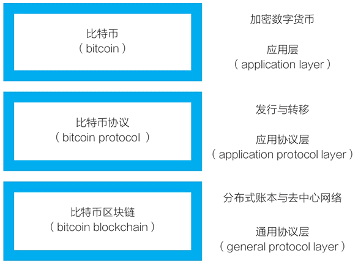
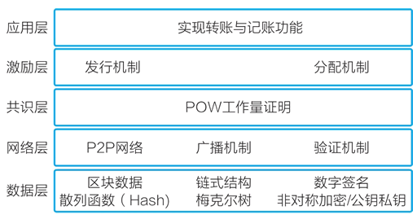

[toc]

# 区块链
区块链技术是虚拟数字货币的底层技术。区块链是一个另类的孩子，它的去中心化，自金融，共识算法等都是与现实公司和社会师姐冲突的。
在比特币的创世时刻，它的三个组成部分都出现了，即数字加密货币、分布式账本、去中心化网络。比特币创造初始的想法是，创造在数字世界中可用的电子现金，它可以点对点也就是个人对个人进行交易，交易中不需要任何中介参与。像支付宝，paypal等都是由中心化数据库作为中介来实现的。
区块链 1.0 是货币、区块链 2.0 是合约、区块链 3.0 是应用

    </img>
    
比特币系统的三层构造

比特币的发行和转账靠的是中间的比特币协议层。下面这张图是比特币协议和比特币区块链两层的细分。比特币协议层被细分为：应用层、激励层和共识层。

    </img>
    
比特币系统架构图

设计比特币系统时，中本聪创造性的将计算机算力和经济激励相结合，形成了工作量证明(proof-of-work，POW)共识机制，让挖矿计算机节点在计算竞争中完成了货币发行和记账功能，也完成了区块链账本和去中心化网络的运维。形成了一个完整循环：矿机挖矿(算力竞争)，完成去中心化记账(运转系统)，获得比特币形式的经济激励(经济奖励)。 

## 1. 比特币是如何转账的
### 1.1 分布式账本和去中心网络
所有区块链系统都包括**分布式账本和去中心网络**这一对必备要素。基于这一对要素，比特别系统实现了去中心化的价值表示和价值转移。
**去中心网络**：比特币网络没有中心服务器，它是由众多全节点和轻节点组成的，这些节点形成一个去中心网络。
- 全节点包含所有比特币区块链的区块数据
- 轻节点仅包括与自己相关的数据

比特币网络完全开放，任何服务器都可以接入，下载全部区块数据成为全节点。
**分布式账本**：所有用户持有的比特币信息都存放在一个**分布式账本**中，这个账本是一个不断增长的由数据块组成的链条。

## 2. 以太坊
由于比特币设计上仅考虑了数字货币场景，且比特币非图灵完备的。所以V神提出了以太坊概念。以太坊上的程序称为**智能合约**，其包含代码和相应的状态数据。以太坊是区块链与智能合约的完美结合。通过编写智能合约可以实现强大功能，完成区中心应用的实现。
以太坊官方推荐的智能合约开发语言为Solidity，是一门静态、支持继承、类库以及复杂的自定义类型等特性的高级语言。
### 2.1 以太坊虚拟机
以太坊虚拟机类似于一个沙箱，运行在EVM中的代码不能与网络、文件系统或其他进程交互。EVM本身运行在以太坊节点上，当把合约部署到以太坊网络上之后，合约就可以在所有以太坊网络节点的以太坊虚拟机上运行了。
合约在部署到EVM之前，需要先编译，因为是以字节码形式在EVM上运行的。
#### 2.1.1 以太坊账户
以太坊有两种账户
- 外部拥有账户(EOA):该类账户类似于银行账户，它由公钥/私钥对控制，由人控制，不关联代码。
- 合约账户：该类账户由存储在账户中的代码控制。

外部账户的地址是由公钥决定的，合约账户的地址是在创建该合约时确定的。
合约账户存储代码，外部账户不存储，外部账户之间可以通过创建和用自己的私钥对交易进行签名，以发送消息给另外一个外部账户或合约账户。
两个外部账户之间的传递消息只是简单的价值转移，而外部账户到合约账户的消息回激活合约账户的代码。
合约账户自己不能发起一笔交易，但可以在响应交易时触发另一笔交易，因此在以太坊上，任何动作都是由外部账户触发的交易所发起的。
#### 2.1.2 钥匙
每个外部账户由一堆公钥/私钥定义，账户地址由公钥衍生而来，取公钥最后20个字节。
每对私钥/地址都被编码在一个钥匙文件里，格式为JSON。私钥通常用创建账户时设置的密码进行加密。可以在以太坊节点数据目录的`keystore`子目录下找到钥匙文件。
钥匙文件丢失或忘记密码，就会丢失所有的以太币，没有密码不可能进入账户，也没有忘记密码的选项。
#### 2.1.3 账户状态
账户状态有四个组成部分。
- Nonce：如果账户是一个外部拥有账户(EOA),Nonce代表从此账户地址发送的交易序号；如果账户是一个合约账户，则表示此账户创建的合约序号。
- Balance：此地址拥有的以太币余额数量，单位是Wei，1Ether=10^18Wei。
- storageRoot：Merkle Patricia树的根节点Hash值。Merkle Patricia树会将此账户存储内容的Hash值进行编码，默认是空值。
- codeHash：此账户EVM代码的Hash值。对于合约账户，就是被Hash的代码并作为codeHash保存，对于外部拥有账户，codeHash域是一个空字符串的Hash值。