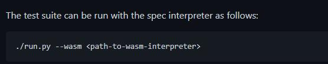
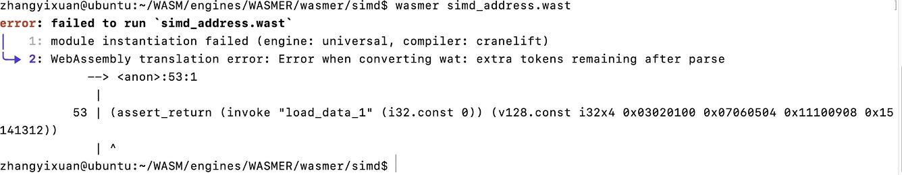
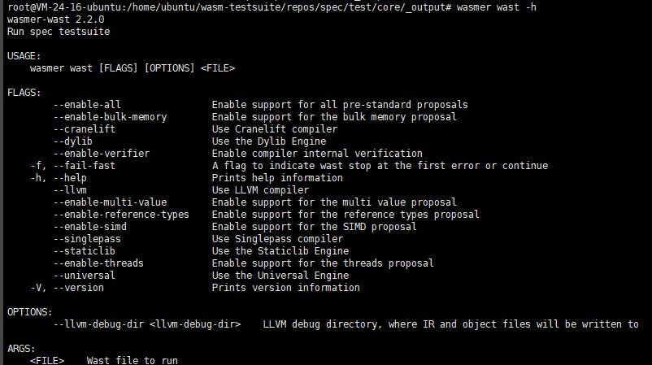
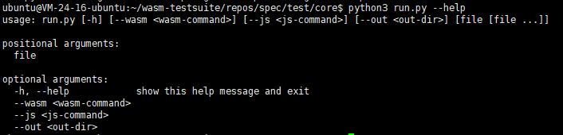

#### markdown语法

**加粗**  *斜体*
**在一行的末尾添加两个或多个空格，然后按回车键,即可创建一个换行( )。**

#### linux命令总结
    1.linux中查找文件并删除 ``find -name "*.log" |xargs rf`` xargs用于管道，将前面的内容作为参数传给后面的命令

## 3.4 用各种wasm runtime测试wasm的benchmark  
#### 目标    
用wasmer、wasmtime、wamr、wasm3等runtime测试[wasm测试集](https://github.com/WebAssembly/spec/tree/main/test/core 'wasm')
#### 步骤
   
这里官方写了一个python脚本来指定wasm runtime路径并循环执行每个测试代码。
测试代码都是以 **.wast** 作为后缀，这个是wasm专门用来执行测试而定义的一种文件格式，**里面包含了一些专门用于测试的wasm指令**(如**assert_**开头的指令)，并且给在wasm runtime的**wast**模式下执行，否则会报错如下： 
   
**wasmer wast指令的帮助**    
    
#### 收获    
1.run.py脚本中使用了argparse这个py标准库，它能够声明run.py --help/-h帮助的输出格式，并且获取用户输入的各个参数，如下：
      
[查看run.py文件](./assets/experiment/3.4/run.py)      
2.这次测试的wasm测试集都是关于wasm的核心语义。wasm还有一些别的还在提案的语义，在[wasm提案语义](https://github.com/WebAssembly/proposals/blob/main/README.md)中。    
3.一般来说那些实现了wasm解释的runtime的github主页里都有test目录，里面提供了如何测试该runtime的方法。    
4.linux中查找文件并删除 ``find -name "*.log" |xargs rf`` xargs用于管道，将前面的内容作为参数传给后面的命令   