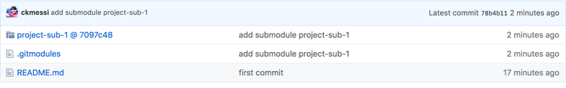
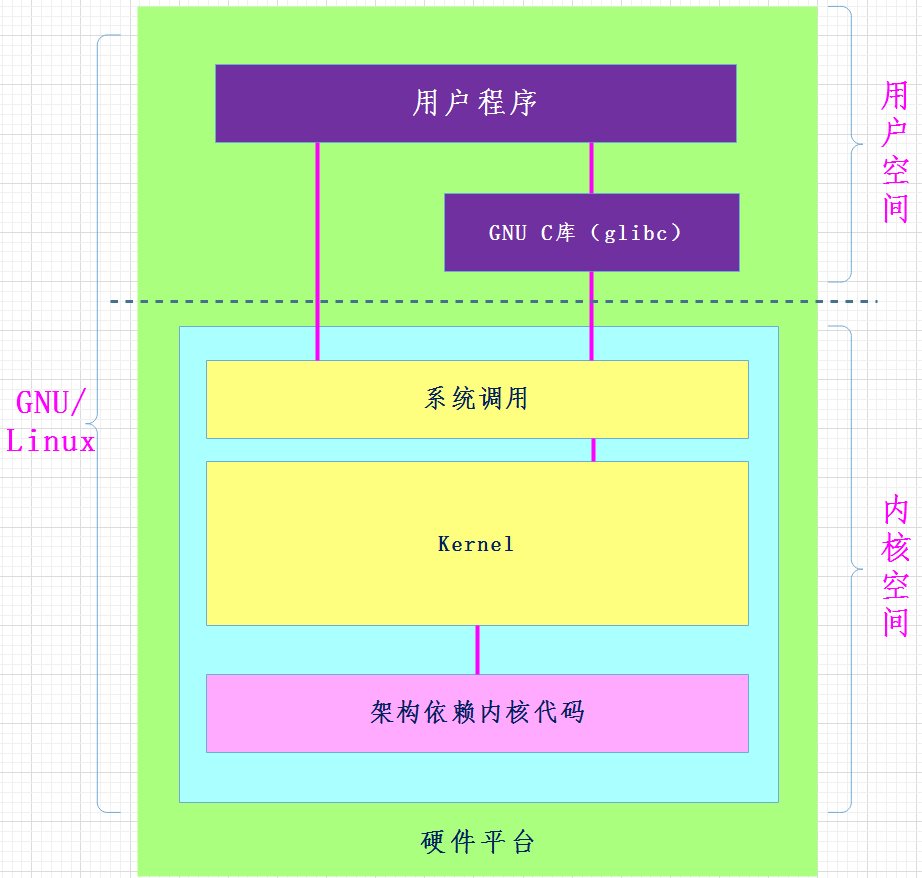
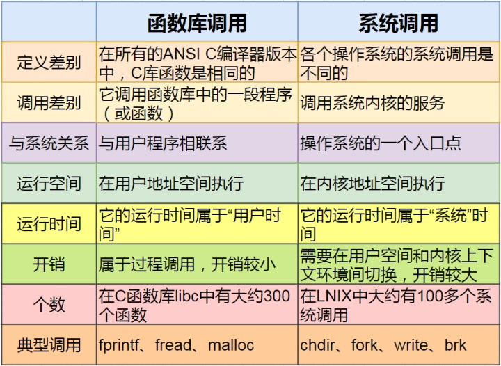
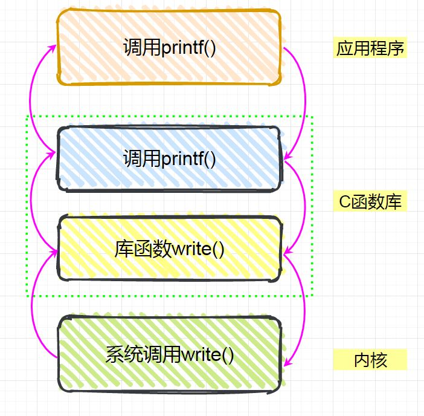
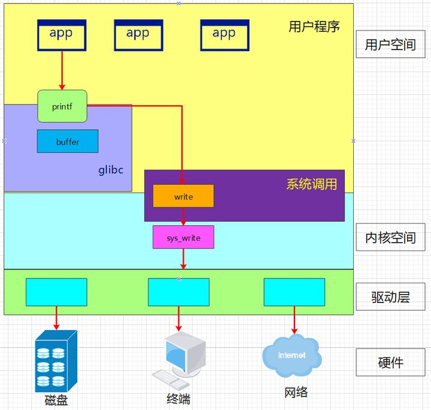

<!--
 * @Author: abc767234318 767234318@qq.com
 * @Date: 2022-05-17 16:46:49
 * @LastEditors: abc767234318 767234318@qq.com
 * @LastEditTime: 2022-06-09 09:14:01
 * @FilePath: \geyou.github.io\杂项笔记.md
 * @Description: 
 * 
 * Copyright (c) 2022 by abc767234318 767234318@qq.com, All Rights Reserved. 
-->
[toc]

#### 协程
协程就是用户态线程内可以被异步执行的函数，用来在用户态下解决异步问题。
**普通函数**：每次调用只能从第一条语句开始执行知道某个出口结束
**协程函数**：协程函数交出控制权后，可以在此从交出控制权的下一步语句开始执行。
协程不是线程，协程包含在线程内，协程在用户态，由用户控制。协程的切换效率比线程切换效率高。

#### mingw 和 cygwin
MinGW设计思想是“最小化支持”，Cygwin是最大可能的模拟一个linux环境；
MinGW可以提供给你一组工具，在windows下也可以用gcc，ls，grep等等这些命令，但其本质都是套了一个GNU风格的壳子，让你在开发windows应用时能“保留”点linux环境下的“感觉”（这个感觉就是常用的一些工具，命令），所以它不是用来保证你linux下写的代码，带有一堆POSIX的接口，拿到windows直接就能编译运行；Cygwin的目标就是，让你在linux下面开发好的代码，一行不改的，放到windows平台上，拿来就能编译运行；

#### MSYS2(Minimal System)
在MinGW出现止之后，为了更方便使用GNU工具链，需要提供一个可执行的shell脚本的运行环境，从而可以在shell中调用那些gcc，make等，于是有了MSYS2。他和Cygwin追求大而全的POSIX兼容系统不同，它只提供剧本的POSIX API。所以MSYS可以看作Cygwin的简化版。
[介绍网址](https://www.msys2.org/wiki/MSYS2-introduction/)

#### github中的PR
PR(pull Request)，就是自己fork了别人仓库的代码，做了修改之后，想将自己的修改贡献给开源社区，PR一下，人家仓库的管理员如果同意了，那就直接合并进去了。

#### python中__new__和__init__
```python
class CapStr(str):
    def __new__(cls, string):
        self_in_init = super().__new__(cls, string)
        print(id(self_in_init))
        return self_in_init
    def __init__(self,string):
        print(id(self))
 
a = CapStr("I love China!")
print(id(a))
"""
执行结果
2691640428616
2691640428616
2691640428616
"""
```
__new__作用是创建此类的一个实例
__new__函数第一个参数必为cls，他为此类的类型对象，重写__new__的时候，必须调用`super().__new__`，而__init__函数的self参数其实是传入的实例化后的对象。所以实例化对象的时候，其实是先调用的__new__，创建对象分配内存，之后调用__init__，对创建的这个对象缝缝补补。**__new__和__init__相配合才是python中真正的类构造器。**


#### git submodule
面对比较复杂的项目，我们有可能将代码根据功能拆解成不同的子模块。主项目对子模块有依赖关系，却又并不关心子模块的内部开发流程细节。
这种情况下，通常不会把所有源码都放在同一个Git仓库中。
git的submodule功能就是建立了当前项目与子模块之间的依赖关系：`子模块路径`，`子模块的远程仓库`，`子模块的版本号`。
使用`submodule`

1.**创建submodule**
`git submodule add <submodule_url>`可以在项目中创建一个子模块。
此时项目中会出现.gitmoudles 和project-sub-1，前者保存子模块相关信息，后者保存着子模块当前版本的版本号信息。
之后主项目仓库中会显示出子模块文件夹，并带上其所在仓库的版本号
<div align=center> 
</img>   
</div>

2.**获取submodule**
clone的时候一并获取submodule需要在git clone命令后添加`--recurse-submodules`参数。不加的话，子模块文件夹下是空的


#### POSIX API
POSIX，全称为可移植性操作系统接口，是一种关于信息技术的IEEE标准。它包括了系统应用程序接口(API)，以及实时拓展(C语言)。
POSIX是IEEE为要在各种UNIX操作系统上运行的软件而定义的一系列API标准的总称，其正式称呼为IEEE 1003
**示例**
glibc 是 Linux 下使用的开源的标准 C 库，它是 GNU 发布的 libc 库，即运行时库。这些基本函数都是被标准化了的，而且这些函数通常都是用汇编直接实现的。

glibc 为程序员提供丰富的 API（Application Programming Interface），这些API都是遵循POSIX标准的，API的函数名，返回值，参数类型等都必须按照POSIX标准来定义。

POSIX兼容也就指定这些接口函数兼容，但是并不管API具体如何实现。
<div align=center> 
</img>  
</img>   
</img>
</img>
</div>

#### SIMD(Single Instruction Multiple Data)
为了提高CPU指令处理数据的能力，推出了一些可以同时并行处理多个数据的指令————SMID指令。


#### Pthread
POSIX线程，简称Pthreads，是线程的POSIX标准，在类Unix操作系统，都使用Pthreads作为操作系统的线程。

#### powershell 中的引号
某些本机命令需要包含引号字符的参数。 通常，PowerShell 的命令行分析会删除所提供的引号字符。 然后，分析的参数将联接到单个字符串中，每个参数用空格分隔。如果想保留引号，就在其之前基础上多加个相同的引号。