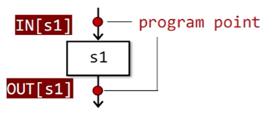
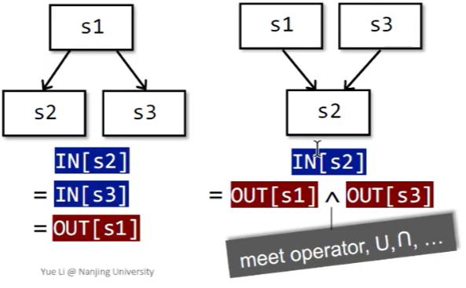
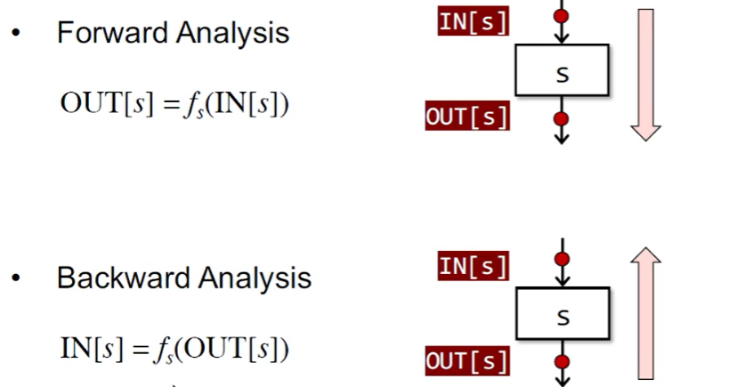

[toc]


# 编译原理
# 程序分析
## 1. 南大静态程序分析 
### 1.1 数据流分析
#### 1.1.1 中间表示
    为什么不拿源代码直接做静态分析？
    1. 是因为我们首先要保证代码的正确性，太贴近语法结构缺乏一致性，而且源代码语义更复杂一些，不利于优化。
    2. AST也是，其更high-level，且更贴近语法结构，而IR是接近机器代码且通常是独立于语言，可以将多种前端语言转成IR一并分析，像llvm ir一样。3. AST缺少控制流，IR包含了控制流信息。
**IR:Three-Address Code**
三地址码(3-Address-Code)通常没有统一格式，每个指令右边至多一个操作符，且每条3AC至多有三个地址(变量名、常量和编译器生成的临时变量)。
```
x = y bop z：双目运算并赋值，bop = binary operator
x = uop z：单目运算并赋值，uop = unary operator
x = y：直接赋值
goto L：无条件跳转，L = label
if x goto L：条件跳转
if x rop y goto L：包含了关系运算的条件跳转，rop = relational operator
```
**IR:Static Single Assignment**
静态单赋值(SSA),每一个变量名称只能被赋值一次，每次想要赋值都要更换名称，并引入phi函数来根据控制流选择最新的变量。
__为什么使用SSA？__  
* 控制流信息间接集成到了独特变量名中
  * 有些对控制流不敏感的简化分析，可以用SSA
* 在 SSA 形式中，UD 链（Use-Define Chain）是十分明确的。变量的每一个使用点只有唯一一个定义可以到达。
  * 编译器在做常量传播、公共子表达式删除等优化之前，必须获取程序的 UD 链和 DU 链。显然，UD 链越简洁，越方便做编译优化。
* 目前成熟语言的编译器里用于做优化的IR都是符合SSA格式的，他的好处就是容易形成UD链

__SSA的缺点？__
  * SSA会引入过多的变量和phi函数
  * SSA转换成机器代码会引入效率低下问题

__Basic Blocks & Control Flow Graphs__
控制流分析通常指的是构建控制流图(CFG)，并以CFG为基础结构进行静态分析  
CFG中每个节点都是一个基本块(控制流只能从块首进入，块末出)  
__构建基本块__
* 给定输入程序P
* 输出P的基本块
* 算法
  * 1.决定P的leaders
    * P的第一条指令为leader
    * P中跳转的目标指令是leader
    * 跳转指令的后一条指令为leader(想象汇编if语句)
  * 2.构建P的基本块
    * 一个leader到其后续直到下一个leader前的所有指令  

#### 1.1.2 数据流分析
__分析的核心：How Data Flows on CFG?__
如何对数据做抽象(+, -, 0 等)？
# 待定  
##### 1.1.2.1 数据流分析的预备知识  
__Input and Output States 输入输出状态__
- 每一条IR的执行都会使状态从**输入状态**变为新的**输出状态**
- 输入/输出状态与语句前/后的program point相关联  
</img> </img>   

数据流分析中，每一个program point都会关联一组数据流值，代表该点可观察的抽象的程序状态。   
__转移方程约束的概念__  
分析数据流有前向和后向两种：  
</img>   
**控制流约束的概念**

# 形式化方法
# 编程语言
## 1. Python
### 1.1 Python AST标准库
[官方文档](https://docs.python.org/zh-cn/3/library/ast.html)   
[Green Tree Snakes - the missing Python AST docs](https://greentreesnakes.readthedocs.io/en/latest/#)介绍了更多标准库中没说明的AST细节     
ASDL(abstract syntax description language)抽象语法描述语言   
class ast.AST为所有节点类的基类，抽象语法定义的每个左侧符号都是定义了一个类，右侧对每个构造器也定义一个类，这些类都是继承于左侧定义的类。括号中都是该类所含有的属性。(带<b>?</b>的属性，标记为可选，可能是<b>None</b>，如果这些属性有0或多个则用<b>*</b>标记)   
python ast里面所有数据类型是没有类型可言的，只给出了基本的常量 元组 冻结集 等，其中还有一些继承的类被用作属性，比如**op**属性接收的就是如ast.UAdd ast.Usub ast.Not等类的实例化对象。   
#### 1.1.2 解析python AST   
**ast.parse**(source, filename='<unknown>', mode='exec', *, type_comments=False, feature_version=None)函数和**compile**(source, filename, mode,ast.PyCF_ONLY_AST)函数等价。    
其中**model**指定了编译代码的种类(exec,eval,single)，以及**type_comments**指定代码是否有类型标注(python语法增强,[PEP 484](https://www.python.org/dev/peps/pep-0484)和[PEP 526](https://www.python.org/dev/peps/pep-0526))    
对应的还有**ast.unparse(ast_obj)**将ast转化为python代码，但是会有一些不同，比如没有编译器优化。   
#### 1.1.2 遍历python AST   
标准库提供了几种解析python AST的方法。   
**class ast.NodeVisitor 类**，这是个访问ast节点类的基类，其遍历整个AST树并调用每个node中找到的visitor函数，需要我们继承它并添加visitor函数。   
访问每个节点，默认实现为**self.visit_classname**方法，classname为要访问的节点的类名。    
其中还有个函数叫做**generic_visit(node)**，它是用来访问节点的子节点的，比如FunctionDef节点中的body可能会有其他操作节点(如，BinOp等)，那我们也要定义visit_BinOp(node)方法，并在visit_FunctionDef(node)中调用generic_visit(node)方法才能递归访问BinOp节点，否则就只会调用visit_FunctionDef(node)方法。比如下面这段代码：  
```python
def add(x, y):
    return x + y
```
其AST中会有FunctionDef还会有BinOp，所以我们定义：   
```python 
class CodeVisitor(ast.NodeVisitor):
    def visit_BinOp(self, node):# 这个函数的访问是由于 Visit_FunctionDef的先访问再generic_visit才访问的
        print('Bin')            # 如果Visit_FunctionDef中没有generic_visit的话，则这个函数是不会访问的
        if isinstance(node.op, ast.Add):
            node.op = ast.Sub()
            
        self.generic_visit(node) # 这也是为了便于访问BinOp节点的子节点，如果有的话
    
    def visit_FunctionDef(self, node):
        print('Function Name: %s'% node.name)
        self.generic_visit(node) # FunctionDef中还包含有 BinOp,因此会进去visit BinOP
```
访问代码AST则输出：   
```
Function Name: add
Bin
```
**注意，如果想要在traversal节点的过程中对节点apply changes，则需要使用NodeTransformer访问类**   
**class ast.NodeTransformer 类**，用于遍历AST，并允许修改节点。其遍历AST，并使用visitor方法的返回值去替换或移除旧节点，如果visitor方法返回值为**None**，则该节点被移除，否则将替换为返回值，返回值为原始节点时无需替换。    
同时，如果要访问子节点，仍然需要为子节点调用generic_visit()方法，并定义相关的visit_classname(node)方法。  
```python
class CodeTransformer(ast.NodeTransformer):
    def visit_BinOp(self, node):
        if isinstance(node.op, ast.Add):
            node.op = ast.Sub()
        self.generic_visit(node)
        return node

    def visit_FunctionDef(self, node):
        self.generic_visit(node) # 这里表示先去访问里面的children node        
        if node.name == 'add':
            node.name = 'sub'
        args_num = len(node.args.args)
        
        args_num = len(node.args.args)
        args = tuple([arg.arg for arg in node.args.args])
        print(str(args))
        func_log_stmt = ''.join(["print('calling func: %s', " % node.name, "'args:'", ", %s" * args_num % args ,')'])
        node.body.insert(0, ast.parse(func_log_stmt))
        
        #func_log_stmt = ''.join(["print 'calling func: %s', " % node.name, "'args:'", ", %s" * args_num % args])
        #node.body.insert(0, ast.parse(func_log_stmt))

        return node

    def visit_Name(self, node):
        replace = {'add': 'sub', 'x': 'a', 'y': 'b'}
        re_id = replace.get(node.id, None)
        node.id = re_id or node.id
        self.generic_visit(node)
        return node
    
    def visit_arg(self, node):
        self.generic_visit(node)
        replace = {'x':'a', 'y':'b'}
        node.arg = replace[node.arg]
        return node
```
#### 1.1.3 其他python AST标准库辅助函数   