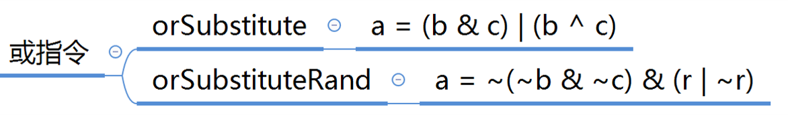
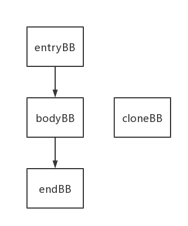

[toc]

# 术语解释
**逃逸变量**指在一个基本块中定义，并且在另一个基本块被引用的变量。
**\+** 号代表出现至少一次， **\*** 号代表出现任意次 **\?** 代表出现零次或一次
**[]**方括号表示之中的元素只会出现一个


# 编译原理
## 编译过程
### 词法分析
**词法分析的任务就是将程序从字符串变成Token串。**
根据这句话来看，逐步解析。
#### 什么是Token?
下面这个表大致描述了token的种类，**关键字、标识符、分隔符、字面量、注释、空白字符等。**  
</img>

#### 如何去将字符串识别成Token
首先最基本的，从字符串中匹配出词，我们需要用到**正则文法**(上下文相关文法的一个子集，同时正则文法不等于正则表达式)。正则文法示例如下：

```
DecimalLiteral: IntegerLiteral '.' [0-9]*     # 匹配浮点数字面量
              | '.' [0-9]+
              | IntegerLiteral 
              ;
IntegerLiteral: '0' | [1-9] [0-9]* ;     # 匹配整数字面量
```
**因为涉及到文法，所以我们实现的过程中应该避免使用无脑的文法规则匹配方式，否则会有大量的栈回溯**
#### 如何避免栈回溯，提高token识别速度
这里用到**有限自动机**，有限自动机分为两种  
+ 确定性有限自动机：针对每个输入都会发生一次确定的迁移(DFA Determinisitic Finite-State Automata)
+ 非确定性有限自动机：某些状态下，针对一个输入可能会迁移到不止一个状态，甚至在没有任何输入下，也会从一个状态迁移到另一个状态(NFA Non-deterministic Finite-State Automata)
  + 任何一个NFA可以通过算法转换DFA   

</img>  


### 语法分析
### 语义分析

# 程序分析
静态分析通常从控制流分析开始，即分析代码的IR形式，以理解各个操作之间的控制流，控制流分析的结果是控制流图。接下来，编译器详细分析值是如何流经代码的。编译器使用分析得到的信息来寻找改进代码的机会，并证明变换的安全性。即使用数据流分析分析值流经代码。
运作于单个基本程序块上或程序块形成的树上的静态分析通常比较简单。另一方面，如果代码从任何外部来源读取值、涉及(即便很少)控制流，或者遇到具有歧义的内存引用(指针、数组引用或传引用参数)，那么静态分析会变得困难很多，而分析的结果也不会很准确。
**动态分析与静态分析？**
一般来说，静态分析的代价更低，动态分析代价更高。即分析带来的节省必须要比分析本身的代价低，这样才有效。  

## 1. 南大静态程序分析 
用的是3AC分析的

### 1.1 名词解释
**半格(semilattice)**
半格是一个二元组`(S,⊓)`,其中S是一个集合，`⊓`是一个交汇运算，并且任意𝑥,𝑦,𝑧 ∈ 𝑆都满足下 列条件:
- 幂等性idempotence: 𝑥 ⊓ 𝑥 = 𝑥
- 交换性commutativity: 𝑥 ⊓ 𝑦 = 𝑦 ⊓ 𝑥
- 结合性associativity： 𝑥 ⊓ 𝑦 ⊓ 𝑧 = 𝑥 ⊓ (𝑦 ⊓ 𝑧)
- 存在一个最大元⊤，使得𝑥 ⊓ ⊤ = 𝑥

**偏序(Partical Order)**
偏序是一个二元组(S, ⊑)，其中S是一个集合， ⊑ 是一个定义在S上的二元关系，并且满足如下性质：
- 自反性：∀𝑎 ∈ 𝑆:𝑎 ⊑ 𝑎
- 传递性：∀𝑥,𝑦,𝑧 ∈ 𝑆:𝑥 ⊑ 𝑦 ∧ 𝑦 ⊑ 𝑧 ⇒ 𝑥 ⊑ 𝑧
- 非对称性：𝑥 ⊑ 𝑦 ∧ 𝑦 ⊑ 𝑥 ⇒ 𝑥 = 𝑦

每个半格都定义了一个偏序关系
- 𝑥 ⊑ 𝑦当且仅当𝑥 ⊓ 𝑦 = 𝑥

**半格示例**
<div align=center>
</img>   
</div>
抽象符号域的五个元素和交汇操作组成了一个半格，半格的笛卡尔乘积`(𝑆 × 𝑇,⊓𝑥𝑦)`还是半格。

$(s_1,t_1)⊓xy(s_2,t_2) =  (s_1⊓_xs_2,t_1⊓_yt_2)$
任意集合和交集操作组成了一个半格
- 偏序关系为子集关系
- 顶元素为全集
  
任意集合和并集操作组成了一个半格
- 偏序关系为超集关系
- 顶元素为空集


**半格和偏序关系**
每个半个都定义了同一集合`S`上的一个偏序关系
例如，正整数集合上的"求最小公倍数运算"是半格，而"整除关系"是对应的偏序。
又如，任意集合和"交集操作"组成了一个半格，顶元素是全集，而"子集关系"是对应的偏序。
又如，任意集合和"并集操作"组成了一个半格，顶元素是空集，而"超集关系"是对应的偏序。

**半格的高度**
定义：半格的偏序图中任意两个结点的最大距离+1

**单调递增函数(Monotone Function)**
定义：给定一个偏序关系(𝑆,⊑)，称一个定义在𝑆上的函数𝑓为单调函数，当且仅当对任意𝑎,𝑏 ∈ 𝑆满足：
- 𝑎 ⊑ 𝑏 ⇒ 𝑓 (𝑎) ⊑ 𝑓 (𝑏)
- 注意：单调不等于a ⊑ 𝑓 (𝑎)
就是说元素作为参数满足偏序关系，函数结果也满足偏序关系的函数𝑓，换个角度说给出一个单调函数，其参数和结果构成的集合，和函数操作也构成半格

**逆后序遍历(Reverse PostOrder, PRO)**
在执行迭代算法时，图的逆后序遍历特别有效。后序遍历在访问某节点之前，会按照某种一致的次序尽可能多地访问该节点的子节点。而PRO遍历正好相反，在访问节点之前，他会尽可能多地访问该节点的前驱节点。节点的PRO编号即为`|N|+1`减去其后序编号，N是图中所有节点的集合。后序编号就是对图执行后序遍历时，节点先后访问的顺序。
对于一个正向数据流问题，迭代算法应该使用在CFG上计算得到的某种PRO顺序。对于一个反向数据流问题，算法应该使用在反向CFG上计算得到的某种PRO顺序。
反向CFG:将原CFG中的各条边反向。编译器可能需要向原CFG添加一个唯一的出口节点，使得反向CFG具有唯一的入口节点。


### 1.2 数据流分析
#### 1.2.1 数据流分析单调框架
目标：通过配置框架的参数，可以导出各种类型的算法，并保证算法的安全性、终止性、收敛性。
**数据流分析单调框架**
- 一个控制流图(V,E)
- 一个有限高度的半格(S,⊓)
- 一个entry的初值I
- 一组结点转换函数，对任意结点𝑣 ∈ 𝑉 − 𝑒𝑛𝑡𝑟𝑦存在 一个结点转换函数𝑓v
#### 1.2.2 中间表示
    为什么不拿源代码直接做静态分析？
    1. 是因为我们首先要保证代码的正确性，太贴近语法结构缺乏一致性，而且源代码语义更复杂一些，不利于优化。
    2. AST也是，其更high-level，且更贴近语法结构，而IR是接近机器代码且通常是独立于语言，可以将多种前端语言转成IR一并分析，像llvm ir一样。
    3. AST缺少控制流，IR包含了控制流信息。  
**IR:Three-Address Code**   
三地址码(3-Address-Code)通常没有统一格式，每个指令右边至多一个操作符，且每条3AC至多有三个地址(变量名、常量和编译器生成的临时变量)。
```
x = y bop z：双目运算并赋值，bop = binary operator
x = uop z：单目运算并赋值，uop = unary operator
x = y：直接赋值
goto L：无条件跳转，L = label
if x goto L：条件跳转
if x rop y goto L：包含了关系运算的条件跳转，rop = relational operator
```
**IR:Static Single Assignment**
静态单赋值(SSA),每一个变量名称只能被赋值一次，每次想要赋值都要更换名称，并引入phi函数来根据控制流选择最新的变量。**(SSA 要求的是在静态，即仅从代码文本层面可以看出的单一赋值，而非运行时只会被赋值一次。参考循环中phi的实现)** SSA在一种稀疏的数据结构中合并了控制流分析和数据流分析的结果。
__为什么使用SSA？__  
* 控制流信息间接集成到了独特变量名中
  * 有些对控制流不敏感的简化分析，可以用SSA
* 在 SSA 形式中，UD 链（Use-Define Chain）是十分明确的。变量的每一个使用点只有唯一一个定义可以到达。
  * 编译器在做常量传播、公共子表达式删除等优化之前，必须获取程序的 UD 链和 DU 链。显然，UD 链越简洁，越方便做编译优化。
* 目前成熟语言的编译器里用于做优化的IR都是符合SSA格式的，他的好处就是容易形成UD链
* 而且就思考一下，ssa形式更容易进行编译前的常量替换。而如果不使用ssa，可能就只能计算一个变量第一次被赋值为常量那点的变量状态。

__SSA的缺点？__
  * SSA会引入过多的变量和phi函数
  * SSA转换成机器代码会引入效率低下问题

__Basic Blocks & Control Flow Graphs__
控制流分析通常指的是构建控制流图(CFG)，并以CFG为基础结构进行静态分析  
CFG中每个节点都是一个基本块(控制流只能从块首进入，块末出)  
__构建基本块__
* 给定输入程序P
* 输出P的基本块
* 算法
  * 1.**决定P的leaders**
    * P的第一条指令为leader
    * P中跳转的目标指令是leader
    * 跳转指令的后一条指令为leader(想象汇编if语句)
  * 2.构建P的基本块
    * 一个leader到其后续直到下一个leader前的所有指令  

<div align=center>
</img>   
<div>生成基本块</div>
</div>

#### 1.2.3 数据流分析
__分析的核心：How Data Flows on CFG?__
如何对数据做抽象(+, -, 0 等)？

不同的数据流分析，有着不同的data abstraction, flow safe-approximation策略，transfer functions&control-flow handings。
# 待定  
##### 1.2.3.1 数据流分析的预备知识  
__Input and Output States 输入输出状态__
- 每一条IR的执行都会使状态从**输入状态**变为新的**输出状态**
- 输入/输出状态与语句前/后的program point相关联  
<div align=center>
</img> </img> 
</div>     
数据流分析中，每一个program point都会关联一组数据流值，代表该点可观察的抽象的程序状态。   

__转移方程约束的概念__  
分析数据流有前向和后向两种：顺控制流和逆控制流
前向意味着是利用基本块出口即OUT信息来计算的，而后向是利用基本块的入口即IN信息来计算的。    
<div align=center> 
</img>   
</div>   
  
**控制流约束的概念**
每条语句s都会使program point发生改变。
B的输出为其输入经过多次转换后得到的状态。
B的输入要根据其数据流分析的需求，对其前驱的输出进行合适的meet operator进行处理。后向分析也一样。   
<div align=center> 
</img>   
</img>   
</div>   

##### 1.2.3.2 Reaching Definitions Analysis 到达定值分析
**基本概念**
- 假定x有定值d(definition)，如果存在一个路径，到达某点p，并且路径上没有x的其他定值，则称x的定值到达(reaching)点p。
- 如果路径上有对x的其他定值，则称x的d定值被kill了。   
<div align=center> 
</img>   
</div>   
到达定值可以用来分析未定义的变量。如，在程序入口为各变量引入一个dummy定值。当程序出口某些变量定值仍未dummy时，可认为此变量未被定义。还有常量传播，一个变量的值一直没有被改变，则可以直接用常量替代。
对于一条赋值语句 D: v = x op y，该语句生成了 v 的一个定值 D，并杀死程序中其它对变量 v 定义的定值。

**分析过程**
使用Abstract和safe-approximation两步骤进行可达定值分析。
- **Abstract**：将所定义的每个变量状态用bit vectors来表示。
  - 程序中所有变量的定值
  - 可以用一个bit vector来定义，变量有多少个赋值语句，有多少位   
<div align=center> 
</img>   
</div>  

- **Safe-approximation**：我们假设有一个声明D: v = x op y,这条语句新增了一个对于v的声明，并杀死了所有其他对于v的声明，语句的其他部分不受影响。转换函数如下：
<div align=center> 
</img>   
</div>   
每个基本块的gen集合和kill集合都是固定的

**可达值分析伪代码**
<div align=center> 
</img>   
</div>  
我们先将所有BB的输出设置成空，然后利用我们的转换函数对于每一个BB的输入输出进行迭代，在一次迭代过程中如果有BB的输出发生变化则进行下一次迭代，直到所有BB的输出都不变为止。他这里while的条件，进入循环之前不能验证条件，否则就不会执行循环了，他是抽象的，就是第一次进循环执行完一遍后，才会判断while的条件。

**可达定值分析实例**  
<div align=center> 
</img>   
</div>  
最终结果  
<div align=center> 
</img>   
</div> 

**总结**
每条赋值三地址码都为左侧变量生成了一个定值，所以有多少个赋值语句，就有多少种定值需要我们分析(这里不考虑这些定值是否会相等，不是这个时候要分析的点)，最重要的就是状态抽象Abstract和转换函数safe-approximation，转换函数针对每个数据流分析是非常需要思考的，算法中先对哪个块进行转换函数计算，包括顺序都是与结果无关的，因为他是个单调函数，总会单调到一个最终相同的结果。算法中的`U`都是交操作，最终结果是sound的。

##### 1.2.3.3 Live Variables Analysis 活跃变量分析
**基本概念**
- 变量`x`在程序点`p`上的值是否会在某条从`p`出发的路径中使用。
- 变量`x`在`p`上活跃，当且仅存在一条从`p`开始的路径，该路径的末端使用了`x`，且路径上没有对`x`进行覆盖。
- 隐藏了一个含义：在被使用前，v没有被重新定义过，即没有被kill过。

该算法可以用于寄存器分配，当一个变量不会再被使用，那此变量就可以从寄存器中腾空，用于新值的分配。死代码去除。

**活跃变量中的数据流值**
- 程序中的所有变量
- 依然可以用bit vector来表示

**活跃变量的转义方程和控制流处理**
<div align=center> 
</img>   
</div> 
上图中IN[B]改为IN[S]

- 一个基本块中，若v = exp，则def v。若exp = exp op v，那么use v。一个变量要么是use，要么是def。
- 考虑基本块B及其后继S，若S中，变量v被使用，那么把v放到S的IN中，交给B来分析。
- 因此对于活跃变量分析，其控制流处理是 OUT[B] = IN[S]。
- 在一个块B中， 如果v被使用，那么需要把v添加到IN[B]中，如果v被定义，那么在其之上的语句中，v都是一个非活跃变量
- 给出一个B，v在从B出发的任一条路径上是活动的，则都有v在B末尾活动。所以我们用并集运算B的后继节点的IN。                

**活跃变量算法**
<div align=center> 
</img>   
</div> 

- 初始化判断技巧：may analysis是空，must analysis 是top

##### 1.2.3.4 Available Expression Analysis 可用表达式分析
**基本概念**
- x + y在p点可用的条件：从流图入口节点到达p的每条路径都对x + y求了值，且在最后一次求值之后再没有对x或y赋值。
可用表达式可以用于全局公共子表达式的计算。省去了不必要的计算开销。
**可用表达式分析中的数据流值**
- 程序中的所有表达式
- 依然可以用bit vector来表示

**可用表达式的转移方程和控制流处理**
<div align=center> 
</img>   
</div> 

- 我们要求无论从哪条路径到达B，表达式都应该已经计算，才能视其为可用表达式，因此是一个must analysis
- 注意到图中，两种不同的路径可能会导致表达式最终结果不一样，但是我们只关心值可不可以复用，因此可以认为表达式可用。
- v = x op y，则gen x op y。当x = a op b，则任何包含x的表达式都被kill掉。若gen和kill同时存在，那么以最后一个操作为准。

#### 1.2.4 数据流分析的局限性 
数据流分析中能获得的消息是有限的，在有些情况下，限制来源于分析底层的一些假设。其他情况下，限制起因于被分析语言的特性。
迭代算法在使用B的后继节点的信息时，其隐含假定执行可以到达这些后继节点，实际上其中一个或者多个可能不是可到达的。也就是说数据流分析假定穿越CFG的所有路径都是可能的，这种假定限制了分析的精确度。
另一种在数据流分析结果中悄然产生不精确性的途径，来自于对数组、指针和过程调用的处理。数组引用，如A[i, j, k]，引用的是A中的一个元素。然而，如果分析无法揭示i,j,k的值，则编译器无法判定正在访问A中的哪一个元素。  编译器传统上将对数组元素的引用都归为对整个数组A的引用，因此会不精确。
指针也会向静态分析的结果添加不确定性，对指针的显式算数运算会更复杂。
过程调用也是不精确的来源，为理解当前过程中的数据流，编译器必须知道被调用者可以如何处理与调用者共享的每一个变量。而被调用者进而又可以调用其他过程，后者自身也可能有潜在副效应。除非编译器对每个过程调用都计算出精确的综述信息，否则它必须估计各次调用的最坏行为。


## 2. 花书
### 2.1 数据流分析
#### 2.1.1 迭代数据流分析


# 形式化方法
# 编程语言
## 1. Python
CPython解释器对Python源码的处理过程如下:
    源代码--(pgen.c)-->语法树--(ast.c)-->抽象语法树(AST)--(compile.c)-->控制流程图--(compile.c)-->字节码
### 1.1 Python AST标准库
[官方文档](https://docs.python.org/zh-cn/3/library/ast.html)   
[Green Tree Snakes - the missing Python AST docs](https://greentreesnakes.readthedocs.io/en/latest/#)介绍了更多标准库中没说明的AST细节     
ASDL(abstract syntax description language)抽象语法描述语言   
class ast.AST为所有节点类的基类，抽象语法定义的每个左侧符号都是定义了一个类，右侧对每个构造器也定义一个类，这些类都是继承于左侧定义的类。括号中都是该类所含有的属性。(带<b>?</b>的属性，标记为可选，可能是<b>None</b>，如果这些属性有0或多个则用<b>*</b>标记)   
python ast里面所有数据类型是没有类型可言的，只给出了基本的常量 元组 冻结集 等，其中还有一些继承的类被用作属性，比如**op**属性接收的就是如ast.UAdd ast.Usub ast.Not等类的实例化对象。   
#### 1.1.2 解析python AST   
**ast.parse**(source, filename='<unknown>', mode='exec', *, type_comments=False, feature_version=None)函数和**compile**(source, filename, mode,ast.PyCF_ONLY_AST)函数等价。    
其中**model**指定了编译代码的种类(exec,eval,single)，同时模式也决定了生成的AST的__根节点__，以及**type_comments**指定代码是否有类型标注(python语法增强,[PEP 484](https://www.python.org/dev/peps/pep-0484)和[PEP 526](https://www.python.org/dev/peps/pep-0526))  
__exec__ 普通的python代码可以直接用exec模式  
__eval__ 单个python表达式可以用eval模式  
__single__ 单个python语句或表达式可以用single模式  
The root of the AST depends on the mode parameter you pass to ast.parse(), and it must correspond to the mode parameter when you call compile(). 

compile()函数也能把AST转换成可执行代码对象，用**exec()**和__eval()__，但是如果之前修改了AST并修改错了，compile函数就会报错。
```python
>>> tree = ast.parse("print('hello world')")
>>> tree
<_ast.Module object at 0x9e3df6c>
>>> exec(compile(tree, filename="<ast>", mode="exec"))
hello world
```   

对应的还有**ast.unparse(ast_obj)**将ast转化为python代码，但是会有一些不同，比如没有编译器优化。   

**lineno和col_offset**
lineno和end_lineno是源代码跨度的第一行和最后一行编号，col_offset和end_col_offset是生成节点的第一个和最后一个token的相应的utf-8字节偏移量。
parse()函数解析出来的AST都会有上面的属性，但是我们自己创建的节点没有，所以当我们替换AST中的节点时，需要修复新建节点的位置信息。
目前有**三种方式**  
**ast.fix_missing_locations(node)** 函数递归的将父节点的位置信息（lineno以及col_offset）赋值给没有位置信息的子节点(这种方法处理较为粗糙，不如下面那个方法)
**ast.copy_location(new_node, node)** 将node的位置信息拷贝给new_node节点，并返回new_node节点。当我们将旧节点替换成一个新节点的时候，这种方法比较适用。  
**ast.increment_lineno(node, n=1)** 将node节点以及其所以子节点的行号加上n。  
#### 1.1.2 遍历python AST   
标准库提供了几种解析python AST的方法。   
**class ast.NodeVisitor 类**，这是个访问ast节点类的基类，其遍历整个AST树并调用每个node中找到的visitor函数，需要我们继承它并添加visitor函数。   
访问每个节点，默认实现为**self.visit_classname**方法，classname为要访问的节点的类名。    
其中还有个函数叫做**generic_visit(node)**，它是用来访问节点的子节点的，比如FunctionDef节点中的body可能会有其他操作节点(如，BinOp等)，那我们也要定义visit_BinOp(node)方法，并在visit_FunctionDef(node)中调用generic_visit(node)方法才能递归访问BinOp节点，否则就只会调用visit_FunctionDef(node)方法。比如下面这段代码：  
```python
def add(x, y):
    return x + y
```
其AST中会有FunctionDef还会有BinOp，所以我们定义：   
```python 
class CodeVisitor(ast.NodeVisitor):
    def visit_BinOp(self, node):# 这个函数的访问是由于 Visit_FunctionDef的先访问再generic_visit才访问的
        print('Bin')            # 如果Visit_FunctionDef中没有generic_visit的话，则这个函数是不会访问的
        if isinstance(node.op, ast.Add):
            node.op = ast.Sub()
            
        self.generic_visit(node) # 这也是为了便于访问BinOp节点的子节点，如果有的话
    
    def visit_FunctionDef(self, node):
        print('Function Name: %s'% node.name)
        self.generic_visit(node) # FunctionDef中还包含有 BinOp,因此会进去visit BinOP
```
访问代码AST则输出：   
```
Function Name: add
Bin
```
**注意，如果想要在traversal节点的过程中对节点apply changes，则需要使用NodeTransformer访问类**   
**class ast.NodeTransformer 类**，用于遍历AST，并允许修改节点。其遍历AST，并使用visitor方法的返回值去替换或移除旧节点，如果visitor方法返回值为**None**，则该节点被移除，否则将替换为返回值，返回值为原始节点时无需替换。    
同时，如果要访问子节点，仍然需要为子节点调用generic_visit()方法，并定义相关的visit_classname(node)方法。  
```python
class CodeTransformer(ast.NodeTransformer):
    def visit_BinOp(self, node):
        if isinstance(node.op, ast.Add):
            node.op = ast.Sub()
        self.generic_visit(node)
        return node

    def visit_FunctionDef(self, node):
        self.generic_visit(node) # 这里表示先去访问里面的children node        
        if node.name == 'add':
            node.name = 'sub'
        args_num = len(node.args.args)
        
        args_num = len(node.args.args)
        args = tuple([arg.arg for arg in node.args.args])
        print(str(args))
        func_log_stmt = ''.join(["print('calling func: %s', " % node.name, "'args:'", ", %s" * args_num % args ,')'])
        node.body.insert(0, ast.parse(func_log_stmt))
        
        #func_log_stmt = ''.join(["print 'calling func: %s', " % node.name, "'args:'", ", %s" * args_num % args])
        #node.body.insert(0, ast.parse(func_log_stmt))

        return node

    def visit_Name(self, node):
        replace = {'add': 'sub', 'x': 'a', 'y': 'b'}
        re_id = replace.get(node.id, None)
        node.id = re_id or node.id
        self.generic_visit(node)
        return node
    
    def visit_arg(self, node):
        self.generic_visit(node)
        replace = {'x':'a', 'y':'b'}
        node.arg = replace[node.arg]
        return node
```
#### 1.1.3 其他python AST标准库辅助函数   
**Inspecting nodes**
ast.iter_fields() 遍历节点的属性
ast.get_docstring() 获得FunctionDef ClassDef Module节点的docstring
ast.dump() 返回一个字符串，其中包含节点以及其子节点。See also the [pretty printer](https://bitbucket.org/takluyver/greentreesnakes/src/master/astpp.py) used in this guide.
#### 1.1.4 python AST的一些应用
[python AST应用](https://greentreesnakes.readthedocs.io/en/latest/manipulating.html)

## 2. LLVM  
### 2.1 LLVM概述与编译流程  
#### 2.1.1 GCC与LLVM编译流程比较  
**GCC**编译流程：  
</img>  
GCC的中间代码为GIMPLE,编译为目标平台机器代码之后，通过链接器才能执行。  
**LLVM**编译流程：     
</img>  
LLVM的中间代码为LLVM IR，其他都一样    
#### 2.1.2 LLVM的优势 
LLVM是高度模块化的，每一个模块都可以从LLVM项目中抽离出来单独使用，而GCC则是一个整体。   
LLVM拓展性高，LLVM有丰富的API，但是GCC拓展难度大。   
#### 2.1.3 LLVM一些指令
**编译**
```bash
clang -S -emit-llvm hello.cpp -o hello.ll # 生成llvm ir
clang -c -emit-llvm hello.cpp -o hello.bc # 生成llvm bytecode
```

**优化**
```bash
// 查看pass的帮助
opt -load LLVMObfuscator.so -help // 所有可用pass 都列在Optimizations available里
opt -load LLVMObfuscator.so -hlw -S hello.ll -o hello_opt.ll -enable-new-pm=0 # 对llvm ir优化，如果不使用新的pass包管理器，则需要加上-enable-new-pm=0选项，否则会找不到-hlw pass，就算-help里面能看到
```
-load 加载特定的LLVM Pass(集合，一般为so库)
-hlw 是LLVM Pass中自定义参数，用来指定用哪个Pass优化

### 2.2 LLVM IR
**[官方文档](https://llvm.org/docs/LangRef.html)**    
</img>   

**代码编译为llvm ir有以下结构**   
</img>  

**IR指令分类：** 
<table ><tr><td bgcolor=#0D1117 ><font size="1" color="#a7cfe9">

+ 终结指令 Terminator instructions
  + ret 指令
    + ret <type\> <value\> ;返回特定类型返回值
    + ret void ;无返回值
      + ret i32 5
      + ret {i32, i8} {i32 4, i8 2} ;返回一个结构体
  + br(branch) ;分支指令
    + br i1 <cond\>, label <iftrue\>, label <iffalse\> ;有条件跳转
    + br label <dest\> ;无条件跳转
  + cmp 指令
    + icmp <cond\> <ty\> <op1\> <op2\> ;比较整数op1,op2，cond:eq(等),ne(不等),ugt(无符号大于)等
    + fcmp <cond\> <ty\> <op1\> <op2\> ;比较浮点数op1,op2，cond:oeq(ordered and equal),ueq(unordered or equal),false(必定不成立)，ordered的意思是两个op都不能为NAN，否则返回true
  + swtich 指令
    + switch <intty\> <value\>, label <defaultdest\> [ <intty\> <val\>, label <dest\> ...]
      + switch i32 %val, label %otherwise [ i32 0, label %onzero   
&#8195;&#8195;&#8195;&#8195;&#8195;&#8195;&#8195;&#8195;&#8195;&#8195;&#8195;&#8195;&#8195;&#8195;&#8195;&#8195;i32 1, label %onone  
&#8195;&#8195;&#8195;&#8195;&#8195;&#8195;&#8195;&#8195;&#8195;&#8195;&#8195;&#8195;&#8195;&#8195;&#8195;&#8195;i32 2, label %ontwo \]
+ 二元运算 Binary Operations
  + add 指令
    + add <ty\> <op1\>, <op2\>
  + sub 指令
    + sub <ty\> <op1\>, <op2\>
  + mul 指令
    + mul <ty\> <op1\>, <op2\>
  + udiv 指令(无符号)
    + udiv <ty\> <op1\>, <op2\>
    + udiv exact <ty\> <op1\>, <op2\> ;加了exact之后，op1必须为op2倍数，否则报错
  + sdiv (有符号) 同上
  + urem (无符号取余)
    + urem <ty\> <op1\>, <op2\> 
  + srem (有符号) 同上
+ 按位二元运算 Bitwise Binary Operations
  + shl 指令
    + shl <ty\> <op1\>, <op2\>
      + shl i32 4, %var ;4左移%var位bit
  + lshr 指令
    + lshr <ty\> <op1\>, <op2\> ;逻辑右移,左侧补零
  + ashr 指令
    + ashr <ty\> <op1\>, <op2\> ;算数右移,左侧根据符号补充内容
  + and 指令
    + and <ty\> <op1\>, <op2\>
  + or 指令
    + or <ty\> <op1\>, <op2\>
  + xor 指令
    + xor <ty\> <op1\>, <op2\> ;异或,变量和-1异或,相当于取反
+ 内存访问和寻址操作 Memory Access and Addressing Operations
  + alloca 指令
    + alloca <type\> [, <ty\> <NumElements\>] [, align <alignment\>] ;栈中分配sizeof(type)*NumElements字节的内存,alignment对齐,返回<type\>类型指针
      + alloca i32
      + alloca i32, i32 4, align 1024
  + store 指令
    + store <ty\> <value\>, <ty\>* <pointer\> ;向特定类型指针指向地址存储相同类型的数据
      + store i32 3, i32* %ptr
  + load 指令
    + load <ty\>, <ty\>* <pointer\> ;从特定类型的指针指向内存中读取特定类型的数据
      + load i32, i32* %ptr
+ 类型转换操作 Conversion Operations
  + trunc .. to 截断指令
    + trunc <ty1\> <value\> to <ty2\> ;将ty1类型变量截断位ty2类型变量
      + trunc i32 254 to i8
  + zext .. to 零拓展指令
    + zext <ty1\> <value\> to <ty2\> ;将ty1类型变量零拓展为ty2类型变量
  + sext .. to 符号位拓展指令
    + sext <ty1\> <value\> to <ty2\> ;将ty1类型变量符号拓展为ty类型变量
+ 其他操作 Other Operations 
  + phi 指令
    + phi <ty\> [ <val0\>, <lable0\>], ... ;
      + phi i32 [ 0, %LoopHeader ], [ %nextindvar, %Loop ]
  + select 指令(三元运算符)
    + select i1 <cond\>, <ty\> <val1\>, <ty\> <val2\>
  + call 指令
    + call <ty\>|<fnty\> <fnptrval\>(<function args\>) ;函数调用
      + call i32 @test(i32 %args)
</font></td></tr></table>


### 2.3 LLVM Pass
**LLVM源代码结构**
LLVM由C++11开发,代码使用了大量C++特性以及C++ STL.  
llvm/include/llvm下存放了llvm提供的一些公共头文件   
</img>    
llvm/lib下存放了llvm大部分源代码    
</img>     
llvm/lib/Transforms下存放了所有llvm pass源代码，其中有一些llvm自带的pass    
</img>  

#### 2.3.1 LLVM Pass编写 

**llvm pass三种编译方式** 
+ 与整个llvm一起重新编译，pass代码放到llvm/lib/Transforms中(时间长)
+ 通过CMake对pass单独编译(方便)
+ 使用命令行对pass单独编译(不好管理)

llvm有多种类型pass，ModulePass，FunctionPass，CallGraphPass，LoopPass等

在llvm中使用CMake参考[llvm cmake官方文档](https://llvm.org/docs/CMake.html#developing-llvm-passes-out-ofsource) 
**编写一个简单的 Function Pass**
Function Pass以函数为单位处理，其子类需要实现runOnFunction(Function &F)函数，pass运行时对程序中每个函数执行runOnFunction函数。
```c++
#include "llvm/Pass.h"
#include "llvm/IR/Function.h"
#include "llvm/Support/raw_ostream.h"

using namespace llvm;

namespace{
    class HelloWorld:public FunctionPass{
        public:
            static char ID;
            HelloWorld() : FunctionPass(ID) {};

            bool runOnFunction(Function &F);
    };
}

bool HelloWorld::runOnFunction(Function &F){
    //todo
    outs() << "Hello" <<F.getName() << "\n";
}

char HelloWorld::ID = 0;
// hlw 是opt使用时的参数
static RegisterPass<HelloWorld> X("hlw", "Pass描述：My first line of llvm pass");

```
#### 2.3.2 LLVM Pass常用API  
<div align=center>
</img>   
</div>

##### 2.3.2.1 函数Function
```c++
F.getName() //获取函数名称
F.getEntryBlock() //获取入口块
//遍历函数F中的基本块
bool runOnFunction(Function &F){
    for(BasicBlock &BB : F){
        //do something with BB
    }
}
```
##### 2.3.2.2 基本块BasicBlock
```c++
BB.getName() //获取基本块名称
BB.getTerminator() //获取基本块终结指令
//基本块的克隆
//基本块的分裂
//基本块的移动
//基本块中指令的遍历
bool runOnFunction(Function &F){
    for(BasicBlock &BB : F){
        for(Instruction &I : BB){
            // do something with I
        }
    }
}
```
##### 2.3.2.3 指令Instruction
Instruction类有很多子类
<div align=center>
</img>   
</div>
```c++
//指令的创建
//指令的删除
//指令的修改
//指令中操作数的遍历
bool runOnFunction(Function &F){
    for(BasicBlock &BB : F){
        for(Instruction &I : BB){
            for(int i = 0;i < I.getNumOperands(); i++){
                Value *V = I.getOperand(i);
            }
        }
    }
}
```
##### 2.3.2.4 值Value
所有可以被当作**指令操作数**的类型都是Value的子类  
<div align=center>
</img>
</div>

##### 2.3.2.5 输出流
LLVM中建议用outs(),errs(),dbgs()三个函数打印输出流
```c++
bool runOnFunction(Function &F){
    outs() << "Function: " << F.getName() << "\n";
    errs() << "something wrong: " << "\n";
    dbgs() << "Dbg: " << "\n";
    // 打印基本块内容
    dbgs() << F.getEntryBlock();
}
```

#### 2.4 LLVM IR混淆
**几个基本思路**  
+ 以函数为单位：控制流平坦化
+ 以基本块为单位：虚假控制流
+ 以指令为单位：指令替代  

+ 符号混淆
  + 将函数符号，如函数名、全局变量名去除或混淆
+ 控制流混淆
  + 控制流平坦化、虚假控制流、随机控制流
+ 计算混淆
  + 混淆程序的计算流程，或计算流程中使用的数据，使分析者难以分辨某一段代码所执行的具体计算。
  + 指令替代、常量替代 
+ 虚拟机混淆  
  + VMProtext为代表的虚拟机混淆方式，性能损耗大，容易被杀毒软件报毒  

##### 2.4.1 代码混淆基本原理  
函数作为代码混淆的基本单位，一个函数可以用一个控制流图表示。  
**不透明谓词**指的是其值为混淆者明确知晓，而反混淆者却难以推断的变量。例如混淆者在程序中使用一个恒为0的全局变量，反混淆者难以推断这个变量恒为0。  

<div align=center>
  </img>
  </img> 
  <div>
    右图IDA无法推断出x的值恒为0
  </div>
</div> 

##### 2.4.2 基本块分割  
**基本块分割是将一个基本块分割为等价的若干个基本块，分割后的基本块之间加上无条件跳转。 **  
此pass不能说是混淆，但是通过增加基本块数量，可以提高最终混淆效果。   
<div align=center>
</img>
基本块分割为
</img>
</div>  
**实现思路**  
遍历每个函数中的每个基本块，对每个基本块进行分割即可，遇到phi函数直接跳过。  
主要使用以下几个API：   
<div align=center>
</img>
</div>

&nbsp;

```cpp
/*
llvm中可以通过cl::opt模板类获取指令中的参数，opt(options)
*/
#include "llvm/Support/CommandLine.h"

// 可选的参数，指定一个基本块会被分割为几个基本块，默认值为2 
// opt -load LLVMObfuscator.so -split -split_num 5 -S program.ll -o program.ll
static cl::opt<int> splitNum("split_num", cl:: init(2), cl::desc("Split <split_num> time(s) each BB"));

//splitBasicBlock 函数是BasicBlock类中的一个成员函数
void SplitBasicBlock::split(BasicBlock *BB){
  BasicBlock *curBB = BB;
  //计算分裂后每个基本块大小
  int splitSize = BB->size() / splitNum;
  if(splitSize){
    for(int i = 0;i < splitNum;i++){
      int cnt = 0;
      for(Insruction &I : *curBB){
        if(++cnt == splitSize){
          //在 I 指令处对基本块进行分割
          curBB = curBB->splitBasicBlock(&I);
          break;
        }
      }
    }
  }
}

//isa<> 是一个模板函数，用于判断一个指针指向的数据类型是不是给定类型，类似于java中instanceof
// 判断基本块中是否含有phi指令
bool SplitBasicBlock::containsPHI(BasicBlock *BB){
  for(Instance &I : *BB){
    if(isz<PHINode>(&I)){
      return true;
    }
  }
}
```

##### 2.4.3 控制流平坦化
**控制流平坦化是指将正常控制流中基本块之间的跳转关系删除，用一个集中的分发块来调度基本块的执行顺序**  
<div align=center>
</img>
</img>
  <div>
    左图经过混淆后转成右图样子
  </div>
</div>  
**控制流平坦化结构**

+ 入口块：进入函数第一个执行的基本块
+ 主分发块与子分发块：负责跳转下一个要执行的基本块
+ 原基本块：混淆之前的基本块，真正完成程序工作的基本块
+ 返回块：返回到主分发块 

<div align=center>
</img>
</div>  

**实现思路** 
<div align=center>
</img>
</div>  

+ **保存基本块**
  + 将除入口块以外的基本块保存到vector容器中，方便后续处理
  + 如果入口块的终结指令是条件分支指令，则该指令单独分离出来作为一个基本块，加入到vector容器最前面 

```cpp
// 将除入口块以外的基本块保存到vector容器中，方便后续处理
// 首先保存所有基本块
vector<BasicBlock*> origBB;
for(BasicBlock &BB : F){
  origBB.push_back(&BB);
}
// 从vector中去除第一个基本块
origBB.erase(origBB.begin());
BasicBlock &entryBB = F.getEntryBlock();
// 如果第一个基本块的末尾是条件跳转，单独分离，因为需要建立到分发块的绝对跳转
if(BranchInst *br = dyn_cast<BranchInst>(entryBB.getTerminator())){ // dyn_cast(dynamic_cast)动态类型转化，如果该Instruction指令为分支指令，就拿过来并转换为分支指令类型，如果不是则返回空指针
  if(br->isConditional()){ // 判断分支指令是否为条件跳转的
    BasicBlock *newBB = entryBB.splitBasicBlock(br, "newBB"); //splitBasicBlock 将此基本块之前的部分分割，并在前一块后添加无条件跳转指令到后面分割的这块，第二个参数指定后面这块的名称。
    origBB.insert(origBB.begin(), newBB());
  }
}
```

+ **创建分发块和返回块**
  + 除了原基本块之外，我们还需要创建一个分发块来调度基本块执行顺序。并建立入口块到分发块的绝对跳转。
  + 再创建一个返回块，原基本块执行完后都需要跳转到这个返回块，返回块直接跳转到分发块。

```cpp
// 创建分发块和返回块
BasicBlock *dispatchBB = BasicBlock::Create(F.getContext(), "dispatchBB", &F, &entryBB); // 第一个参数为LLVMContext上下文类型，第三个参数指定我们再哪个函数内创建基本块，第四个参数是这个创建的新基本块要移动到哪个基本块前面
BasicBlock *returnBB = BasicBlock::Create(F.getContext(), "returnBB", &F, &entryBB);
BranchInst::Create(dispatchBB, returnBB); // 使returnBB 跳转到dispatchBB
entryBB.moveBefore(dispatchBB);
// 去除第一个基本块末尾的跳转  ？？？？ 之前已经取出条件跳转指令了，为啥还要去除跳转
entryBB.getTerminator()->eraseFromParent();
// 使第一个基本块跳转到dispatchBB
BranchInst *brDispatchBB = BranchInst::Create(dispatchBB, &entryBB);
```

+ **实现分发块调度**
  + 在入口块中创建并初始化switch变量，在调度块中插入switch指令实现分发功能
  + 将原基本块移动到返回块之前，并分配随机的case值，并将其添加到switch指令的分支中

<div align=center>
</img>
</div>  

```cpp
// 在入口块插入alloca和store指令创建并初始化switch变量，初始值为随机值
int randNumCase = rand();
AllocaInst *swVarPtr = new AllocaInst(TYPE_I32, 0, "swVar.ptr", brDispatchBB);
new StoreInst(CONST_I32(randNumCase), swVarPtr, brDispatchBB);
// 在分发块插入load指令读取swtich变量
LoadInst *swVar = new LoadInst(TYPE_I32, swVarPtr, "swVar", false, dispatchBB);
// 在分发块插入switch指令实现基本块的调度
BasicBlock *swDefault = BasicBlock::Create(F.getContext(), "swDefault", &F, returnBB); // 建立switch default跳转的块
BranchInst::Create(returnBB, swDefault); // 将default块，直接跳转到返回块
SwitchInst *swInst = SwitchInst::Create(swVar, swDefault, 0, dispatchBB);
// 将原基本块插入到返回块之前，并分配case值
for(BasicBlock *BB : origBB){
  BB->moveBefore(returnBB);
  swInst->addCase(CONST_I32(randNumCase), BB);
  randNumCase = rand();
}
```

+ **实现调度变量自动调整**
  + 在每个原基本块最后添加修改switch变量值的指令，以便返回分发块之后，能正确执行到下一个基本块。
  + 删除原基本块末尾的跳转，使其结束执行后跳转到返回块

<div align=center>
</img>
</div>  

```cpp
// 在每个基本块最后添加修改switch变量的指令和跳转到返回块的指令
for(BasicBlock *BB : origBB){
  // retn BB
  if(BB->getTerminator()->getNumSuccessors() == 0){
    continue;
  }
  // 非条件跳转
  else if(BB->getTerminator()->getNumSucessors() == 1){
    BasicBlock *sucBB = BB->getTerminator()->getSuccessor(0); // 去除后继基本块
    BB->getTerminator()->eraseFromParent();
    ConstantInt *numCase = swInst->findCaseDest(sucBB); // 获取switch case中后续基本块的值
    new StoreInst(numCase, swVarPtr, BB); // 添加修改switch变量的store指令
    BranchInst::Create(returnBB, BB); // 使此块直接跳转到返回块
  }
  // 条件跳转
  else if(BB->getTerminator()->getNumSuccessors() == 2){
    ConstantInt *numCaseTrue = swInst->findCaseDest(BB->getTerminator()->getSuccessor(0));
    ConstantInt *numCaseFalse = swInst->findCaseDest(BB->getTerminator()->getSuccessor(1));
    BranchInst *br = cast<BranchInst>(BB->getTerminator()); // 取出条件跳转指令,他和dyn_cast差不多，但是他不会检查其是否为目标类型，一旦转换错，就会抛出失败断言。
    SelectInst *sel = SelectInst::Create(br->getCondition(), numCaseTrue, numCaseFalse, "", BB->getTerminator()); // 在终结符之前添加select指令 有insertBefore insertAtEnd两种
    BB->getTerminator()->eraseFromParent();
    new StoreInst(sel, swVarPtr, BB);
    BranchInst::Create(returnBB, BB);
  }
}
```

+ 修复PHI指令和逃逸变量
  + PHI指令的值由前驱块决定，平坦化后所有原基本块前驱都变成了分发块，因此PHI收到了破坏
  + **逃逸变量**指在一个基本块中定义，并且在另一个基本块被引用的变量。在原程序中某些基本块可能引用之前的某个基本块中的变量，平坦化后原基本块之间不存在确定的前后关系了(这类逃逸变量在编译（LLVM IR->目标平台机器代码）时会出现分不清定义和引用顺序的问题，因此也需要进行修复。)，因此某些变量的引用可能受损。
  + 修复的方法为，将PHI指令和逃逸变量都转化为内存存取指令。

```cpp
void Flattening::fixStack(Function &F){
  vector<PHINode*> origPHI;
  vector<Instruction*> origReg;
  BasicBlock &entryBB = F.getEntryBlock();
  for(BasicBlock &BB : F){
    for(Instruction &I : BB){
      if(PHINode *PN = dyn_cast<PHINode>(&I)){
        origPHI.push_back(PH); // 找到函数中的PHI指令存入vector中
        // 用来判断当前指令是否是alloca指令，并且是否位于函数入口块，该类指令不算是逃逸变量，所以不做处理（因为修复逃逸变量就是靠入口块的alloca指令和store, load指令）
      }else if(!(isa<AllocaInst>(&I) && I.getParent() == &entryBB) && I.isUsedOutsideOfBlock(&BB)){
        origReg.push_back(&I);
      }
    }
  }
  for(PHINode *PN :origPHI){
    // 这个函数用来降级，将phi指令降级为用alloca，store，load三类内存指令实现
    DemotePHIToStack(PN, entryBB.getTerminator()); // 在entryBB的终结符之前实现
  }
  for(Instruction *I : origReg){
    DemoteRegToStack(*I, entryBB.getTerminator()); // 降级同理
  }
}
```

##### 2.4.3 虚假控制流 
**虚假控制流**，通过向正常控制流中插入若干**不可达基本块**，和由**不透明谓词**造成的虚假跳转，以产生大量垃圾代码干扰攻击者分析的混淆。

<div align=center>
</img>
</img>
  <div>
    虚假控制流混淆
  </div>
</div>    

**虚假控制流结构**
<div align=center>
</img>
<div>
呈长条状
</div>
</div>    

**虚假控制流混淆原理**
虚假控制流以基本块为单位进行混淆，每个基本块要经过分裂、克隆、构建虚假跳转等操作。虚假控制流不需要修复逃逸变量是因为克隆块根本不会执行
<div align=center>
</img>
<div>

**基本块拆分**
+ 通过getFirstNonPHI函数获取第一个不是PHINode的指令，以该指令为界限进行分割，得到entryBB和bodyBB。(因为一般来说PHI指令都在基本块的最前面，保证基本块中PHI指令都集中在entryBB中，因为构造新的到PHI指令的控制流会违反规则)
+ 以bodyBB的终结指令为界限进行分割，最终得到头部、中部、尾部三个基本块，entryBB,bodyBB,endBB。

```cpp
void BogusControlFlow::bogus(BasicBlock *entryBB){
  // 第一步，拆分得到 entryBB,bodyBB,endBB
  // 其中所有的 PHI 指令都在entryBB(如果有的话)
  // endBB 只包含一条终结指令
  BasicBlock *bodyBB = entryBB->splitBasicBlock(entryBB->getFirstNonPHI(), "bodyBB");
  BasicBlock *endBB = bodyBB->splitBasicBlock(bodyBB->getTerminator(), "endBB");
}
```

**基本块克隆**
+ 克隆中间的bodyBB，得到克隆块cloneBB。
  + LLVM自带CloneBasicBlock函数，该函数为不完全克隆，还需要做一些补充处理
  + 克隆的基本块中，仍然会引用原基本块中的同名变量，该引用得到赋值时在SSA ir中是非法的，所以需要修改此引用。

```cpp
// 根据VMap对克隆基本块中的变量进行修复
BasicBlock* llvm::createCloneBasicBlock(BasicBlock *BB){
  ValueToValueMapTy VMap;
  // 返回值VMap是一个变量映射表，第三个参数制定了映射规则
  BasicBlock *cloneBB = CloneBasicBlock(BB, VMap, BB->getName() + "cloneBB", BB->getParent());
  // 对克隆基本块的引用进行修复
  for(Instruction &I : *cloneBB){
    for(int i = 0;i < I.getNumOperands();i++){
      Value *V = MapValue(I.getOperand(i), VMap);
      if(V){
        I.setOperand(i, V);
      }
    }
  }
}

// 第二步，克隆bodyBB得到克隆块cloneBB
BasicBlock *cloneBB = createCloneBasicBlock(bodyBB);
```

**构造虚假跳转**
+ 将entryBB到bodyBB的绝对跳转改为条件跳转
+ 将bodyBB到endBB的绝对跳转改为条件跳转
+ 添加cloneBB到bodyBB的绝对跳转

```cpp
Value* BogusControlFlow::createBogusCmp(BasicBlock *insertAfter){
  // if(y < 10 || x * (x + 1) % 2 == 0)
  // 等价于 if(true)
  Module *M = insertAfter->getModule();
  GlobalVariable *xptr = new GlobalVariable(*M, TYPE_I32, false, GlobalValue::CommonLinkage, CONST_I32(0), "x");
  GlobalVariable *yptr = new GlobalVariable(*M, TYPE_I32, false, GlobalValue::CommonLinkage, CONST_I32(0), "y");
  LoadInst *x = new LoadInst(TYPE_I32, xptr, "", insertAfter);
  LoadInst *y = new LoadInst(TYPE_I32, yptr, "", insertAfter);
  ICmpInst *cond1 = new ICmpInst(*insertAfter, CmpInst::ICMP_SLT, y, CONST_I32(10));
  BinaryOperator *op1 = BinaryOperator::CreateAdd(x, CONST_I32(1), "", insertAfter);
  BinaryOperator *op2 = BinaryOperator::CreateMul(op1, x, "", insertAfter);
  BinaryOperator *op3 = BinaryOperator::CreateURem(op2, CONST_I32(2), "", insertAfter);
  ICmpInst *cond2 = new ICmpInst(*insertAfter, CmpInst::ICMP_EQ, op3, CONST_I32(0));
  return BinaryOperator::CreateOr(cond1, cond2, "", insertAfter);
}

// 第三步，构造虚假跳转
// 1.将 entryBB, bodyBB, cloneBB 末尾的绝对跳转移除
entryBB->getTerminator()->eraseFromParent();
bodyBB->getTerminator()->earseFromParent();
// 2.在 entryBB 和 bodyBB 的末尾插入条件恒为真的虚假比较指令
Value *cond1 = createBogusCmp(entryBB);
Value *cond2 = createBogusCmp(bodyBB);
// 3.将 entryBB 到 bodyBB 的绝对跳转改为条件跳转
BranchInst::Create(bodyBB, cloneBB, cond1, entryBB);
// 4.将 bodyBB 到 endBB 的绝对跳转改为条件跳转
BranchInst::Create(endBB, cloneBB, cond2, bodyBB);
// 5.添加 bodyBB.clone 到 bodyBB 的绝对跳转
```

##### 2.4.4 指令替代 
**指令替代**指将正常的二元运算指令(如加法、减法、异或等)，替换为等效而更复杂的指令序列，以达到混淆。
比如 a+b -> a-(-b), a^b -> (~a&b)|(a&~b) ，仅支持整型运算，因为替换浮点指令会造成舍入的错误和误差。

**实现思路**
扫描所有指令，对目标指令(加法、减法、与或非、异或)进行替换。
```cpp
bool Substitution::runOnFunction(Function &F){
  for(int i = 0;i < ObfuTime;i++){
    for(BasicBlock &BB : F){
      vector<Instruction*> origInst;
      for(Instruction &I : BB){
        origInst.push_back(&I);
      }
      for(Instruction *I : origInst){
        if(isa<BinaryOperator>(I)){
          BinaryOperator *BI = cast<BinaryOperator>(I);
          substitute(BI);
        }
      }
    }
  }
}
```

**加法替换**
a = b + c;
<div align=center>
</img>
<div>

**减法替换**
a = b - c;
<div align=center>
</img>
<div>

**与替换**
a = b & c;
<div align=center>
</img>
<div>

**或替换**
<div align=center>
</img>
<div>

**异或替换**
<div align=center>
</img>
<div>

##### 2.4.5 随机控制流 
随机控制流是虚假控制流的一种变体，随即控制流通过克隆基本块，以及添加随机跳转(随机跳转到两个功能相同的基本块中的一个)来混淆控制流。
与虚假控制流不同，随机控制流中不存在不可达基本块和不透明谓词，因此用于**去除虚假控制流的手段**(消除不透明谓词、符号执行获得不可达基本块后去除)失效。
随机的跳转和冗余的不可达基本块导致大量垃圾代码，并且rdrand指令可以干扰某些符号执行引擎(如angr)的分析。

**随机控制流混淆原理**
随机控制流同样是以基本块为单位的混淆。每个基本块要经过分裂、克隆、构造随机跳转和构造虚假随机跳转四个操作。
<div align=center>
</img>
</img>
  <div>
    经过混淆后
  </div>
<div>

**基本块拆分**
+ 将基本块拆成entryBB,bodyBB,endBB。
  + 通过getFirstNonPHI函数获取第一个不是PHINode的指令，以该指令为界限进行分割，得到entryBB和bodyBB。(因为一般来说PHI指令都在基本块的最前面，保证基本块中PHI指令都集中在entryBB中，因为构造新的到PHI指令的控制流会违反规则)
  + 以bodyBB的终结指令为界限进行分割，最终得到头部、中部、尾部三个基本块，entryBB,bodyBB,endBB。

```cpp
  // 第一步，拆分得到 entryBB,bodyBB,endBB
  // 其中所有的 PHI 指令都在entryBB(如果有的话)
  // endBB 只包含一条终结指令
  BasicBlock *entryBB = BB;
  BasicBlock *bodyBB = entryBB->splitBasicBlock(BB->getFirstNonPHIOrDbgOrLifetime(), "bodyBB");
  BasicBlock *endBB = bodyBB->splitBasicBlock(bodyBB->getTerminator(), "endBB");
}
```

**基本块克隆**
+ 将中间基本块进行克隆，这里**可以对基本块进行变异**，但不能改变基本块功能。
+ 与虚假控制流不同，随机控制流在克隆时还需要修复逃逸变量，因为cloneBB也可能执行。

*逃逸变量引发的问题*
<div align=center>
</img>
  <div>
    上面origBB和cloneBB都可能执行，origBB执行，anotherBB不会报错，但当cloneBB执行时，anotherBB里面会因为没有定义**%a**而出错。
  </div>
<div>

```cpp
BasicBlock* llvm::createCloneBasicBlock(BasicBlock *BB){
  // 克隆之前先修复所有逃逸变量
  vector<Instruction*> origReg;
  BasicBlock &entryBB = BB->getParent()->getEntryBlock();
  for(Instruction &I : *BB){
    // 判断操作数是否在块外引用
    IF(!(ISA<AllocaInst>(&I) && I.getParent() == &entryBB) && I.isUsedOutsideOfBlock(BB)){
      origReg.push_back(&I);
    }
  }
  for(Instruction &I : origReg){
    DemoteRegToStack(*I, entryBB.getTerminator());
  }
  ValueToValueMapTy VMap;
  BasicBlock *cloneBB = CloneBasicBlock(BB, VMap, "cloneBB", BB->getParent());
  // 对克隆基本块的引用进行修复
  for(Instruction &I : *cloneBB){
    for(int i = 0;i < I.getNumOperands();i++){
      Value *V = MapValue(I.getOperand(i), VMap);
      if(V){
        I.setOperand(i, V);
      }
    }
  }
  return cloneBB;
}
```

**构造随机跳转**
将生成随机数的指令插入到entryBB，将生成的随机数命名为randVar，并在entryBB后插入基于randVar的随机跳转指令。  
<div align=center>
</img>
</img>
  <div>
    构造随机跳转
  </div>
<div>  

**插入生成随机数指令**
+ 向entryBB中插入生成随机数的指令和随机跳转，使其能够随机跳转到bodyBB或者cloneBB。
+ 随机数指令我们可以使用llvm内置函数rdrand()

```cpp
// 在 entryBB 后插入随机跳转，使其能够随机跳转到 bodyBB 或者 cloneBB
entryBB->getTerminator()->eraseFromParent();
Function *rdrand = Intrinsic::getDeclaration(entryBB->getModule(),Intrinsic::x86_rdrand_32);
CallInst *randVatStruct = CallInst::Create(rdrand->getFunctionType(), rdrand, "", entryBB);
// 通过rdrand内置函数获取随机数
Value *randVar = ExtractValueInst::Create(randVarStruct, 0, "", entryBB);

// 插入随机跳转
void RandomControlFlow::insertRandomBranch(Value *randVar, BasicBlock *ifTrue, BasicBlock *ifFalse, BasicBlock *insertAfter){
  // 对随机数进行等价变换
  Value *alteredRandVar = alterVal(randVar, insertAfter);
  Value *randMod2 = BinaryOperator::Create(Instruction::And, alteredRandVar, CONST(1), "", insertAfter);
  ICmpInst *condition = new ICmpInst(*insertAfter, ICmpInst::ICMP_EQ, randMod2, CONST(1));
  BranchInst::Create(ifTrue, ifFalse, condition, insertAfter);
}

// 对随机变量的恒等变换
Value* RandomControlFlow::alterVal(Value *startVar, BasicBlock *insertAfter){
  uint32_t code = rand() % 3;
  Value *result;
  if(code == 0){
    //x = x * (x + 1) - x^2
    BinaryOperator *op1 = BinaryOperator::Create(Instruction::Add, startVar, CONST(1), "", insertAfter);
    BinaryOperator *op2 = BinaryOperator::Create(Instruction::Mul, startVar, op1, "", insertAfter);
    BinaryOperator *op3 = BinaryOperator::Create(Instruction::Mul, startVar, startVar, "", insertAfter);
    BinaryOperator *op4 = BinaryOperator::Create(Instruction::Sub, op2, op3, "", insertAfter);
    result = op4;
  }else if(code == 1){
    // x = 3 * x * (x - 2) - 3 * x^2 + 7 * x
    BinaryOperator *op1 = BinaryOperator::Create(Instruction::Mul, startVar, CONST(3), "", insertAfter);
    BinaryOperator *op2 = BinaryOperator::Create(Instruction::Sub, startVar, CONST(2), "", insertAfter);
    BinaryOperator *op3 = BinaryOperator::Create(Instruction::Mul, op1, op2, "", insertAfter);
  }
}
```

**构造虚假随机跳转**
在bodyBB和cloneBB后插入虚假随机跳转指令(实际上仍会直接跳转到endBB)

<div align=center>
</img>
</img>
  <div>
    构造虚假随机跳转
  </div>
<div>  

```cpp
// 添加 bodyBB 到 bodyBB.clone 的虚假随机跳转
bodyBB->getTerminator()->eraseFromParent();
insertRandomBranch(randVar, endBB, cloneBB, bodyBB);
// 添加 bodyBB.clone 到 bodyBB 的虚假随机跳转
cloneBB->getTerminator()->eraseFromParent();
insertRandomBranch(randVar, bodyBB, endBB, cloneBB);
```