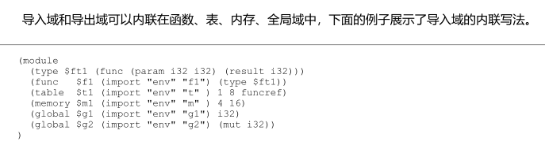

[toc]

# 1. WebAssembly 
## 1.1 wasm 概述 
wasm模块有三种格式，前两种是熟知的wasm和wat格式，而第三种为内存(in-memory)格式，Wasm实现(如解释器)通常会把二进制模块解码为内部形式(即内存格式，比如C/C++/Go结构体)，然后再进行后续处理。
<div align=center>
 </img>
 <div>wasm三种格式之间关系</div>
</div>

从语义上讲，wasm模块从二进制格式到最终被执行可分为3个阶段：解码、验证、执行。解码阶段将二进制模块解码为内存格式；验证阶段对模块进行静态分析，确保模块的结构满足规范要求；执行阶段分为实例化和函数调用两个阶段。
<div align=center>
 </img>
 <div>wasm模块语义执行阶段</div>
</div>

## 1.2 wasm 二进制格式
wasm规范一共定义了12种段，每种段都有一个ID，0-11，除了自定义段，其他段都只能最多出现一次，且出现顺序严格按照ID顺序(是因为很多段与段之间有依赖关系，只有知道前者的信息，后者才能解析，wasm二进制格式设计原则之一就是(One-Pass)一遍完成模块解析、验证和编译，即**可流式处理**)。
<div align=center>
 </img>
 <div>
    </img>
 </div>
 <div>wasm二进制格式总体结构</div>
</div>

**类型段(Type Section) ID : 1**
存储wasm模块用到的所有的类型，大部分是函数类型(函数签名)。
**导入段和导出段(Import and Export Section) ID : 2/7**
存储wasm模块中所有的导入和导出项，多个模块可以通过导入导出项链接在一起。
**函数段和代码段(Function and Code Section) ID : 3/10**
内部函数信息被分开存储在这两个段中，函数段是一个索引表，列出内部函数对应的签名索引；代码段存储内部函数的局部变量信息和字节码。
**表段和元素段(Table and Element Section) ID : 4/9**
表段列出模块内定义的所有表，元素段列出表初始化数据。wasm规范规定模块最多只能导入或定义一张表，表内容和间接函数调用有关。
**内存段和数据段(Memory and Data Section) ID : 5/11**
内存段列出模块内定义的所有内存，数据段列出内存初始化数据。wasm规范规定模块最多只能导入或定义一块内存。
**全局段(Global Section) ID : 6**
该段列出模块内定义的所有全局变量信息，包括值类型、可变性(Mutability)和初始值。
**起始段(Start Section) ID : 8**
该段给出模块的起始函数索引，起始函数主要两个作用，一个是模块加载后进行一些初始化工作，另一个是把模块变成可执行程序。
**自定义段(Custom Section) ID : 0**
该段给编译器等工具使用，可以存放函数名等调试信息，或者其他附加信息。自定义段与wasm语义无关，完全忽略也不会影响执行。

**wasm二进制编码格式**
为了让wasm二进制格式尽可能紧凑，段的字节数、各种索引等整数值都是按照**LEB128**格式编码后存储的。
**LEB128**是一种变长编码格式(variable-length code)。i32编码后可能为1-5byte，i64编码后可能1-10byte。越小的整数，编码后占用字节数就越少。
- 采用小端编码，低位字节在前
- 采用128进制，每7bit为一组，由一字节的第七位承载，空出来的最高位是标志位，1表示还有后续字节，0表示没有。
- LEB128无符号整数编码小于128的整数编码后是他本身，因为只有一字节，首位就为0
- LEB128有两种变体，分别用来编码无符号整数和有符号整数
**LEB128解码** 
<div align=center>
<div>
 </img>
</div>
 <div>LEB128无符号整数解码</div>
<div>
 </img>
</div>
 <div>LEB128有符号整数解码</div>
</div>
判断字节个数、反转字节顺序、去掉最高位字节，只有最后一个字节的处理方式不同，最后一字节的第二高位是符号位，1表示负数，需要最高位全部补1，0为正数，最高位全补0。
放眼整个wasm二进制格式，建立基本类型对照。
<div align=center>
 </img>
 <div>wasm基本类型映射表</div>
</div>

<br>

- Wasm 二进制的每个段都以 1 字节的段 ID 开始
- 段的统一编码格式如下
  ```
  sec: id|byte_count|byte+   # byte_count 有助于跳过某些段
  byte_count: u32            # LEB128 编码的 32 位无符号整数
  ```
- 大部分段可以包含多个项目，以**向量**结构编码，用 `vec<T>` 表示，具体编码方式为：先记录项目数量，然后再依次记录每个项目，**如果项目数为00，则后面项目也不需记录占字节了**。
- 借助向量表示法，段编码格式可简写为 `id|vec<byte>`，**后续部分会多次沿用这种简写格式**。

### 1.2.1 类型段

- 类型段的编码格式
  ```
  type_count: u32            # LEB128 编码的 32 位无符号整数
  type_sec:  0x01|byte_count|vec<func_type>
  vec<func_type>:  type_count|func_type+
  func_type: 0x60|vec<val_type>|vec<val_type> # 第一个 vec 表示参数列表，第二个 vec 表示结果列表
  ```
### 1.2.2 导入段
- 模块可以导出 4 种类型成员：函数、表、内存和全局变量，也可以从其他模块导入这 4 种成员
- 借助导入和导出串联多个模块，完成复杂功能
- 导入段的每项需要给出以下信息
  - 模块名
  - 成员名
  - 具体描述信息
- 导入段的编码格式如下
  ```
  import_sec: 0x02|byte_count|vec<import>
  # module_name 和 member_name 可以是任意 UTF-8 编码的字符串，以 vec<byte> 形式存储
  import:     module_name|member_name|import_desc
  module_name,member_name : length_int | byte+
  # tag={0 ： "函数", 1 : "表", 2 : "内存", 3 : "全局变量"}，作为区分导入的四种类型成员，下面方括号表示只出现其中一个元素
  import_desc: tag|[type_idx, table_type, mem_type, global_type]
  type_idx : u32
  ```

### 1.2.3 函数段
- 编码格式
  ```
  func_sec: 0x03|byte_count|vec<type_idx>
  ```


 ### 1.2.4 表段
- Wasm 规范目前规定模块最多只能定义一张表，且元素类型必须为函数引用（编码为 0x70）
- 除了元素类型，表还需要指定元素数量的限制，包括**必须的下限**和**可选的上限**
- 编码格式如下
  ```
   table_sec: 0x04|byte_count|vec<table_type> # 目前 vec 长度必须为 1
  table_type: 0x70|limits
  # tag为0，则指定下限 tag为1，则上下限都要指定
      limits: tag|min|max?
  ```

### 1.2.4 内存段 
- Wasm 规范规定模块最多只能定义一块内存
- 内存只需指定内存页数限制
- 编码格式如下
  ```
   mem_sec: 0x50|byte_count|vec<mem_type> # 目前 vec 长度只能是 1
  mem_type: limits
    limits: tag|min|max?
  ```

### 1.2.5 全局段 
- 全局段列出模块内定义的所有全局变量，全局项需要指定全局变量的类型（包括值类型和可变性）以及初始值
- 编码格式如下
  ```
   global_sec: 0x06|byte_count|vec<global>
       global: global_type|init_expr
          mut: u32 # (1 可变，0 不可变)
  global_type: val_type|mut
         expr: byte*|0x0B
  ```

### 1.2.6 导出段 
- 导出段列举模块的所有导出成员，只有被导出的成员才能被外界访问
- 编码格式如下
  ```
   export_sec: 0x07|byte_count|vec<export>
       export: name|export_desc
  export_desc: tag|[func_idx, table_idx, mem_idx, global_idx]
  ```

### 1.2.7 起始段 
- 编码格式如下
  ```
  start_sec: 0x08|byte_count|func_idx
  ```

### 1.2.8 元素段 
- 每个元素项包含3部分信息：表索引（初始化哪张表）、表内偏移量（从哪里开始初 始化）、函数索引列表（给定的初始数据）
- 编码格式如下
  ```
  elem_sec: 0x09|byte_count|vec<elem>
      elem: table_idx|offset_expr|vec<func_idx> # 目前 table_idx 只能为 0
  ```

### 1.2.9 代码段
- 存放函数的字节码和方法的局部变量
- 为了节约空间，局部变量信息是压缩后存储的：连续多个相同类型的局部变量会被分为一组，统一记录变量数量和类型
- 注意：每个代码项都以该项所占字节数开头，以便于 Wasm 实现并行处理（例如，验证、分析和编译等）函数字节码
- 编码格式如下
  ```
  code_sec: 0x0A|byte_count|vec<code>
      code: byte_count|vec<locals>|expr
    locals: local_count|val_type
  ```

### 1.2.10 数据段
- 数据段 vs 元素段
  - 元素段存放表初始化数据，数据段存放内存初始化数据
  - 数据项包含三部分信息：内存索引、内存偏移量、初始数据
  - 目前模块最多只能导入或定义一块内存，所以内存索引必须为 0
  - 内存偏移量也由表达式指定
- 编码格式
  ```
  data_sec: 0x0B|byte_count|vec<data>
      data: mem_idx|offset_expr|vec<byte>
  ```

### 1.2.11 自定义段
- 相对于其他段，自定义段有两点不同
  - 不参与模块语义
  - 可以出现在任意非自定义段前后，且次数不限
- Wasm 规范要求自定义段必须以一个字符串开头，标识自定义段
- Wasm 规范在附录 7.4 定义了一个标准的自定义段，名为 `name`，专门用于存放模块名、内部函数名和局部变量名
- 编码格式如下
  ```
  custom_sec: 0x00|byte_count|name|namedata
  namedata: modulenamesubsec?|funcnamesubsec?|localnamesubsec?
  modulenamesubsec: 0x00|byte_count|modulename
  funcnamesubsec: 0x01|byte_count|namemap
  namemap: vec<nameassoc>
  nameassoc: idx|name
  localnamesubsec: 0x02|byte_count|indirectnamemap
  indirectnamemap: vec<indirectnameassoc>
  indirectnameassoc: idx|namemap
  ```

## 1.3 wasm指令集格式
wasm二进制模块中的代码(代码段中的函数代码，全局段中的初始值表达式，元素和数据段中的偏移量表达式)也是由一条一条指令构成。

wasm指令包括两部分信息：
- 操作码(opcode) : 指令的ID，决定指令将执行的操作
- 操作数(operands) : 指令的参数，决定指令执行的结果
  
### 1.3.1 操作码 
wasm指令的操作码固定为一个字节， 因此指令最多有256种。wasm共178条指令，大致分为五类：
- 控制指令，13条
- 参数指令，2条 drop和select
- 变量指令，5条
- 内存指令，25条
- 数值指令，133条
  - 常量指令
  - 测试指令
  - 比较指令
  - 算术运算指令
  - 类型转换指令

<div align=center>
 </img>
 <div>wasm指令集操作码分布图</div>
</div>

**助记符**
- 为了方便开发者书写和理解，wasm 规范为每个操作码定义了助记符（Mnemonic）
- 两条命名规则
  - 类型前缀：数值指令的前缀通常为 `i32`、`i64`、`f32`、`f64`，例如，`i32.load`
  - 符号后缀
    - 如果整数指令的结果不受符号影响，则操作码助记符无特别后缀，例如，`i32.add`
    - 否则指令决定将整数解释为有符号（操作码助记符以 `_s` 结尾）还是无符号（操作码助记符以 `_u` 结尾），两者一般成对出现，例如 `i64.div_s`<->`i64.div_u`

**立即数**
- 为了方便开发者书写和理解，wasm 规范为每个操作码定义了助记符（Mnemonic）
- 两条命名规则
  - 类型前缀：数值指令的前缀通常为 `i32`、`i64`、`f32`、`f64`，例如，`i32.load`
  - 符号后缀
    - 如果整数指令的结果不受符号影响，则操作码助记符无特别后缀，例如，`i32.add`
    - 否则指令决定将整数解释为有符号（操作码助记符以 `_s` 结尾）还是无符号（操作码助记符以 `_u` 结尾），两者一般成对出现，例如 `i64.div_s`<->`i64.div_u`

### 1.3.2 立即数

- 操作数分为两种
  - **静态操作数**
    - 直接编码在指令里，跟在操作码后面
    - 又称为指令的**静态立即参数**（Static Immediate Arguments），简称**立即数**
  - **动态操作数**：在运行时从操作数栈获取。后续部分如无特别说明，操作数特指动态操作数
- 立即数大致分为
  - 数值（包括常量和索引）
  - 内存指令参数
  - 控制指令参数
- 内存指令：内存加载/存储系列指令需要指定内存偏移量和对齐提示
- `block` 和 `loop` 指令
  - wasm 使用 `block`、`loop` 和 `if` 这三种指令定义顺序、循环和分支结构的起点，均以 `end` 指令为终点，形成内部是嵌套的指令序列
  - `br` 系列指令可跳出 `block` 和 `if` 块，或者重新开始 `loop` 块
  - **多返回值提案接受前**，块最多只有一个结果，其类型用一个字节表示（0x7F->`i32`，0x7E->`i64`，0x7D->`f32`，0x7C->`f64`，`0x40`->`void`）
  - **多返回值提案接受后**，块类型被重新解释为 LEB128 有符号整数
    - 负数：-1、-2、-3、-4 和 -64 分别对应限制放开前的 5 种结果
    - 非负数：必须是有效的类型索引（**块类型也存在类型段**）
- `if` 指令类似 `block` 指令，只是需要额外考虑 `else` 分支
- `br_table` 指令
  - `br` 系列指令包括 4 条：`br`、`br_if`、`br_table` 和 `return`
  - `return` 没有立即数
  - `br` 和 `br_if` 指令的立即数是索引类型
  - `br_table` 的立即数包括一个跳转表和默认跳转标签，类似 Go 语言的 `switch`

### 1.3.3 操作数
- wasm 规范实际上定义了一台概念上的**栈式虚拟机**。绝大多数的 wasm 指令都是基于这个栈式虚拟机工作：从栈顶弹出若干个数，进行计算，然后把结果压栈
- 运行时位于栈顶并被指令操纵的数叫做指令的**动态操作数**，简称**操作数**。相应地，这个栈称为**操作数栈**。为了实现控制指令，wasm还需要一个控制栈。
- 由于采用了栈式虚拟机，大部分 wasm 指令（特别是数值指令）都很短，只有一个操作码，因为操作数都已隐含在栈上。

> Python 和 Ruby 等语言也用栈式虚拟机。Lua 和 Android 早期的 Dalvik 虚拟机采用的是寄存器虚拟机，其指令需要包含寄存器索引，所以寄存器虚拟机的指令一般较长。

## 1.4 wasm指令分析

### 1.4.1 数值指令
- 4 条常量指令和8条饱和截断指令
  - `i32.const`/`i64.const` 带 `s32`/`s64` 类型的立即数，使用 LEB128 有符号编码
  - `f32.const`/`f64.const` 带 `f32`/`f64` 类型的立即数，固定占用 4/8 字节
  - `trunc_sat`（操作码 0xFC）：格式为`前缀操作码（0xFC）+ 子操作码`，带一个单字节的子操作码作为立即数
  
- 编码格式
  ```
  i32.const: 0x41|s32
  i64.const: 0x42|s64
  f32.const: 0x43|f32
  f64.const: 0x44|f64
  trunc_sat: 0xfc|byte
  num_instr: opcode
  ```

- 二进制分析
```bash
  wat2wasm 01-numeric.wat 
  wasm-objdump -d 01-numeric.wasm 

  01-numeric.wasm:	file format wasm 0x1

  Code Disassembly:

  000016 func[0]:
  000017: 43 cd cc 44 41             | f32.const 0x1.89999ap+3   # 12.3
  00001c: 43 66 66 36 42             | f32.const 0x1.6cccccp+5   # 45.6
  000021: 92                         | f32.add
  000022: fc 00                      | i32.trunc_sat_f32_s
  000024: 1a                         | drop
  000025: 0b                         | end
```

### 1.4.2 变量指令
- 变量指令共 5 条
  - 3 条用于读写局部变量，立即数是局部变量索引，用的是LEB128无符号整数编码
  - 2 条用于读写全局变量，立即数是全局变量索引
- 编码格式
  ```
   local.get:  0x20|local_idx
   local.set:  0x21|local_idx
   local.tee:  0x22|local_idx
  global.get: 0x23|global_idx
  global.set: 0x24|global_idx
  ```

- 二进制分析
```bash
  wat2wasm 02-variable.wat 
  wasm-objdump -d 02-variable.wasm 

  02-variable.wasm:	file format wasm 0x1

  Code Disassembly:

  000025 func[0]:
  000026: 23 00                      | global.get 0    
  000028: 24 01                      | global.set 1
  00002a: 20 00                      | local.get 0
  00002c: 21 01                      | local.set 1
  00002e: 0b                         | end
```

### 1.4.3 内存指令
- 内存指令共 25 条
  - 14 条加载指令，用于将内存数据加载到操作数栈，有两个立即数：对齐提示和内存偏移量
  - 9 条存储指令，用于将操作数栈顶数据写回内存，有两个立即数：对齐提示和内存偏移量
  - 2 条指令用于获取和拓展内存页数，立即数是内存索引。wasm 规范目前规定模块只能导入或定义一块内存，所以内存索引只起到占位作用，必须为 0
- 编码格式

  ```
  load_instr: opcode|align|offset # align: u32, offset: u32
  store_instr: opcode|align|offset
  memory.size: 0x3f|0x00
  memory.grow: 0x40|0x00
  ```
- 具体例子
  ```
    (module
    (memory 1 8)
    (data (offset (i32.const 100)) "hello")

    (func
      (i32.const 1) (i32.const 2)
      (i32.load offset=100)
      (i32.store offset=100)
      (memory.size) (drop)
      (i32.const 4) (memory.grow) (drop)
    )
  )
  ```

- 二进制分析
  ```bash
  wat2wasm 03-memory.wat 
  wasm-objdump -d 03-memory.wasm 

  03-memory.wasm:	file format wasm 0x1

  Code Disassembly:

  00001c func[0]:
  00001d: 41 01                      | i32.const 1
  00001f: 41 02                      | i32.const 2
  000021: 28 02 64                   | i32.load 2 100
  000024: 36 02 64                   | i32.store 2 100
  000027: 3f 00                      | memory.size 0
  000029: 1a                         | drop
  00002a: 41 04                      | i32.const 4
  00002c: 40 00                      | memory.grow 0
  00002e: 1a                         | drop
  00002f: 0b                         | end
  ```

### 1.4.4 结构化控制指令
- 控制指令共 13 条，包括结构化控制指令、跳转指令、函数调用指令等
- 结构化控制指令有 3 条
  - `block`、`loop` 和 `if`
  - 必须和 `end` （操作码 0x0B）指令搭配，成对出现
  - 如果 `if` 指令有两条分支，则中间由 `else` 指令（操作码 0x05）分隔
  - `end` 和 `else` 也称为**伪指令**
- 编码格式

  ```
  block_instr: 0x02|block_type|instr*|0x0b
   loop_instr: 0x03|block_type|instr*|0x0b
     if_instr: 0x04|block_type|instr*|(0x05|instr*)?|0x0b
   block_type: s32
  ```
- 具体例子
  ```
    (module
    (func (result i32)
      (block (result i32)
        (i32.const 1)
        (loop (result i32)
          (if (result i32)
            (i32.const 2)
            (then (i32.const 3))
            (else (i32.const 4))
          )
        )
        (drop)
      )
    )
  )
  ```

- 二进制分析
  ```bash
  wat2wasm 04-block.wat 
  wasm-objdump -d 04-block.wasm 

  04-block.wasm:	file format wasm 0x1

  Code Disassembly:

  000017 func[0]:
  000018: 02 7f                      | block i32
  00001a: 41 01                      |   i32.const 1
  00001c: 03 7f                      |   loop i32
  00001e: 41 02                      |     i32.const 2
  000020: 04 7f                      |     if i32
  000022: 41 03                      |       i32.const 3
  000024: 05                         |     else
  000025: 41 04                      |       i32.const 4
  000027: 0b                         |     end
  000028: 0b                         |   end
  000029: 1a                         |   drop
  00002a: 0b                         | end
  00002b: 0b                         | end
  ```

### 1.4.5 跳转指令
- 共 4 条指令如下

  | 指令       | 操作码 | 作用                                 | 立即数                       |
  | ---------- | ------ | ------------------------------------ | ---------------------------- |
  | `br`       | 0x0C   | 无条件跳转                           | 目标标签索引                 |
  | `br_if`    | 0x0D   | 有条件跳转                           | 目标标签索引                 |
  | `br_table` | 0x0E   | 查表跳转                             | 目标标签索引表和默认标签索引 |
  | `return`   | 0x0F   | 直接跳出最外层循环并导致整个函数返回 | N/A                          |
  目标标签索引表: vec<label>
  默认标签索引: default # u32类型

- 具体例子
  ```
    (module
    (func
      (block
        (block
          (block
            (br 1)
            (br_if 2 (i32.const 100))
            (br_table 0 1 2 3)
            (return)
          )
        )
      )
    )
  )
  ```

- 二进制分析
  ```bash
  wat2wasm 05-break.wat 
  wasm-objdump -d 05-break.wasm 

  05-break.wasm:	file format wasm 0x1

  Code Disassembly:

  000016 func[0]:
  000017: 02 40                      | block
  000019: 02 40                      |   block
  00001b: 02 40                      |     block
  00001d: 0c 01                      |       br 1
  00001f: 41 e4 00                   |       i32.const 100
  000022: 0d 02                      |       br_if 2
  000024: 0e 03 00 01 02 03          |       br_table 0 1 2 3
  00002a: 0f                         |       return
  00002b: 0b                         |     end
  00002c: 0b                         |   end
  00002d: 0b                         | end
  00002e: 0b                         | end
  ```

### 1.4.6 函数调用指令
- 两种函数调用方式
  - `call`（操作码 0x10）进行直接函数调用，函数索引由立即数指定
  - `call_indirect`（操作码 0x11）进行间接函数调用，函数签名的签名由立即数指定，到运行时才能知道具体调用的函数
- 编码格式

  ```
     call_instr: 0x10|func_idx
  call_indirect: 0x11|type_idx|0x00
  ```
- 间接函数调用指令需要查表才能完成，由第 2 个立即数指定查哪张表。目前由于模块最多只能导入或定义一张表，所以这个立即数只起到占位作用，必须为 0
- 二进制分析
  ```bash
  wat2wasm 06-call.wat 
  wasm-objdump -d 06-call.wasm 

  06-call.wasm:	file format wasm 0x1

  Code Disassembly:

  00002b func[0]:
  00002c: 10 00                      | call 0
  00002e: 41 02                      | i32.const 2
  000030: 11 01 00                   | call_indirect 1 0
  000033: 0b                         | end
  ```

### 1.4.6 其他指令
前面章节没有介绍指令和表达式解码逻辑，包括
- 全局项的初始化表达式
- 元素和数据项的偏移量表达式
- 代码项的字节码

其编码格式如下

```
global: global_type|init_expr
  elem: table_idx|offset_expr|vec<func_idx>
  data: mem_idx|offset_expr|vec<byte>
  code: byte_count|vec<locals>|expr
  expr: instr*|0x0b
```

##### 1.1.1.1 wabt观察二进制格式
```bash
// dump wasm模块所有信息
wasm-objdump -x *.wasm

```

## 1.5 wasm验证
很多高级语言的虚拟机依然保留goto或者jump指令。比如java虚拟机有goto，lua虚拟机有jump。但是允许任意跳转的一个问题是，字节码验证麻烦，所以wasm彻底废弃了任意跳转指令，只支持结构化控制指令和受限制的跳转指令，验证代码就很简单了。
wasm的三条控制指令，block、loop、if都必须和end伪指令成对出现，具有良好的结构特征，因此被称为结构化控制指令。
### 1.5.1 跳转标签
wasm的受限跳转指令只能够跳转到结构化控制指令所定义的目标处，这些跳转目标称为跳转标签。block和if，是跳转到指令的结尾处，loop指令跳转目标位于指令的开始处。
<div align=center> 
</img>   
</div>

if指令实际上是冗余的，可以通过block指令和条件跳转指令br_if实现同样的结果。
loop指令并不能自动形成循环，必须要和跳转指令配合使用，如果没有跳转指令配合，那就和block没有区别。
**跳转指令的特点** 
- 不能跳出函数
- 只能跳出外围控制块，不能跳到平行的控制块里

### 1.5.2 跳转标签索引
跳转指令的立即数指定了跳转标签索引，跳转标签索引是相对的。`0`表示该指令所在的控制块定义的跳转标签，`1`表示往外一层控制块定义的跳转标签。
<div align=center> 
</img>   
</div>
上面这个图可以看到跳转指令可以直接跳转到函数末尾，其实还有个`return`指令能更直接跳转到函数末尾。
为了便于程序员编写，WAT允许给标签分配标识符，这样可以直接在跳转指令中通过函数名字来指定跳转目标。
<div align=center> 
</img>   
</div>
wasm给了四条跳转指令：`br`无条件跳转，`br_if`条件跳转，`br_table`查表跳转，`return`直接跳出最外层循环(函数返回)。

### 1.5.3 块类型
2020年四月，多返回值提案被并入wasm规范，这个提案放开了此前wasm模块存在的三个限制：
- 函数最多只能有一个返回值
- 控制块不能有参数
- 控制块最多只能产生一个结果

这个提案通过后，结构化控制指令的语义和函数调用更像了：会消耗操作数栈顶指定数目和类型的参数(这种消耗不是弹出栈，而是会检查栈中有没有这些参数)，留下指定数目和类型的结果。换句话说，结构化控制指令就像一个内联函数。此结构化控制指令的类型叫做块类型。
<div align=center> 
</img>   
</div>

**指令块与无参数的函数很相似，体现在：**
- 从逻辑上，指令块拥有自己独立的栈帧
- 指令块可以有返回值，当指令块执行完毕时，其栈状态必须与它声明的返回值相匹配

WebAssembly使用这种设计方式，是为了维持栈平衡。在条件分支if和循环分支loop构成的指令块中，指令块的执行是动态的，如果指令块没有独立的栈，将使合法性检查变得困难。指令块函数化的设计，在简化合法性检查的同时，保持了整个体系结构的优雅。
为指令块声明返回值的方法与函数一样，使用result属性声明。示例：
```wasm
block (result i32)
  i32.const 42
end      ;;get 42 on the stack
```
上述指令执行完毕后，栈上增加了一个i32的值，这与调用了一个无参数且返回值为i32的函数相比，对栈的影响是一致的。

**br指令**
br指令进行无条件跳转，带有一个立即数，指定跳转标签索引。
<div align=center> 
</img>   
</div>
br指令执行前操作数栈如下：
<div align=center> 
</img>   
</div>
br指令执行后，控制栈顶的三个控制帧被弹出，与这三个控制帧对应的操作数栈也应该被清理。注意，由于标签索引`2`指向的控制块有一个结果，所以应该先从栈顶弹出一个操作数暂存起来，对栈进行清理后，再把暂存的结果压栈。

## 1.6 wasmtime c api
wasmtime的C内嵌API，可以帮助C语言与wasm做交互。[API文档](https://docs.wasmtime.dev/c-api/)
wasmtime的C语言API，分布在三个头文件中`wasmtime.h`,`wasi.h`,`wasm.h`中。`wasmtime.h`头文件包含所有其他头文件，主要使用它。`wasm.h`头文件直接来自WebAssembly/wasm-c-api存储库，但是存储库里没有文档，wasmtime文档里给出了详细文档。
[wasmtime C API实例](https://docs.wasmtime.dev/examples-c-hello-world.html)这里提供了很多实例。
### 1.6.1 部分数据结构介绍
`wasmtime_store_t`用来存储wasm对象们。一个store相当于一个wasm运行容器，包含运行某个wasm模块所需要的各种对象，如：导入导出对象等(参考实例文档中，`Hello, world!`一节，对hello函数的创建，其实就是在store中构建了一个export的hello函数，供hello.wasm模块import)。store中的对象是用整数句柄索引的而不是迭代器。`wasmtime_store_context`获取store的`wasmtime_context_t`类型的context，很多C API都需要此context。

## 1.7 wat格式补充
wat使用的S-表达式源自Lisp语言，特别适合描述类似抽象语法树的树形结构。wat编译器会用**后序遍历**将S-表达式展开，取消折叠。
wat没有自定义域，没法描述自定义段。
为了便于编写，wat提供了很多内联写法。函数域、表域、内存域、全局域可以内联导入或导出域，表域可以内联内存元素域，内存域可以内联数据域，函数域和导入域可以内联类型域。 
wat中的注释有两种，单行注释以`;;`开始，跨行注释以`(;;`开始，`;;)`结束。


**全局变量可以指定变量是可变的还是不可变的，同时也可以起名字。** 
<div align=center> 
</img>   
</div>

**内存可以在WebAssembly内部创建**，语法：
```wasm
(memory initial_size)
```
其中，initial_size为内存的初始容量，单位为页。
新建内存中所有字节的默认初值都是0，可以用数据段Data来为它赋自定义的值。示例：
```wasm
(module
  (memory 1)
  (data (offset i32.const 0) "hello")
)
```
实例化时，(data (offset i32.const 0) "hello")将在偏移0处存入字符串"hello"的字节码，(offset i32.const 0)表示起始偏移为0，语句中的offset对象是可省略的，省略时默认偏移为0。
多个data段之间可以重叠，在重叠部分，后声明的值会覆盖先声明的值。示例：
```wasm
(module
  (memory 1)
  (data (i32.const 0) "hello")
  (data (i32.const 4) "u")
)
```
无论运行在哪种系统上，WebAssembly固定使用小端序。下列语句将在偏移为12处存入32位整数0x00123456：
```wasm
(data (i32.const 12) "\56\34\12\00")
```


### 1.7.1 内联举例
下面这个图，导入了个函数，此函数需要用到一个类型，下面这样写是当此导入类型被多个函数使用时省代码，当这个类型只被一个函数使用时，可以直接在导入域中内联。
<div align=center> 
</img>   
</img>  
</div>

<div align=center> 
</img>   
</div>

**函数类型的内联以及函数的参数和局部变量可以起名字，提高可读性**：
<div align=center> 
</img>   
</img>  
</div>

### 1.7.2 指令折叠
对普通指令进行三步调整可以获得折叠指令：1.用圆括号把指令包起来。2.结构化控制指令，把end去掉，if指令略麻烦。3.如果某条指令和它前面的几条指令从逻辑上可以看为一组操作，则把前几条指令折叠进该指令。


## 1.8 wasm优化
### 1.8.1 Liftoff编译器
V8引擎在v6.9引入了一个全新的wasm baseline编译器————Liftoff。目前在桌面平台是默认开启的。
对于大型的wasm应用，它们的体积一般很大，30-40mb，因为编译时间是随着包的大小线性增长的，所以这些大型应用要花费相当多时间在启动上。长的有30多秒。
为什么Js启动就很快呢，因为wasm需要保证一个预期性能，所以V8会对wasm代码提前编译，这样就防止执行时还给编译带来的性能损耗。
现存的编译管线**TurboFan**，V8之前对wasm编译是基于TurboFan的，他一开始是为Js和asm.js设计的优化编译器。内部使用一种基于图的IR，将wasm代码转换为TurboFan的IR。
**Liftoff**
Liftoff的目标是通过尽快生成可执行代码来缩减启动时间，速度之上，质量其次，毕竟**hot**的代码还会被TurboFan再编译一次。Liftoff在对wasm字节码的单次处理中，规避了构建IR的过程。wasm的decoder通过回调方式与TurboFan后续的那些步骤进行交互，Liftoff在解码和校验函数的时候执行，再结合wasm的流式处理的特型，能够让V8在下载代码的同时编译wasm为机器码。
<div align=center> 
</img>   
</div>

#### 1.8.1.1 Liftoff的代码生成
Liftoff

### 1.8.2 SpiderMonkey编译器
SpiderMonkey是Firefox中使用的Js和wasm引擎。Cranelift是在SpiderMonkey中使用的用于提高ARM的32和64位平台生成的wasm代码质量的技术。
SpiderMonkey现在有两个wasm编译器，第一层和第二层编译器使用lonMonkey Jit编译器的Js优化和寄存器分配。Cranelift目标是取代基于lonMonkey的tier2编译器，仅用于wasm，他将wasm字节码直接转换为自己的IR，并生成二进制机器码，而不依赖SpiderMonkey。
<div align=center> 
</img>
<div>没使用Cranelift的时候，lonMonkey负责MIR、LIR</div>   
</div>

<div align=center> 
</img>
<div>使用Cranelift的时候，直接取代lonMonkey的LIR部分，并直接生成机器码</div>   
</div>

### 1.8.3 V8引擎介绍
V8是Google开源的采用c++编写的高性能Js和wasm引擎，应用在Chrome和Node.js等中。V8可以独立运行，也可以嵌入到任何C++程序中。
#### 1.8.3.1 V8的组成
- Parser 解析器，负责将源代码解析成AST
- Ignition 解释器，将AST转换成字节码并执行，同时会标记热点代码
- TurboFan 编译器，将热点代码编译成机器码并执行
- Orinoco 垃圾回收器，负责进行内存空间回收

<div align=center> 
</img>
</div>


### 1.9 wasm虚拟机和解释器
#### 1.9.1 操作数栈
参数指令drop和select，这两条指令对栈顶操作数的类型要求宽松，其他指令都严格限制了栈顶操作数类型。
**drop:	从栈顶弹出1个值，无视类型**
**select:依次从栈顶弹出1个i32的值c、1个值b、1个值a，若c不为0，则将a压入栈，否则将b压入栈。a和b必须为同一种类型。**

函数调用的栈初始化，函数栈帧在构造的时候，参数和局部变量按顺序入栈，而且参数是**从左到右入栈**。
<div align=center> 
</img>
</img>
</div>

##### 1.9.1.1 控制栈
控制指令的参数和普通函数的参数是不同的。函数的参数理论上说并不在栈上，要通过专门的局部变量来操作(但是在函数调用的时候已经把参数压栈了，只是无法从栈上获取，只能改用局部变量操作罢了)。而控制指令的参数就在栈上，无法通过局部变量来操作。控制指令是没有自己的局部变量的。

#### 1.9.2 内存
wasm内存是一个现行的字节数组，可以按照偏移量读写任意字节。数值在wasm内存中按小端方式存储。wasm内存是无类型的，没办法对其进行类型检查，在运行时能做的检查只是确保不越界。
wasm内存可以在限制范围内动态增长，增长必须以页为单位，一页64kb。内存的总页数不能超过65536，也就是4G。
memory.size指令把内存当前页数以i32类型压栈，所带立即数只能为0，因为目前只有一块内存。
memory.grow将内存增长若干页，顺便获取增长前的页数。先从栈顶弹出i32类型的数代表增长多少页，增长成功后，将原内存页数以i32类型压栈，否则压-1。所带立即数也只能为0.
对其方式align和内存偏移量offset，其中对齐方式是2的指数：0表示1字节对齐，1表示2字节对齐，2表示四字节对齐等。地址的对齐方式只起提示作用，目的是帮助JIT/AOT编译器生成更优化的机器代码，对实际结果没影响。

### 1.10 wasm runtimes
#### 1.10.1 WAMR
WAMR是一个轻量级standalone wasm runtime，大致分为以下四类
- iwasm VM core 用来执行wasm应用，支持解释器模式，aot模式和jit模式
- wamrc AOT compiler 用来编译wasm文件到AOT文件来获得更高性能和更小执行体量，在iwasm中执行。
- application framework 和 对wasm应用支持的API们
- dynamic management wasm应用

##### 1.10.1.1 application framework
此framework支持像多wasm应用交互，timers等功能。
- Timer
- Micro-service module(request/response)
  - 可以搭建客户端wasm app和服务端wasm app。
- Pub/sub model
  - 可以实现事件驱动的wasm应用交互
- Sensor API iot传感器api
- Connection API TCP网络连接api
- GUI API 基于2D图像库 LVGL

# 2. Python 
## 2.1 Python源码剖析
### 2.1.1 对象模型
**一切皆对象**
Python是一门面向对象语言，实现了一个完整的面向对象系统，在Python的对象模型世界，**一切皆对象**，**基本类型也是对象**，python所有基本类型内部均由对象实现。一个整数，一个字符串都是对象。
python中的类型也是一种对象，称为**类型对象**。
```python
>>>int
<class 'int'>
```
通过整数类型实例化可以得到一个整数对象，称为**实例对象**
```python
>>>int('1024')
1024
```
面向对象理论中的“类”和“对象”在python内部都是通过对象实现的，这是python最大的特点。
<div align=center> 
</img>   
</div>

#### 2.1.1.1 类型、对象体系
##### 2.1.1.1.1 类型体系
**内置类型**
a是一个整数对象(实例对象)，其类型是整数类型(类型对象)：
```python
>>> a = 1
>>> type(a)  # 实例对象
<class 'int'>
>>> isinstance(a, int)  # 实例对象
True
```  
整数类型的类型则是：  
```python
>>> type(int)
<class 'type'>
```
type，即**类型的类型**，这个类型特殊，它的实例对象还是**类型对象**。
还有一个特殊类型`object`，是所有类型的基类：
```python
>>> issubclass(int, object)
True
```  
<div align=center> 
</img>   
</div>

**自定义类型**
```python
class Dog(object):

  def yelp(self):
    print('woof')
```
dog实例类型为Dog：
```python
>>> dog = Dog()
>>> type(dog)
<class '__main__.Dog'>
```
Dog类的类型自然也是type，其基类是object：
```python
>>> type(Dog)
<class 'type'>
>>> issubclass(Dog, object)
True
```
<div align=center> 
</img>   
</div>  
给出一Dog类子类Sleuth类，类型系统如下图：
<div align=center> 
</img>   
</div>
<br>
现在来讨论type和object这两个特殊的类型。
object是所有类型的基类，本质上也是一种类型，所以其类型必然是type。而type是所有类型的类型，其类型还是它自己。

```python
>>> type(object)
<class 'type'>
>>> type(type)
<class 'type'>
```
object是所有类型的基类，理论上也是type的基类(__base__):
```python
>>> type.__base__
<class 'object'>
```
<div align=center> 
</img>   
</div>
即所有类型的基类收敛于object，所有的类型的类型都是type，包括type它自己。

##### 2.1.1.1.2 变量只是名字
```python
>>> a = 1
>>> id(a)
4302704784
```
定义一个变量a，通过id内建函数取出其“地址”
定义另一个变量b，以a赋值，并取出b的“地址”
```python
>>> b = a
>>> id(b)
4302704784
```
a和b的地址相同，在python中，一切皆对象，整数也是如此，**变量只是一个与对象关联的名字**。python内部，变量只是一个名字，保存着指向实例对象的指针，进而与其绑定。变量赋值只拷贝指针，并不拷贝指针指向的对象。
<div align=center> 
</img>   
</div>

##### 2.1.1.1.3 可变对象与不可变对象
```python
>>> a = 1
>>> id(a)
4302704784
>>> a += 1
>>> id(a)
4302704816
```
变量a自增1之后对象直接变了(因为地址变了，变量名指向的不是一个对象了)，原因要从**可变对象**，与**不可变对象**说起。**可变对象**在对象创建后，其值可以进行修改；而**不可变对象**在对象创建后整个生命周期，其值都不可修改。
python中，整数类型是不可变类型，整数对象是不可变对象。修改整数对象时，python将以新数值创建一个新对象，并进行变量名绑定，就对象若无其他引用，将被释放。每次修改整数引发的创建新对象，释放旧对象的效率问题，将由**小整数池**等手段优化。
<div align=center> 
</img>   
</div>

可变对象典型例子是**列表(list)**:

```python
>>> l = [1, 2]
>>> id(l)
4385900424
>>> l.append(3)
>>> id(l)
4385900424
```
list添加元素后，地址没变。列表对象内部维护了一个**动态数组**，存储元素对象的指针：
<div align=center> 
</img>   
</div>

##### 2.1.1.1.4 定长对象与变长对象
标准库sys模块提供了一个`getsizeof`函数查看对象大小
```python
>>> import sys
>>> sys.getsizeof(1)
28
>>> sys.getsizeof(100000000000000000)
32
>>> sys.getsizeof(100000000000000000000000000000000000000000000)
44
```
整数对象的大小与其数值有关，像这样**大小不固定**的对象称为**变长对象**
python采用类似C++中**大整数类**的思路实现整数对象————串联多个普通32为整数，以便支持更大数值范围。**整数对象头部额外存储一些信息，记录对象用了多少个32位整数。**
```python
>>> sys.getsizeof('a')
50
>>> sys.getsizeof('abc')
52
```
字符串对象也是变长对象。
定长对象————浮点数对象float：
```python
>>> sys.getsizeof(1.)
24
>>> sys.getsizeof(1000000000000000000000000000000000.)
24
```
浮点数是由一个double实现，就算表示很大的数，浮点数对象大小也不变。64位的double牺牲了精度，来表示大范围。
```python
>>> int(1000000000000000000000000000000000.)
999999999999999945575230987042816
```

| 类别       | 特点               |
| ---------- | ------------------ |
| 可变对象   | 对象创建后可以修改 |
| 不可变对象 | 对象创建后不可修改 |
| 定长对象   | 对象大小固定       |
| 变长对象   | 对象大小不固定     |

#### 2.1.1.2 深入探究对象
**PyObject，对象的基石**
在python内部，对象都由`PyObject`结构体表示，对象引用则是指针`PyObject *`。PyObject结构体定义于头文件`object.h`，路径为`Include/object.h`。
```cpp
typedef struct _object {
    _PyObject_HEAD_EXTRA
    Py_ssize_t ob_refcnt;  // 引用计数
    struct _typeobject *ob_type;  // 类型指针
} PyObject;
```
**类型指针**指向对象的类型对象，类型对象**描述实例对象的数据及行为**
_PyObject_HEAD_EXTRA 宏的定义，同样在 Include/object.h 头文件内：
```cpp
#ifdef Py_TRACE_REFS
/* Define pointers to support a doubly-linked list of all live heap objects. */
#define _PyObject_HEAD_EXTRA            \
    struct _object *_ob_next;           \
    struct _object *_ob_prev;

#define _PyObject_EXTRA_INIT 0, 0,

#else
#define _PyObject_HEAD_EXTRA
#define _PyObject_EXTRA_INIT
#endif
```
_PyObject_HEAD_EXTRA宏展开为两个指针，用来实现双向链表，双向链表用于跟踪所有**活跃堆对象**，不深入介绍。

对于**变长对象**，需要在PyObject基础上加入长度信息，即PyVarObject：
```cpp
typedef struct {
    PyObject ob_base;
    Py_ssize_t ob_size; /* Number of items in variable part */
} PyVarObject;
```
<div align=center> 
</img>   
</div>

**具体对象，视其大小是否固定，需要包含头部PyObject或PyVarObject。**头文件里准备了两个宏，方便其他对象使用：
```cpp
#define PyObject_HEAD          PyObject ob_base;
#define PyObject_VAR_HEAD      PyVarObject ob_base;
```
例如，对于大小固定的**浮点对象**，只需在PyObject头部基础上，用一个double加以实现：
```cpp
typedef struct {
    PyObject_HEAD

    double ob_fval;
} PyFloatObject;
```
对于大小不固定的**列表对象**，需在PyVarObject头部基础上，加一个动态数组实现，数组存储列表包含的对象，即PyObject指针：
```cpp
typedef struct {
    PyObject_VAR_HEAD  // PyVarObject中ob_size指示列表当前长度

    PyObject **ob_item;
    Py_ssize_t allocated;
} PyListObject;
```
<div align=center> 
</img>   
</div> 
**两个初始化对象头部的宏定义**

```cpp
#define PyObject_HEAD_INIT(type)        \
    { _PyObject_EXTRA_INIT              \
    1, type },    // 定长

#define PyVarObject_HEAD_INIT(type, size)       \
    { PyObject_HEAD_INIT(type) size },    //变长
```

**PyTypeObject，类型的基石**
描述对象支持的操作和对象所需内存空间的**元信息**，由一个独立实体保存，与对象**所属类型**密切相关。
PyObject中的ob_type指针，指向一个类型对象，元信息存在其中。PyTypeObject也在 Include/object.h 中定义。
```cpp
typedef struct _typeobject {
    PyObject_VAR_HEAD  // PyTypeObject也是个变长对象，其也含变长对象头部
    const char *tp_name; /* For printing, in format "<module>.<name>" */
    Py_ssize_t tp_basicsize, tp_itemsize; /* For allocation */

    /* Methods to implement standard operations */
    destructor tp_dealloc;
    printfunc tp_print;

    getattrfunc tp_getattr;
    setattrfunc tp_setattr;

    // ...
    /* Attribute descriptor and subclassing stuff */
    struct _typeobject *tp_base;

    // ......
} PyTypeObject;
```
PyTypeObject是一个变长对象，包括变长对象头部。专有字段有：
- 类型名称 ，即 tp_name 字段；
- 类型的继承信息，例如 tp_base 字段指向基类对象；
- 创建实例对象时所需的 内存信息 ，即 tp_basicsize 和 tp_itemsize 字段；
- 该类型支持的相关 操作信息 ，即 tp_print 、 tp_getattr 等函数指针；

PyTypeObject就是**类型对象**在Python中的表现形式，对应**类**的概念。
```python
>>> float
<class 'float'>
>>> pi = 3.14
>>> e = 2.71
```
对于`pi = 3.14`代码中各个对象在内存中形式如下图：
<div align=center> 
</img>   
</div>  
由于浮点**类型对象**全局唯一，在 C 语言层面作为一个全局变量静态定义即可，Python 的确就这么做。 浮点类型对象就藏身于 Object/floatobject.c 中， PyFloat_Type 是也：

```cpp
PyTypeObject PyFloat_Type = {
    PyVarObject_HEAD_INIT(&PyType_Type, 0)  // ob_type指向PyType_Type，也是个静态全局变量，类型的类型即type的对象
    "float",
    sizeof(PyFloatObject),
    0,
    (destructor)float_dealloc,                  /* tp_dealloc */

    // ...
    (reprfunc)float_repr,                       /* tp_repr */

    // ...
};
```

**PyType_Type，类型的类型**
PyType_Type 在 Object/typeobject.c 中定义：
```cpp
PyTypeObject PyType_Type = {
    PyVarObject_HEAD_INIT(&PyType_Type, 0)
    "type",                                     /* tp_name */
    sizeof(PyHeapTypeObject),                   /* tp_basicsize */
    sizeof(PyMemberDef),                        /* tp_itemsize */
    (destructor)type_dealloc,                   /* tp_dealloc */

    // ...
    (reprfunc)type_repr,                        /* tp_repr */

    // ...
};
```

内建类型和自定义类对应的PyTypeObject对象都是通过PyType_Type创建的。type作为**元类型**，可以被用来实现很多高级操作。
<div align=center> 
</img>   
</div>  

**PyBaseObject_Type，类型之基**
Object/object.c中：
```cpp
if (PyType_Ready(&PyFloat_Type) < 0)
    Py_FatalError("Can't initialize float type");
```
PyType_Ready会对创建好的PyFloat_Type静态定义后进行进一步加工，将tp_base字段初始化成PyBaseObject_Type：
```cpp
int
PyType_Ready(PyTypeObject *type)
{
    // ...

    base = type->tp_base;
    if (base == NULL && type != &PyBaseObject_Type) {
        base = type->tp_base = &PyBaseObject_Type;
        Py_INCREF(base);
    }

    // ...
}
```
PyBaseObject_Type内容：
```cpp
PyTypeObject PyBaseObject_Type = {
    PyVarObject_HEAD_INIT(&PyType_Type, 0)
    "object",                                   /* tp_name */
    sizeof(PyObject),                           /* tp_basicsize */
    0,                                          /* tp_itemsize */
    object_dealloc,                             /* tp_dealloc */

    // ...
    object_repr,                                /* tp_repr */
};
```
**完整的对象图**
<div align=center> 
</img>   
</div> 

#### 2.1.1.3 对象的生命周期
**C API**
Python提供了两种类型C API，让用户可以从C环境中与其交互。Python内部也大量使用这些API。分为**泛型API**和**特型API**。
**泛型API**
泛型API与类型无关，属于**抽象对象层**(Abstract Object Layer AOL)。这类API参数为`PyObject *`,可处理任意类型的对象，API内部根据对象类型区别处理。
```cpp
int
PyObject_Print(PyObject *op, FILE *fp, int flags)
```
以此对象打印函数为例，第一个参数为待打印对象，可以为任意类型对象，因此参数为`PyObject *`,Python内部一般都是通过`PyObject *`引用对象，以达到泛型化的目的。
```cpp
// 打印浮点对象
PyObject *fo = PyFloatObject_FromDouble(3.14);
PyObject_Print(fo, stdout, 0);

// 打印整数对象
PyObject *lo = PyFloatObject_FromLong(100);
PyObject_Print(lo, stdout, 0);
```

**特型API**
**特型API**与类型相关，属于**具体对象层(Concrete Object Layer COL)**。这类API只能作用于某种类型的对象，如浮点对象PyFloatObject。python内部为每一种内置对象提供了这样一组API，如下：
```cpp
PyObject *
PyFloat_FromDouble(double fval)  // 创建一个浮点对象，并初始化为定值fval
```

##### 2.1.1.3.1 对象的创建
前面提到的**元数据**里，包括**对象如何创建**的信息。
python对**内建对象**是非常清晰的，可以直接通过C API来创建对象，像上面的`PyFloat_FromDouble`一样。
对于自定义类型(Dog)，只能通过Dog所对应的类型对象创建实例对象，分配多少内存，如何初始化，都存在类型对象里。
即：
- 通过 C API ，例如 PyFloat_FromDouble ，多用于内建类型；
- 通过类型对象，例如 Dog ，多用于自定义类型，也可用于内建类型；
  - 所以第二种更通用

```python
>>> pi = float('3.14')
```
float类型对象可以被调用，实例化了个浮点数pi，可以被调用的对象就是**可调用对象**。
由于类型对象保存着实例对象的元信息，float类型对象的类型为type，在`PyType_Type` 中，有个`tp_call`函数指针字段。
```cpp
PyTypeObject PyType_Type = {
    PyVarObject_HEAD_INIT(&PyType_Type, 0)
    "type",                                     /* tp_name */
    sizeof(PyHeapTypeObject),                   /* tp_basicsize */
    sizeof(PyMemberDef),                        /* tp_itemsize */

    // ...
    (ternaryfunc)type_call,                     /* tp_call */

    // ...
};
```
`float('3.14')`在C层面等价于：
```cpp
PyFloat_Type.ob_type.tp_call(&PyFloat_Type, args, kwargs)
// 即
PyType_Type.tp_call(&PyFloat_Type, args, kwargs)
```
`tp_call`函数在Include/typeobject.c中：
```cpp
static PyObject *
type_call(PyTypeObject *type, PyObject *args, PyObject *kwds)
{
    PyObject *obj;

    // ...
    obj = type->tp_new(type, args, kwds);   // 调用类型对象tp_new函数指针申请内存
    obj = _Py_CheckFunctionResult((PyObject*)type, obj, NULL);
    if (obj == NULL)
        return NULL;

    // ...
    type = Py_TYPE(obj);
    if (type->tp_init != NULL) {
        int res = type->tp_init(obj, args, kwds);  // 必要时调用类型对象 tp_init 函数指针对对象进行初始化
        if (res < 0) {
            assert(PyErr_Occurred());
            Py_DECREF(obj);
            obj = NULL;
        }
        else {
            assert(!PyErr_Occurred());
        }
    }
    return obj;
}
``` 
**创建过程图**
<div align=center> 
</img>   
</div> 

- 调用 float ， Python 最终执行其类型对象 type 的 tp_call 函数；
- tp_call 函数调用 float 的 tp_new 函数为实例对象分配 内存空间 ；
- tp_call 函数必要时进一步调用 tp_init 函数对实例对象进行 初始化 ；

##### 2.1.1.3.2 对象的多态性
python创建一个对象，比如PyFloatObject，此后python内部会通过一个`PyObject *`变量来保存和维护这个对象，而不是通过`PyFloatObject *`。使用PyObject保存和维护对象，可以实现更抽象的上层逻辑，而不用关心具体对象细节。
比如有个计算对象hash值的接口
```cpp
Py_hash_t
PyObject_Hash(PyObject *v);
```
对象类型不同，hash计算方法也不同。如何解决不同呢？
```cpp
Py_hash_t
PyObject_Hash(PyObject *v)
{
    PyTypeObject *tp = Py_TYPE(v);
    if (tp->tp_hash != NULL)
        return (*tp->tp_hash)(v);
    /* To keep to the general practice that inheriting
    * solely from object in C code should work without
    * an explicit call to PyType_Ready, we implicitly call
    * PyType_Ready here and then check the tp_hash slot again
    */
    if (tp->tp_dict == NULL) {
        if (PyType_Ready(tp) < 0)
            return -1;
        if (tp->tp_hash != NULL)
            return (*tp->tp_hash)(v);
    }
    /* Otherwise, the object can't be hashed */
    return PyObject_HashNotImplemented(v);
}
```
函数先通过 ob_type 指针找到对象的类型 (第 4 行)； 然后通过类型对象的 tp_hash 函数指针，调用对应的哈希值计算函数 (第 6 行)。也就说根据对象类型的不同，调用不同的函数版本，这就是**多态性**。
##### 2.1.1.3.3 对象的行为
`PyTypeObject`结构体还定义了很多函数指针，用于表现多态性。这些都对应着**实例对象**在运行时的行为。
而且不同对象也有一些共性，比如整数对象和浮点对象都支持加减乘除等**数值型操作**。元组对象tuple，列表对象list，都支持**下标操作**等。
根据对象行为，可以对对象进行分类如下：
<div align=center> 
</img>   
</div> 
python为每个类别都定义了一个**标准操作集**

- PyNumberMethods 结构体定义了 数值型 操作；
- PySequenceMethods 结构体定义了 序列型 操作；
- PyMappingMethods 结构体定义了 关联型 操作；

只要**类型对象**提供相关**操作集**，**实例对象**便具备对应的**行为**。操作集字段如下：
```cpp
typedef struct _typeobject {
    PyObject_VAR_HEAD
    const char *tp_name; /* For printing, in format "<module>.<name>" */
    Py_ssize_t tp_basicsize, tp_itemsize; /* For allocation */

    // ...
    /* Method suites for standard classes */

    PyNumberMethods *tp_as_number;
    PySequenceMethods *tp_as_sequence;
    PyMappingMethods *tp_as_mapping;

    // ...
    /* Functions to access object as input/output buffer */
    PyBufferProcs *tp_as_buffer;

    // ...
} PyTypeObject;
```
以`float`为例，PyFloat_Type相关字段初始化如下：
```cpp
static PyNumberMethods float_as_number = {
    float_add,          /* nb_add */   // 都是函数指针
    float_sub,          /* nb_subtract */
    float_mul,          /* nb_multiply */
    float_rem,          /* nb_remainder */
    float_divmod,       /* nb_divmod */
    float_pow,          /* nb_power */
    // ...
};

PyTypeObject PyFloat_Type = {
    PyVarObject_HEAD_INIT(&PyType_Type, 0)
    "float",
    sizeof(PyFloatObject),

    // ...
    &float_as_number,                           /* tp_as_number */
    0,                                          /* tp_as_sequence */
    0,                                          /* tp_as_mapping */

    // ...
};
```
只有`tp_as_number`非空，所以float对象只支持数值型操作。

##### 2.1.1.3.4 引用计数
python对象创建后引用计数设为1：
```python
>>> a = 3.14
>>> sys.getrefcount(a)
2
```
对象作为函数参数传递，需要将引用计数加一，避免对象被提前销毁，函数返回时，再将引用计数减一。
```python
>>> del a # 此时a被删除，引用计数变为0
```
涉及引用计数调整的操作：
- 容器操作；
- 变量赋值；
- 函数参数传递；
- 属性操作；

当一个对象引用计数为0，python便调用对象对应的析构函数销毁对象，但对象内存不一定会回收。为了提高内存分配效率，python会为一些常用对象维护**内存池**，对象回收后进入内存池，以便下次使用，由此**避免频繁申请、释放内存**。

### 2.1.2 内建对象
#### 2.1.2.1 解剖float对象
float作为python中最简单的对象之一，拥有对象的全部必要水平，值得探究一番。
**内部结构**
float 实例对象在 Include/floatobject.h 中定义：
```cpp
typedef struct {
    PyObject_HEAD
    double ob_fval;
} PyFloatObject;
```
float类型对象全局唯一，作为全局变量定义：
```cpp
PyTypeObject PyFloat_Type = {
    PyVarObject_HEAD_INIT(&PyType_Type, 0)
    "float",                                    /* tp_name 保存类型名称float */
    sizeof(PyFloatObject),
    0,
    (destructor)float_dealloc,                  /* tp_dealloc */
    0,                                          /* tp_print */
    0,                                          /* tp_getattr */
    0,                                          /* tp_setattr */
    0,                                          /* tp_reserved */
    (reprfunc)float_repr,                       /* tp_repr */
    &float_as_number,                           /* tp_as_number */
    0,                                          /* tp_as_sequence */
    0,                                          /* tp_as_mapping */
    (hashfunc)float_hash,                       /* tp_hash */
    0,                                          /* tp_call */
    (reprfunc)float_repr,                       /* tp_str */
    PyObject_GenericGetAttr,                    /* tp_getattro */
    0,                                          /* tp_setattro */
    0,                                          /* tp_as_buffer */
    Py_TPFLAGS_DEFAULT | Py_TPFLAGS_BASETYPE,   /* tp_flags */
    float_new__doc__,                           /* tp_doc */
    0,                                          /* tp_traverse */
    0,                                          /* tp_clear */
    float_richcompare,                          /* tp_richcompare */
    0,                                          /* tp_weaklistoffset */
    0,                                          /* tp_iter */
    0,                                          /* tp_iternext */
    float_methods,                              /* tp_methods */
    0,                                          /* tp_members */
    float_getset,                               /* tp_getset */
    0,                                          /* tp_base */
    0,                                          /* tp_dict */
    0,                                          /* tp_descr_get */
    0,                                          /* tp_descr_set */
    0,                                          /* tp_dictoffset */
    0,                                          /* tp_init */
    0,                                          /* tp_alloc */
    float_new,                                  /* tp_new */
};
```
- tp_dealloc、tp_init、tp_alloc、tp_new字段是对象创建销毁相关函数
- tp_repr字段是生成语法字符串表示形式的函数
- tp_str字段是生成普通字符串表示形式的函数
- tp_as_number字段是数值操作集
- tp_hash哈希值生成函数

PyFloat_Type中tp_init函数指针为空，是因为float是一种很简单的对象，初始化在tp_new中完成即可。
python为内置对象实现了对象创建API，简化对象创建：
```cpp
// 浮点值创建float
PyObject *
PyFloat_FromDouble(double fval);
// 字符串创建float
PyObject *
PyFloat_FromString(PyObject *v);
```
PyFloat_FromDouble中特化的对象创建流程如下：
```cpp
PyObject *
PyFloat_FromDouble(double fval)
{
    // 为对象分配内存空间，优先使用空闲对象缓存池
    PyFloatObject *op = free_list;
    if (op != NULL) {
        free_list = (PyFloatObject *) Py_TYPE(op);
        numfree--;
    } else {
        op = (PyFloatObject*) PyObject_MALLOC(sizeof(PyFloatObject));
        if (!op)
            return PyErr_NoMemory();
    }
    /* Inline PyObject_New */
    // 为PyFloatObject初始化对象类型字段ob_type以及引用计数ob_refcnt
    // 宏 PyObject_INIT 在头文件 Include/objimpl.h
    (void)PyObject_INIT(op, &PyFloat_Type);
    // 为ob_fval 初始化指定浮点值
    op->ob_fval = fval;
    return (PyObject *) op;
}
// 宏 PyObject_INIT 在头文件 Include/objimpl.h
#define PyObject_INIT(op, typeobj) \
    ( Py_TYPE(op) = (typeobj), _Py_NewReference((PyObject *)(op)), (op) )
// 宏 _Py_NewReference 将对象引用计数初始化为 1，在 Include/Object.h 中定义
#define _Py_NewReference(op) (                          \
    _Py_INC_TPALLOCS(op) _Py_COUNT_ALLOCS_COMMA         \
    _Py_INC_REFTOTAL  _Py_REF_DEBUG_COMMA               \
    Py_REFCNT(op) = 1)
```

**对象的销毁**
python通过Py_DECREF或者Py_XDCREF宏减少引用计数；为0时，用_Py_Dealloc宏回收对象。
```cpp
#define _Py_Dealloc(op) (                               \
    _Py_INC_TPFREES(op) _Py_COUNT_ALLOCS_COMMA          \
    (*Py_TYPE(op)->tp_dealloc)((PyObject *)(op)))
// 实际调用float_dealloc
static void
float_dealloc(PyFloatObject *op)
{
    if (PyFloat_CheckExact(op)) {
        if (numfree >= PyFloat_MAXFREELIST)  {
            PyObject_FREE(op);
            return;
        }
        numfree++;
        Py_TYPE(op) = (struct _typeobject *)free_list;
        free_list = op;
    }
    else
        Py_TYPE(op)->tp_free((PyObject *)op);
}
```
对象从创建到销毁所涉及的函数调用关系如下：
<div align=center> 
</img>   
</div>

**空闲对象缓存池**
浮点运算背后有**大量临时对象创建及销毁**，如计算圆面积：
```python
>>> area = pi * r ** 2
```
首先计算r的平方，中间结果由一个临时对象来保存，假设是t；然后pi与t乘积得到结果赋值给area。最后临时对象t销毁。
如此大量内存分配回收操作，python是这样解决的：**浮点对象销毁后并不着急回收内存，而是将对象放入一个空闲链表。后续创建浮点对象时，先到空闲链表中取，省去分配内存的开销。**
浮点对象的空闲链表在Objects/floatobject.c中定义：
```cpp
// 宏限制链表最大长度，避免过多占用内存
#ifndef PyFloat_MAXFREELIST
#define PyFloat_MAXFREELIST    100
#endif
// 维护当前链表长度
static int numfree = 0;
// 指向空闲链表头节点
static PyFloatObject *free_list = NULL;
```
为了简洁，python把ob_type字段当作next指针来用
<div align=center> 
</img>   
</div>
在**创建浮点对象时**，会先看看空闲链表是否为空，不为空就从里面拿：

```cpp
PyFloatObject *op = free_list;
// 检查空闲链表是否为空
if (op != NULL) {
    // 如果能用，则取出头节点备用
    free_list = (PyFloatObject *) Py_TYPE(op);
    numfree--;
} else {
    op = (PyFloatObject*) PyObject_MALLOC(sizeof(PyFloatObject));
    // ...
}
```
在销毁对象时，python将其缓存在空闲链表中：
```cpp
// 若空闲链表长度超了，则调用PyObject_FREE回收对象内存
if (numfree >= PyFloat_MAXFREELIST)  {
    PyObject_FREE(op);
    return;
}
// 空闲链表可用，则将对象插入链表头部
numfree++;
Py_TYPE(op) = (struct _typeobject *)free_list;
free_list = op;
```

**对象的行为**
PyFloat_Type中定义了很多函数指针，tp_repr 、 tp_str 、 tp_hash 等
**数值操作集**
python将数值操作抽象为数值操作集`PyNumberMethods`.在Include/object.h 中：
```cpp
typedef struct {
    /* Number implementations must check *both*
    arguments for proper type and implement the necessary conversions
    in the slot functions themselves. */

    binaryfunc nb_add;
    binaryfunc nb_subtract;
    binaryfunc nb_multiply;
    binaryfunc nb_remainder;
    binaryfunc nb_divmod;   // binaryfunc二元函数
    ternaryfunc nb_power;   
    unaryfunc nb_negative;  // unaryfunc 一元函数
    // ...

    binaryfunc nb_inplace_add;
    binaryfunc nb_inplace_subtract;
    binaryfunc nb_inplace_multiply;
    binaryfunc nb_inplace_remainder;
    ternaryfunc nb_inplace_power;
    //...
} PyNumberMethods;
```
float类型对象里定义float的数值操作集`float_as_number`:
```cpp
static PyNumberMethods float_as_number = {
    float_add,          /* nb_add */
    float_sub,          /* nb_subtract */
    float_mul,          /* nb_multiply */
    float_rem,          /* nb_remainder */
    float_divmod,       /* nb_divmod */
    float_pow,          /* nb_power */
    (unaryfunc)float_neg, /* nb_negative */
    // ...

    0,                  /* nb_inplace_add */
    0,                  /* nb_inplace_subtract */
    0,                  /* nb_inplace_multiply */
    0,                  /* nb_inplace_remainder */
    0,                  /* nb_inplace_power */
    // ...
};
```
`float_add`同样位于Objects/floatobject.h 中：
```cpp
static PyObject *
float_add(PyObject *v, PyObject *w)
{
    double a,b;
    // 将两个python对象转换成double浮点变量
    CONVERT_TO_DOUBLE(v, a);
    CONVERT_TO_DOUBLE(w, b);
    PyFPE_START_PROTECT("add", return 0)
    // 求和
    a = a + b;
    PyFPE_END_PROTECT(a)
    // 创建python浮点数对象并返回
    return PyFloat_FromDouble(a);
}
```

#### 2.1.2.2 解剖int对象
int对象在`Include/longobject.h`头文件中定义
```cpp
typedef struct _longobject PyLongObject; /* Revealed in longintrepr.h */

// Include/longintrepr.h中如下定义
struct _longobject {
    PyObject_VAR_HEAD  // 变长对象头部
    digit ob_digit[1];  // digit数组，虽然长度为一，后续还会扩张，毕竟c语言内存分配灵活性高
};

#if PYLONG_BITS_IN_DIGIT == 30
typedef uint32_t digit;   // 由此可知，int对象通过整数数组实现大整数
// ...
#elif PYLONG_BITS_IN_DIGIT == 15  // 用小类型是为了省内存，默认32位uint32_t
typedef unsigned short digit;   // 是使用uint32_t还是unsigned short编译python解释器时，可通过宏定义指定版本
// ...
#endif
```
**大整数布局**
整数分正、负、零，三种存储方式不同：
- 整数 绝对值 根据实际情况分为若干部分，保存于 ob_digit 数组中；
- ob_digit 数组长度 保存于 ob_size 字段，对于 负整数 的情况，ob_size 为负；
- 整数 零 以 ob_size 等于 0 来表示，ob_digit 数组为空；

<div align=center> 
</img>   
</div>

对于整数 1073741824 ( 2 的 30 次方)，**由于 Python 只使用 32 整数的后 30 位**，需要另一个整数才能存储，整数数组长度为 2 。绝对值这样计算：2^30*1+2^0*0=10737418242 

对于整数 -4294967297 (负的 2 的 32 次方加 1 )，同样要长度为 2 的 ob_digit 数组，但 ob_size 字段为负。绝对值这样计算：2^30*4+2^0*1=42949672972 

**小整数静态对象池**
整数对象是**不可变对象**，整数运算结果都以**新对象**返回：
为了避免**大量整数创建销毁**影响性能，采用**小整数对象池**：预先将常用的对象创建好，以备后用。
小整数对象池在`Objects/longobject.c`中实现：
```cpp
#ifndef NSMALLPOSINTS
#define NSMALLPOSINTS           257   // 规定对象池正数个数
#endif
#ifndef NSMALLNEGINTS
#define NSMALLNEGINTS           5     // 规定对象池负数个数
#endif
// -5~-1 1~256
static PyLongObject small_ints[NSMALLNEGINTS + NSMALLPOSINTS];   // 保存预先创建好的小整数对象
```
小整数对象池验证如下：
```python
>>> a = 1 + 0
>>> b = 1 * 1
>>> id(a), id(b)
(4408209536, 4408209536)  # 相同

>>> c = 1000 + 0
>>> d = 1000 * 1
>>> id(c), id(d)
(4410298224, 4410298160)  # 不同
```

#### 2.1.2.3 解剖bytes对象
python中字符串对象(str)采用Unicode编码，Unicode可以表示各种字符，无需关心编码问题。然而在遇到**存储**和**网络通讯**时，字符串对象不可避免要**序列化**为字节序列。所以有了**字节序列对象**————bytes。
<div align=center> 
</img>   
</div>

**bytes对象结构**
bytes对象用于表示由若干字节组成的**字节序列**及相关**操作**。bytes是**变长对象**，内部由C数组实现。
bytes定义在`Include/bytesobject.h`：
```cpp
typedef struct {
    PyObject_VAR_HEAD
    Py_hash_t ob_shash;  // 保存字节序列的hash值，存下来省的老算
    char ob_sval[1];

    /* Invariants:
     *     ob_sval contains space for 'ob_size+1' elements.
     *     ob_sval[ob_size] == 0. 末尾存\0，以便兼容C字符串
     *     ob_shash is the hash of the string or -1 if not computed yet.
     */
} PyBytesObject;
```
<div align=center> 
</img>   
</div>

<div align=center> 
</img>   
</div>
 
bytes对象占用内存空间详细如下：

- 变长对象公共头部 24 字节，ob_refcnt 、 ob_type 、 ob_size 每个字段各占用 8 字节；
- 哈希值 ob_shash 占用 8 字节；
- 字节序列本身，假设是 n 字节；
- 额外 1 字节用于存储末尾处的 \0 ；
即24+8+n+1

**bytes对象行为**
Objects/bytesobject.c 源码文件中找到bytes**类型对象**定义：
```cpp
PyTypeObject PyBytes_Type = {
    PyVarObject_HEAD_INIT(&PyType_Type, 0)
    "bytes",
    PyBytesObject_SIZE,
    sizeof(char),
    // ...
    &bytes_as_number,                           /* tp_as_number */
    &bytes_as_sequence,                         /* tp_as_sequence */
    &bytes_as_mapping,                          /* tp_as_mapping */
    (hashfunc)bytes_hash,                       /* tp_hash */
    // ...
};
// 数值行为
static PyNumberMethods bytes_as_number = {
    0,              /*nb_add*/
    0,              /*nb_subtract*/
    0,              /*nb_multiply*/
    bytes_mod,      /*nb_remainder*/  // tp_as_number结构体中只定义了一个操作 % 
}

static PyObject *
bytes_mod(PyObject *self, PyObject *arg)
{
    if (!PyBytes_Check(self)) {
        Py_RETURN_NOTIMPLEMENTED;
    }
    return _PyBytes_FormatEx(PyBytes_AS_STRING(self), PyBytes_GET_SIZE(self),
                             arg, 0);
}
```
bytes对象只是借用`%`运算符实现字符串格式化：
```python
>>> b'msg: a=%d b=%d' % (1, 2)
b'msg: a=1 b=2'
```

**序列型操作**
bytes是序列型对象：
```cpp
static PySequenceMethods bytes_as_sequence = {
    (lenfunc)bytes_length, /*sq_length*/  // 查询序列长度
    (binaryfunc)bytes_concat, /*sq_concat*/  // 合并序列
    (ssizeargfunc)bytes_repeat, /*sq_repeat*/  // 重复序列
    (ssizeargfunc)bytes_item, /*sq_item*/  // 取出给定下标序列元素
    0,                  /*sq_slice*/
    0,                  /*sq_ass_item*/
    0,                  /*sq_ass_slice*/
    (objobjproc)bytes_contains /*sq_contains*/  // 包含关系判断
};
```
**长度**
```cpp
static Py_ssize_t
bytes_length(PyBytesObject *a)
{
    // 查长度直接返回ob_size
    return Py_SIZE(a);
}
```
**合并**
```python
>>> b'abc' + b'cba'
b'abccba'
```
```cpp
static PyObject *
bytes_concat(PyObject *a, PyObject *b)
{
    // 定义缓冲区va、vb
    Py_buffer va, vb;
    // result是结果
    PyObject *result = NULL;

    va.len = -1;
    vb.len = -1;
    // 从待合并对象中获取字节序列所在缓冲区
    if (PyObject_GetBuffer(a, &va, PyBUF_SIMPLE) != 0 ||
        PyObject_GetBuffer(b, &vb, PyBUF_SIMPLE) != 0) {
        PyErr_Format(PyExc_TypeError, "can't concat %.100s to %.100s",
                     Py_TYPE(b)->tp_name, Py_TYPE(a)->tp_name);
        goto done;
    }
    // 如果第一个对象长度为0，则第二个对象为结果
    /* Optimize end cases */
    if (va.len == 0 && PyBytes_CheckExact(b)) {
        result = b;
        Py_INCREF(result);
        goto done;
    }
    // 如果第二个对象长度为0，则第一个对象为结果
    if (vb.len == 0 && PyBytes_CheckExact(a)) {
        result = a;
        Py_INCREF(result);
        goto done;
    }
    // 判断a和b总长度是否超过限制
    if (va.len > PY_SSIZE_T_MAX - vb.len) {
        PyErr_NoMemory();
        goto done;
    }
    // 新建bytes对象给result
    result = PyBytes_FromStringAndSize(NULL, va.len + vb.len);
    // 将字节序列从待合并对象拷贝到结果对象
    if (result != NULL) {
        memcpy(PyBytes_AS_STRING(result), va.buf, va.len);
        memcpy(PyBytes_AS_STRING(result) + va.len, vb.buf, vb.len);
    }
  // 返回结果
  done:
    if (va.len != -1)
        PyBuffer_Release(&va);
    if (vb.len != -1)
        PyBuffer_Release(&vb);
    return result;
}
```
**Py_buffer提供了一套操作对象缓冲区的统一接口**
<br>

**数据拷贝的陷阱**
考虑合并三个bytes对象
```python
# 合并时先合并a和b，得到临时对象t，再将t和c合并得到result
>>> result = a + b + c
```
<div align=center> 
</img>   
</div>
可以看到a和b的数据需要被拷贝两遍，而且待合并的bytes对象越多，数据拷贝越严重，如下图：
<div align=center> 
</img>   
</div>
好在bytes对象有个内建方法`join`，可高效合并多个bytes对象：

```python
>>> result = b''.join(segments)
```
join方法对数据拷贝进行优化，先遍历待合并对象，计算总长度；然后根据总长度创建目标对象；最后再遍历待合并对象，逐一拷贝数据。

**字符缓冲池**
为了优化单字节bytes对象的创建效率，python内部维护了一个**字符缓冲池**(像小整数缓冲池一样)，字符缓冲池一开始为空的，随着单字节bytes对象的创建，慢慢进行缓存。
```cpp
static PyBytesObject *characters[UCHAR_MAX + 1];
```
python内部创建字节bytes对象时，先检查目标对象是否已在缓冲池中，`PyBytes_FromStringAndSize`函数是负责创建bytes对象的通用接口，在`Objects/bytesobject.c`中。
```cpp
PyObject *
PyBytes_FromStringAndSize(const char *str, Py_ssize_t size)
{
    PyBytesObject *op;
    if (size < 0) {
        PyErr_SetString(PyExc_SystemError,
            "Negative size passed to PyBytes_FromStringAndSize");
        return NULL;
    }
    // 如果str长度为1，且在字符缓冲池中，则直接返回已缓存的对象
    if (size == 1 && str != NULL &&
        (op = characters[*str & UCHAR_MAX]) != NULL)
    {
#ifdef COUNT_ALLOCS
        one_strings++;
#endif
        Py_INCREF(op);
        return (PyObject *)op;
    }
    // 创建新的bytes对象
    op = (PyBytesObject *)_PyBytes_FromSize(size, 0);
    if (op == NULL)
        return NULL;
    if (str == NULL)
        return (PyObject *) op;
    // 拷贝字节序列
    memcpy(op->ob_sval, str, size);
    /* share short strings */
    // 如果创建的对象为单字节对象，将其放入字符缓冲池
    if (size == 1) {
        characters[*str & UCHAR_MAX] = op;
        Py_INCREF(op);
    }
    return (PyObject *) op;
}
```
**验证**字符缓冲池技术：
```python
# 场景一，单字节对象直接创建缓存并后续引用缓存
>>> a1 = b'a'
>>> a2 = b'a'
>>> a1 is a2
True

# 场景二，非单字节对象
>>> ab1 = b'ab'
>>> ab2 = b'ab'
>>> ab1 is ab2
False
```

#### 2.1.2.4 解剖str对象
python3以后，str对象内部改用Unicode表示，并进行了优化，比如ASCII字符占1字节，中文字符占2字节，并没有都占用4字节。
跟str对象相关的源码如下：
- Include/unicodeobject.h
- Objects/unicodectype.c

在`Include/unicodeobject.h`头文件中，str对象底层底层存储规定如下：
- PyUnicode_1BYTE_KIND ，所有字符码位均在 U+0000 到 U+00FF 之间；
- PyUnicode_2BYTE_KIND ，所有字符码位均在 U+0000 到 U+FFFF 之间，且至少一个大于 U+00FF；
- PyUnicode_4BYTE_KIND ，所有字符码位均在 U+0000 到 U+10FFFF 之间，且至少一个大于 U+FFFF；

```cpp
enum PyUnicode_Kind {
/* String contains only wstr byte characters.  This is only possible
   when the string was created with a legacy API and _PyUnicode_Ready()
   has not been called yet.  */
    PyUnicode_WCHAR_KIND = 0,
/* Return values of the PyUnicode_KIND() macro: */
    PyUnicode_1BYTE_KIND = 1,
    PyUnicode_2BYTE_KIND = 2,
    PyUnicode_4BYTE_KIND = 4
};
// 字符存储单元
typedef uint32_t Py_UCS4;
typedef uint16_t Py_UCS2;
typedef uint8_t Py_UCS1;
```

Unicode内部存储结构因其中文本类型而异，类型kind必须作为Unicode对象公共字段保存。python内部定义了若干个**标志位**，作为Unicode公共字段。
- interned ，是否为 interned 机制维护；
- kind ，类型，用于区分字符底层存储单元大小；
- compact ，内存分配方式，对象与文本缓冲区是否分离；
- ascii ，文本是否均为纯 ASCII ；

Objects/unicodectype.c 源文件中的 PyUnicode_New 函数，根据文本字符数 size 以及最大字符 maxchar 初始化 Unicode 对象。该函数根据 maxchar 为 Unicode 对象选择最紧凑的字符存储单元以及底层结构体：

|                  | maxchar < 128         | maxchar < 256           | maxchar < 65536         | maxchar < MAX_UNICODE   |
| ---------------- | --------------------- | ----------------------- | ----------------------- | ----------------------- |
| kind             | PyUnicode_1 BYTE_KIND | PyUnicode_1 BYTE_KIND   | PyUnicode_2 BYTE_KIND   | PyUnicode_4 BYTE_KIND   |
| ascii            | 1                     | 0                       | 0                       | 0                       |
| 字符存储单元大小 | 1                     | 1                       | 2                       | 4                       |
| 底层结构体       | PyASCIIObject         | PyCompact UnicodeObject | PyCompact UnicodeObject | PyCompact UnicodeObject |

**PyASCIIObject**
```cpp
/* ASCII-only strings created through PyUnicode_New use the PyASCIIObject
   structure. state.ascii and state.compact are set, and the data
   immediately follow the structure. utf8_length and wstr_length can be found
   in the length field; the utf8 pointer is equal to the data pointer. */
typedef struct {
    PyObject_HEAD
    // 文本长度
    Py_ssize_t length;          /* Number of code points in the string */
    Py_hash_t hash;             /* Hash value; -1 if not set */
    // Unicode对象标志位
    struct {
        unsigned int interned:2;
        unsigned int kind:3;
        unsigned int compact:1;
        unsigned int ascii:1;
        unsigned int ready:1;
        unsigned int :24;
    } state;
    // ASCII文本紧接着位于wstr后面
    wchar_t *wstr;              /* wchar_t representation (null-terminated) */
} PyASCIIObject;
```

<div align=center> 
</img>   
</div>
和bytes文本一样，python也在ASCII文本末尾添加`\0`.因此64位机器上，长度为 n 的纯 ASCII 字符串对象，需要消耗 n+48+1，即 n+49 字节的内存空间。

**PyCompactUnicodeObject**
```cpp
/* Non-ASCII strings allocated through PyUnicode_New use the
   PyCompactUnicodeObject structure. state.compact is set, and the data
   immediately follow the structure. */
typedef struct {
    PyASCIIObject _base;
    // 文本UTF8编码长度
    Py_ssize_t utf8_length;     /* Number of bytes in utf8, excluding the
                                 * terminating \0. */
    // 文本UTF8编码形式，缓存以避免重复编码运算
    char *utf8;                 /* UTF-8 representation (null-terminated) */
    Py_ssize_t wstr_length;     /* Number of code points in wstr, possible
                                 * surrogates count as two code points. */
} PyCompactUnicodeObject;
```

**PyUnicode_1BYTE_KIND**
<div align=center> 
</img>   
</div>

**PyUnicode_2BYTE_KIND**
<div align=center> 
</img>   
</div>

**PyUnicode_4BYTE_KIND**
<div align=center> 
</img>   
</div>

**interned机制**
如果str对象`interned`标识位为1，python虚拟机将为其开启interned机制。
由于 str 是不可变对象，因此 Python 内部将有潜在重复可能的字符串都做成**单例模式**，这就是 interned 机制。Python 具体做法是在内部维护一个全局 dict 对象，所有开启 interned 机制 str 对象均保存在这里；后续需要用到相关对象的地方，则优先到全局 dict 中取，避免重复创建。
验证interned机制：
```python
>>> a = 'abc'
>>> b = 'ab' + 'c'
>>> c = 'abc'
>>> id(a), id(b), a is b
(4424345224, 4424345224, True)
```

#### 2.1.2.5 解剖list对象，容量自适应的数组式容器
list对象可以根据元素个数**自动扩缩容**
**基本用法**
append：尾部追加元素
pop：尾部弹出元素，pop(0)头部弹出元素
insert：向某位置插入元素
index：查找元素第一次出现的位置下标
extend：用一可迭代对象拓展列表，元素逐一追加到尾部
```python
>>> l = [1, 2, 3]
>>> l.extend([1, 2])
>>> l
[1, 2, 3, 1, 2]
```
count：计算元素出现次数
reverse：将列表反转
clear：清空列表
其中对list头部和尾部进行插入弹出操作，时间复杂度分别为O(n)和O(1).因为头部操作需要将原有的元素们往后移一位。
**内部结构**
list对象用PyListObject结构体表示，定义在`Include/listobject.h`中
```cpp
typedef struct {
    PyObject_VAR_HEAD
    /* Vector of pointers to list elements.  list[0] is ob_item[0], etc. */
    // 指向动态数组的指针，动态数组保存元素对象的指针
    PyObject **ob_item;

    /* ob_item contains space for 'allocated' elements.  The number
     * currently in use is ob_size.
     * Invariants:
     *     0 <= ob_size <= allocated
     *     len(list) == ob_size
     *     ob_item == NULL implies ob_size == allocated == 0
     * list.sort() temporarily sets allocated to -1 to detect mutations.
     *
     * Items must normally not be NULL, except during construction when
     * the list is not yet visible outside the function that builds it.
     */
    // 动态数组长度
    Py_ssize_t allocated;
} PyListObject;
```
<div align=center> 
</img>   
</div>

**动态扩容**
如果list对象内部数组已满，再添加元素就需要扩容，append等方法执行时会检查内部数组，需要扩容则调用list_resize函数，python重新分配一个长度更大的数组替换旧数组，且为了避免频繁扩容，每次分配更大数组时会留有富余量，一般为`1/8`左右。
扩容时，需要将元素从旧数组拷贝到新数组，复杂度为`O(n)`
<div align=center> 
</img>   
</div>

**头部操作**
如果需要频繁操作列表头部，可以使用标准库中的双端队列deque，头插尾插性能优秀。

**浅拷贝**
list对象的copy方法，可对列表进行**浅拷贝**,对新列表可变元素的修改对就列表依然可见。
列表对象内部数组保存元素对象的**指针**，copy方法复制时也是拷贝对象的指针，而不是将元素对象都拷贝一遍。
<div align=center> 
</img>   
</div>

**深拷贝**
可以通过copy模块中的deepcopy函数进行深拷贝。

**容量调整**
当列表长度超过底层数组容量时，需要对底层数组进行**扩容**；当列表长度远低于底层数组容量时，需要对底层数组进行**缩容**
`Objects/listobject.c`中，扩容缩容依赖`list_resize`函数调整数组长度.
list_resize函数调整之前，先检查底层数组容量，必要时重新分配底层数组。
- **扩容条件**：新长度大于底层数组长度
- **缩容条件**：新长度小于底层数组长度一半
```cpp
static int
list_resize(PyListObject *self, Py_ssize_t newsize)
{
    // 用于保存新数组
    PyObject **items;
    // 新数组容量、内存大小(以字节为单位)
    size_t new_allocated, num_allocated_bytes;
    // 保存旧数组容量
    Py_ssize_t allocated = self->allocated;

    /* Bypass realloc() when a previous overallocation is large enough
       to accommodate the newsize.  If the newsize falls lower than half
       the allocated size, then proceed with the realloc() to shrink the list.
    */
    // 如果新长度不超数组容量，且大于数组容量一半，则无需扩容，只需改ob_size字段
    if (allocated >= newsize && newsize >= (allocated >> 1)) {
        assert(self->ob_item != NULL || newsize == 0);
        Py_SIZE(self) = newsize;
        return 0;
    }

    /* This over-allocates proportional to the list size, making room
     * for additional growth.  The over-allocation is mild, but is
     * enough to give linear-time amortized behavior over a long
     * sequence of appends() in the presence of a poorly-performing
     * system realloc().
     * The growth pattern is:  0, 4, 8, 16, 25, 35, 46, 58, 72, 88, ...
     * Note: new_allocated won't overflow because the largest possible value
     *       is PY_SSIZE_T_MAX * (9 / 8) + 6 which always fits in a size_t.
     */
    // 新容量在长度加上1/8的裕量，再加上3或6的裕量
    new_allocated = (size_t)newsize + (newsize >> 3) + (newsize < 9 ? 3 : 6);
    // 如果新容量超出允许范围，返回错误
    if (new_allocated > (size_t)PY_SSIZE_T_MAX / sizeof(PyObject *)) {
        PyErr_NoMemory();
        return -1;
    }
    // 如果新长度为0，将新容量也设为0，因此空列表底层数组亦为空
    if (newsize == 0)
        new_allocated = 0;
    num_allocated_bytes = new_allocated * sizeof(PyObject *);
    // PyMem_Realloc函数重新分配底层数组
    // PyAPI_FUNC(void *) PyMem_Realloc(void *ptr, size_t new_size);
    items = (PyObject **)PyMem_Realloc(self->ob_item, num_allocated_bytes);
    if (items == NULL) {
        PyErr_NoMemory();
        return -1;
    }
    // 更新底层数组相关字段
    self->ob_item = items;
    Py_SIZE(self) = newsize;
    self->allocated = new_allocated;
    return 0;
}
```

**尾部追加**
**头部插入**
**弹出元素**
**删除元素**

#### 2.1.2.6 解剖dict对象，高效的关联式容器
dict对象底层由哈希表实现，查找操作平均时间复杂度为O(1),哈希不均匀时，最坏为O(n),一般很少出现。一个好的哈希函数应将键尽可能均匀映射到哈希空间，最大限度避免哈希冲突。dict的搜索效率远大于list，O(1)与O(n)的区别。
**基本用法**
```python
>>> scores = {}
>>> import sys
>>> sys.getsizeof(scores)
240   # 空dict对象占240字节
>>> scores['jim'] = 70
>>> sys.getsizeof(scores)
240   # 添加数据后，dict对象大小没变，说明dict也有list类似的 预分配机制
```
****
python虚拟机的运行重度依赖dict对象，包括**名字空间**以及**对象属性空间**等概念底层都是dict对象实现的。
dict对象由PyDictObject表示，在头文件Include/dictobject.h中定义：
```cpp
typedef struct {
    PyObject_HEAD

    /* Number of items in the dictionary */
    // 对象当前键值对个数
    Py_ssize_t ma_used;

    /* Dictionary version: globally unique, value change each time
       the dictionary is modified */
    // 对象当前版本号，每次修改时更新
    uint64_t ma_version_tag;
    // 指向按键对象映射的哈希表结构
    PyDictKeysObject *ma_keys;

    /* If ma_values is NULL, the table is "combined": keys and values
       are stored in ma_keys.

       If ma_values is not NULL, the table is splitted:
       keys are stored in ma_keys and values are stored in ma_values */
    // 分离模式下指向由所有值对象组成的数组
    PyObject **ma_values;
} PyDictObject;
```
PyDictKeysObject在`Objects/dict-common.h`头文件中 _dictkeysobject 是也：
```cpp
struct _dictkeysobject {
    // 引用计数
    Py_ssize_t dk_refcnt;
    /* Size of the hash table (dk_indices). It must be a power of 2. */
    // 哈希表大小，必须为2^n，这样可将模运算优化成按位与运算
    Py_ssize_t dk_size;
    /* Function to lookup in the hash table (dk_indices):

       - lookdict(): general-purpose, and may return DKIX_ERROR if (and
         only if) a comparison raises an exception.

       - lookdict_unicode(): specialized to Unicode string keys, comparison of
         which can never raise an exception; that function can never return
         DKIX_ERROR.

       - lookdict_unicode_nodummy(): similar to lookdict_unicode() but further
         specialized for Unicode string keys that cannot be the <dummy> value.

       - lookdict_split(): Version of lookdict() for split tables. */
    // 哈希查找函数指针，可根据dict当前状态选用最优函数版本
    dict_lookup_func dk_lookup;
    /* Number of usable entries in dk_entries. */
    // 键值对数组可用个数
    Py_ssize_t dk_usable;
    /* Number of used entries in dk_entries. */
    // 键值对数组已用个数
    Py_ssize_t dk_nentries;
    /* Actual hash table of dk_size entries. It holds indices in dk_entries,
       or DKIX_EMPTY(-1) or DKIX_DUMMY(-2).

       Indices must be: 0 <= indice < USABLE_FRACTION(dk_size).

       The size in bytes of an indice depends on dk_size:

       - 1 byte if dk_size <= 0xff (char*)
       - 2 bytes if dk_size <= 0xffff (int16_t*)
       - 4 bytes if dk_size <= 0xffffffff (int32_t*)
       - 8 bytes otherwise (int64_t*)

       Dynamically sized, SIZEOF_VOID_P is minimum. */
    // 哈希表起始地址，哈希表后紧跟键值对数组dk_entries
    char dk_indices[];  /* char is required to avoid strict aliasing. */

    /* "PyDictKeyEntry dk_entries[dk_usable];" array follows:
       see the DK_ENTRIES() macro */
};

typedef struct {
    /* Cached hash code of me_key. */
    // 缓存键对象的哈希值，避免重复调用__hash__计算哈希值
    Py_hash_t me_hash;
    // 键对象指针
    PyObject *me_key;
    // 值对象指针
    PyObject *me_value; /* This field is only meaningful for combined tables */
} PyDictKeyEntry;
```
<div align=center> 
</img>   
</div>
dict对象真正的实现在PyDictKeysObject中，他内部包含两个关键数组，一个是键值对数组dk_entries，另一个是哈希索引数组dk_indices。dict中的键值对，按照先来后到顺序保存在键值对数组中，哈希索引数组对应槽位保存着键值对在数组中的位置。

当向空dict对象插入新键值对`('jim',70)`：
- 将键值对保存于dk_entries数组末尾，即下标为0的位置。
- 计算键对象'jim'的哈希值并取右3位，得到该键在哈希索引数组中的下标5
- 将键值对在数组中的下标0，保存于哈希索引数组中编号为5的槽位中。

查找时：
- 计算键对象'jim'哈希值并取右3位，得到哈希索引数组下标5
- 从哈希索引数组中取出下标0
- 找到键值对数组0号位置，取出值对象。

**容量策略**
dict对象也有类似list对象的**预分配机制**。dict对象容量管理策略：
`Objects/dictobject.c`中的PyDict_MINSIZE宏定义，表明dict内部哈希表最小长度为8
```cpp
#define PyDict_MINSIZE 8
```
哈希表越密集，哈希冲突越频繁，性能越差。哈希表越稀疏性能越好。由于内存开销的制约，不能无限稀疏，需要在时间和空间上权衡。一个1/2到2/3满的哈希表，性能更理想，以相对合理的内存换高效性能。
python通过USABLE_FRACTION宏将哈希表内元素控制在2/3以内。
```cpp
#define USABLE_FRACTION(n) (((n) << 1)/3)
```
哈希表长度一定是2^n，采用**翻倍扩容**策略。
一个空dict对象所占空间，240字节：
- 可收集对象链表节点，共 24 字节，在此不再展开， 垃圾回收机制 讲解中有详细介绍；
- PyDictObject 结构体，6 个字段，共 48 字节；
- PyDictKeysObject 结构体，除两个数组外有 5 个字段，共 40 字节；
- 哈希索引数组，长度为 8 ，每个槽位 1 字节，共 8 字节；
- 键值对数组，长度为 5 ，每个 PyDictKeyEntry 结构体 24 字节，共 120 字节。


### 2.1.3 Python虚拟机
#### 2.1.3.1 Python字节码
**生成字节码**
Python提供了一个内置函数`compile`，用于即时编译源码。
compile函数三个必填参数：
- source，待编译源码
- filename，源码所在文件名
- mode，编译模式，exec表示将源码当做一个模块来编译
  - exec，编译模块源码
  - single，编译一个单独python语句(交互式下)
  - eval，编译一个eval表达式

```python
PI = 3.14

def circle_area(r):
    return PI * r ** 2

class Dog(object):
  
    def __init__(self, name):
        self.name = name
  
    def yelp(self):
        print('woof, i am', self.name)
```

**PyCodeObject**
```python
>>> result
<code object <module> at 0x103d21150, file "demo.py", line 1>
>>> result.__class__
<class 'code'>
```
源码编译后产生一个code对象，定义在`Include/code.h`中。
```cpp
/* Bytecode object */
typedef struct {
    PyObject_HEAD
    // 参数个数
    int co_argcount;            /* #arguments, except *args */
    // 关键字参数个数
    int co_kwonlyargcount;      /* #keyword only arguments */
    // 局部变量个数
    int co_nlocals;             /* #local variables */
    // 执行代码所需栈空间
    int co_stacksize;           /* #entries needed for evaluation stack */
    // 标识
    int co_flags;               /* CO_..., see below */
    // 代码块首行行号
    int co_firstlineno;         /* first source line number */
    // 字节码
    PyObject *co_code;          /* instruction opcodes */
    // 常量列表
    PyObject *co_consts;        /* list (constants used) */
    // 名字列表
    PyObject *co_names;         /* list of strings (names used) */
    // 局部变量名列表
    PyObject *co_varnames;      /* tuple of strings (local variable names) */
    // 
    PyObject *co_freevars;      /* tuple of strings (free variable names) */
    PyObject *co_cellvars;      /* tuple of strings (cell variable names) */
    /* The rest aren't used in either hash or comparisons, except for co_name,
       used in both. This is done to preserve the name and line number
       for tracebacks and debuggers; otherwise, constant de-duplication
       would collapse identical functions/lambdas defined on different lines.
    */
    Py_ssize_t *co_cell2arg;    /* Maps cell vars which are arguments. */
    PyObject *co_filename;      /* unicode (where it was loaded from) */
    PyObject *co_name;          /* unicode (name, for reference) */
    PyObject *co_lnotab;        /* string (encoding addr<->lineno mapping) See
                                   Objects/lnotab_notes.txt for details. */
    void *co_zombieframe;       /* for optimization only (see frameobject.c) */
    PyObject *co_weakreflist;   /* to support weakrefs to code objects */
    /* Scratch space for extra data relating to the code object.
       Type is a void* to keep the format private in codeobject.c to force
       people to go through the proper APIs. */
    void *co_extra;
} PyCodeObject;
```

```python
>>> result.co_code       # 字节码
b'd\x00Z\x00d\x01d\x02\x84\x00Z\x01G\x00d\x03d\x04\x84\x00d\x04e\x02\x83\x03Z\x03d\x05S\x00'
>>> result.co_names      # 所有名字
('PI', 'circle_area', 'object', 'Dog')
>>> result.co_consts     # 常量列表包含代码对象涉及的所有常量
(3.14, <code object circle_area at 0x10356c5d0, file "demo.py", line 3>, 'circle_area', <code object Dog at 0x10356cae0, file "demo.py", line 6>, 'Dog', None)
```

从co_consts中可看到还有两个代码对象circle_area和Dog，即python中**每个作用域对应着一个代码对象**：Python 源码编译后，每个作用域都对应着一个代码对象，子作用域代码对象位于父作用域代码对象的常量列表里，层级一一对应。
<div align=center> 
</img>   
</div>

**查看字节码**
```python
>>> import dis
>>> dis.dis(result.co_code)    # 只对字节码反编译，会缺少代码对象的常量、名字等上下文信息
          0 LOAD_CONST               0 (0)   # 第一列是字节码偏移量，这里操作数的0是常量下标即co_consts[0]，3.14
          2 STORE_NAME               0 (0)   
          4 LOAD_CONST               1 (1)
          6 LOAD_CONST               2 (2)
          8 MAKE_FUNCTION            0
         10 STORE_NAME               1 (1)
         12 LOAD_BUILD_CLASS
         14 LOAD_CONST               3 (3)
         16 LOAD_CONST               4 (4)
         18 MAKE_FUNCTION            0
         20 LOAD_CONST               4 (4)
         22 LOAD_NAME                2 (2)
         24 CALL_FUNCTION            3
         26 STORE_NAME               3 (3)
         28 LOAD_CONST               5 (5)
         30 RETURN_VALUE
>>> dis.dis(result)           # 直接对代码对象反编译可以得到更完整的结果，并以语句用空行隔开
  1           0 LOAD_CONST               0 (3.14)
              2 STORE_NAME               0 (PI)

  3           4 LOAD_CONST               1 (<code object circle_area at 0x10356c5d0, file "demo.py", line 3>)
              6 LOAD_CONST               2 ('circle_area')
              8 MAKE_FUNCTION            0
             10 STORE_NAME               1 (circle_area)

  6          12 LOAD_BUILD_CLASS
             14 LOAD_CONST               3 (<code object Dog at 0x10356cae0, file "demo.py", line 6>)
             16 LOAD_CONST               4 ('Dog')
             18 MAKE_FUNCTION            0
             20 LOAD_CONST               4 ('Dog')
             22 LOAD_NAME                2 (object)
             24 CALL_FUNCTION            3
             26 STORE_NAME               3 (Dog)
             28 LOAD_CONST               5 (None)
             30 RETURN_VALUE
```

**pyc**
如果将demo作为模块导入，python将在demo.py文件所在目录下生成`.pyc`文件：
pyc文件保存经过序列化处理的代码对象PyCodeObject。这样python后续导入demo模块时，直接读取pyc文件并反序列化得到代码对象，避免了重复编译的开销。

#### 2.1.3.2 Python作用域与名字空间
**名字绑定**
**赋值**
```python
a = 1
```
python中，变量只是一个与实际对象绑定起来的名字，变量定义本质上就是建立名字与对象的约束关系。
**模块导入**
```python
import xxx
from xxx import yyy
```
导入模块时，也会在当前上下文创建一个名字，并与被导入对象绑定
**函数、类定义**
```python
def circle_area(r):
    return PI * r ** 2

class Dog(object):
    pass
```
**as关键字**
```python
import xxx as yyy
from xxx import yyy as zzz

with open('/some/file') as f:
    pass

try:
    # do something
except SomeError as e:
    # handle error
```

**作用域**
在 Python 中，一个名字在程序中某个区域能否起作用，是由名字引入的位置决定的，而不是运行时动态决定的。因此， Python 具有 静态作用域 ，也称为 词法作用域 。

Python 在编译时，根据语法规则将代码划分为不同的 代码块 ，每个代码块形成一个 作用域 。首先，整个 .py 文件构成最顶层的作用域，这就是 全局作用域 ，也称为 模块作用域 ；其次，当代码遇到 函数定义 ，函数体成为当前作用域的 子作用域 ；再次，当代码遇到 类定义 ，类定义体成为当前作用域的子作用域。

**Python 语句在查找名字时，按照 Local Enclosing Global Builtin 这样的顺序在 4 个名字空间中查找，这也就是所谓的 LEGB 规则。**

**名字空间**
**作用域**是语法层面的概念，是**静态**的。当程序开始执行后，作用域中的名字绑定关系需要存储在某个地方，这个地方就是**名字空间**。由于名字绑定关系是有**名字**和**对象**组成的键值对，因而**dict**对象是理想的存储容器。

```python
# circle.py

pi = 3.14

def circle_area_printer(hint):

    def print_circle_area(r):
        print(hint, pi * r ** 2)

    return print_circle_area
```

**Gloabls**
python中，每个模块都有一个dict对象，用于存储全局作用域中的名字，即**全局名字空间(Gloabls)**。
```python
>>> import circle
>>> type(circle)
<class 'module'>
>>> dir(circle)
['__builtins__', '__cached__', '__doc__', '__file__', '__loader__', '__name__', '__package__', '__spec__', 'circle_area_printer', 'pi']
```
全局名字空间藏身于模块对象中的dict对象中：
```python
circle.__dict__
```

**Locals**
python执行一个作用域内的代码时，需要一个容器来存储当前作用域内名字，这就是**局部名字空间(Locals)**
python执行`circle_area_printer`函数时，将分配一个**栈帧对象**保存**上下文信息以及执行状态**，即`PyFrameObject`对象。全局名字空间和局部名字空间也在栈帧对象上记录：

<div align=center> 
</img>   
</div>

**Enclosings**
在作用域存在嵌套的情况下，python将内层代码块中依赖的所有外层名字存储在一个容器内，即**闭包名字空间**。
`print_circle_area`函数的闭包名字空间enclosings如下：
<div align=center> 
</img>   
</div>

**Builtin**
Python 在 builtin 模块中提供了很多内建函数和类型，构成运行时的另一个名字空间**内建名字空间**
<div align=center> 
</img>   
</div>

全局名字空间中有一个名字指向**内建名字空间**。
```python
>>> import builtins
>>> circle.__builtins__ is builtins.__dict__
True
```

**属性空间**
python是一个动态语言，在运行时可以很灵活地为一些对象设置新属性。
```python
>>> class A(object):
...     pass
... 
>>> a = A()
>>> a.value = 'abc'
>>> a.value
'abc'
```
也可以直接修改代表对象空间的dict对象：
```python
>>> a.__dict__['name'] = 'tom'
>>> a.name
'tom'
```

**Python 语句在查找名字时，按照 Local Enclosing Global Builtin 这样的顺序在 4 个名字空间中查找，这也就是所谓的 LEGB 规则。**

#### 2.1.3.3 python字节码执行过程探索
**PyFrameObject**
执行上下文至少要包含**名字空间**，**当前执行字节码位置**。
PyFrameObject在`Include/frameobject.h`中定义：
```cpp
typedef struct _frame {
    PyObject_VAR_HEAD
    // 前一个栈帧对象，也就是调用者
    struct _frame *f_back;      /* previous frame, or NULL */
    // 代码对象
    PyCodeObject *f_code;       /* code segment */
    // 内建名字空间
    PyObject *f_builtins;       /* builtin symbol table (PyDictObject) */
    // 全局名字空间
    PyObject *f_globals;        /* global symbol table (PyDictObject) */
    // 局部名字空间
    PyObject *f_locals;         /* local symbol table (any mapping) */
    PyObject **f_valuestack;    /* points after the last local */
    /* Next free slot in f_valuestack.  Frame creation sets to f_valuestack.
       Frame evaluation usually NULLs it, but a frame that yields sets it
       to the current stack top. */
    PyObject **f_stacktop;
    PyObject *f_trace;          /* Trace function */
    char f_trace_lines;         /* Emit per-line trace events? */
    char f_trace_opcodes;       /* Emit per-opcode trace events? */

    /* Borrowed reference to a generator, or NULL */
    PyObject *f_gen;
    // 上条已执行字节码指令编号
    int f_lasti;                /* Last instruction if called */
    /* Call PyFrame_GetLineNumber() instead of reading this field
       directly.  As of 2.3 f_lineno is only valid when tracing is
       active (i.e. when f_trace is set).  At other times we use
       PyCode_Addr2Line to calculate the line from the current
       bytecode index. */
    // 源码文件行数
    int f_lineno;               /* Current line number */
    int f_iblock;               /* index in f_blockstack */
    char f_executing;           /* whether the frame is still executing */
    PyTryBlock f_blockstack[CO_MAXBLOCKS]; /* for try and loop blocks */
    // 静态存储的局部名字空间和临时栈
    PyObject *f_localsplus[1];  /* locals+stack, dynamically sized */
} PyFrameObject;
```

<div align=center> 
</img>   
</div>
虚拟机内部用一个C局部变量`next_instr`维护下条字节码的位置。

```python
pi = 3.14

def square(r):
    return r ** 2

def circle_area(r):
    return pi * square(r)

def main():
    print(circle_area(5))
    
if __name__ == '__main__':
    main()
```
<div align=center> 
</img>   
</div>
可以通过sys模块的`_getframe()`函数获取栈帧对象。

**字节码执行**
python虚拟机执行代码对象的源码在`Python/ceval.c`中，主要有两个函数：
- PyEval_EvalCodeEx 是通用接口，一般用于函数这样带参数的执行场景； 
- PyEval_EvalCode 是更高层封装，用于模块等无参数的执行场景。

```cpp
PyObject *
PyEval_EvalCode(PyObject *co, PyObject *globals, PyObject *locals);

PyObject *
PyEval_EvalCodeEx(PyObject *_co, PyObject *globals, PyObject *locals,
                  PyObject *const *args, int argcount,
                  PyObject *const *kws, int kwcount,
                  PyObject *const *defs, int defcount,
                  PyObject *kwdefs, PyObject *closure);
```
这两个函数最终调用`_PyEval_EvalCodeWithName`函数，初始化栈帧对象并调用`PyEval_EvalFrame`系列函数。`PyEval_EvalFrame`系列函数最终调用`_PyEval_EvalFrameDefault`函数。
```cpp
PyObject *
PyEval_EvalFrame(PyFrameObject *f);
PyObject *
PyEval_EvalFrameEx(PyFrameObject *f, int throwflag)

PyObject* _Py_HOT_FUNCTION
_PyEval_EvalFrameDefault(PyFrameObject *f, int throwflag);
```
<div align=center> 
</img>   
</div>

`_PyEval_EvalFrameDefault`函数伪代码描述如下：
```cpp
PyObject* _Py_HOT_FUNCTION
_PyEval_EvalFrameDefault(PyFrameObject *f, int throwflag)
{
    // 逐条取出字节码来执行
    for (;;) {
        // 读取下条字节码
        // 字节码位于： f->f_code->co_code, 偏移量由 f->f_lasti 决定
        opcode, oparg = read_next_byte_code(f);
        if (opcode == NULL) {
            break;
        }
        // 根据操作码判断如何加载操作数
        switch (opcode) {
            // 加载常量
            case LOAD_CONST:
                // ....
                break;
            // 加载名字
            case LOAD_NAME:
                // ...
                break;
            // ...
        }
    }
}
```

**字节码执行的各结构关系图如下：**
<div align=center> 
</img>   
</div>

参考下面字节码
```python
  1           0 LOAD_CONST               0 (3.14)
              2 STORE_NAME               0 (pi)

  2           4 LOAD_CONST               1 (3)
              6 STORE_NAME               1 (r)

  3           8 LOAD_NAME                0 (pi)
             10 LOAD_NAME                1 (r)
             12 LOAD_CONST               2 (2)
             14 BINARY_POWER
             16 BINARY_MULTIPLY
             18 STORE_NAME               2 (area)
             20 LOAD_CONST               3 (None)
             22 RETURN_VALUE
```

第一个指令`LOAD_CONST 0`，其在`_PyEval_EvalFrameDefault`函数 switch 结构的一个 case 分支中实现
```cpp
TARGET(LOAD_CONST) {
    PyObject *value = GETITEM(consts, oparg);
    Py_INCREF(value);
    PUSH(value);
    FAST_DISPATCH();
}
```
指令执行时，先以操作数为下标从常量表中找到对应常量压入栈帧对象尾部的临时栈：
<div align=center> 
</img>   
</div>
`STORE_NAME 0`指令执行时，将栈顶元素3.14弹出并保存到局部名字空间，名字下标由操作数 0 给出： 
<div align=center> 
</img>   
</div>
剩余指令执行时，临时栈的变化：
<div align=center> 
</img>   
</div>

#### 2.1.3.4 python模块动态加载
**import语句字节码**
```python
import demo
# 字节码如下
  1           0 LOAD_CONST               0 (0)
              2 LOAD_CONST               1 (None)
              4 IMPORT_NAME              0 (demo)
              6 STORE_NAME               0 (demo)
              8 LOAD_CONST               1 (None)
             10 RETURN_VALUE
```
指令执行过程如下：
<div align=center> 
</img>   
</div>

- IMPORT_NAME 指令负责加载模块，模块名由操作数指定，其他参数从栈上取；模块加载完毕后，模块对象便保存在栈顶；
- STORE_NAME 指令从栈顶取出模块对象并保存到局部名字空间中；


```python
import demo as d
# 字节码如下
  1           0 LOAD_CONST               0 (0)
              2 LOAD_CONST               1 (None)
              4 IMPORT_NAME              0 (demo)
              6 STORE_NAME               1 (d)
              8 LOAD_CONST               1 (None)
             10 RETURN_VALUE
```
指令执行过程如下：
<div align=center> 
</img>   
</div>

```python
from demo import value
# 字节码如下
  1           0 LOAD_CONST               0 (0)
              2 LOAD_CONST               1 (('value',))
              4 IMPORT_NAME              0 (demo)
              6 IMPORT_FROM              1 (value)
              8 STORE_NAME               1 (value)
             10 POP_TOP
             12 LOAD_CONST               2 (None)
             14 RETURN_VALUE

from demo import value, data
# 字节码如下
  1           0 LOAD_CONST               0 (0)
              2 LOAD_CONST               1 (('value', 'data'))   # 元组
              4 IMPORT_NAME              0 (demo)
              6 IMPORT_FROM              1 (value)
              8 STORE_NAME               1 (value)
             10 IMPORT_FROM              2 (data)
             12 STORE_NAME               2 (data)
             14 POP_TOP
             16 LOAD_CONST               2 (None)
             18 RETURN_VALUE
```
第一部分指令执行过程如下：
<div align=center> 
</img>   
</div>

- IMPORT_NAME 指令如果发现 value 为 demo 模块的子模块，将同时加载 value 子模块。此外，IMPORT_FROM 与 STORE_NAME 这两个指令相互配合，从模块中取出给定名字并保存。
- 所有需要导入的名字均导入完毕后，栈顶的模块对象由 POP_TOP 指令弹出

**模块加载流程**
`IMPORT_NAME`字节码指令在`Include/opcode.h`中定义
```cpp
#define IMPORT_NAME             108
#define IMPORT_FROM             109
```
在`Python/ceval.c`源文件中，`IMPORT_NAME`指令处理逻辑如下：
```cpp
        TARGET(IMPORT_NAME) {
            // 根据字节码操作数取出待加载模块名
            PyObject *name = GETITEM(names, oparg);
            // 从栈顶弹出fromlist元组参数，其中包含需要加载的子模块列表
            PyObject *fromlist = POP();
            // 从栈顶弹出level参数
            PyObject *level = TOP();
            PyObject *res;
            // 调用 import_name 函数完成模块加载工作
            res = import_name(f, name, fromlist, level);
            // 释放参数并加载模块对象保存到栈顶
            Py_DECREF(level);
            Py_DECREF(fromlist);
            SET_TOP(res);
            if (res == NULL)
                goto error;
            DISPATCH();
        }
```

`import_name`函数调用位于`Python/import.c`的`PyImport_ImportModuleLevelObject`函数：
```cpp
PyObject *
PyImport_ImportModuleLevelObject(PyObject *name, PyObject *globals,
                                 PyObject *locals, PyObject *fromlist,
                                 int level);
```

### 2.1.4 python函数机制
#### 2.1.4.1 python函数对象
定义一个函数，观察函数对象的属性：
```python
def circle_area(r):
     return pi * r ** 2

>>> dir(circle_area)
['__annotations__', '__call__', '__class__', '__closure__', '__code__', '__defaults__', '__delattr__', '__dict__', '__dir__', '__doc__', '__eq__', '__format__', '__ge__', '__get__', '__getattribute__', '__globals__', '__gt__', '__hash__', '__init__', '__init_subclass__', '__kwdefaults__', '__le__', '__lt__', '__module__', '__name__', '__ne__', '__new__', '__qualname__', '__reduce__', '__reduce_ex__', '__repr__', '__setattr__', '__sizeof__', '__str__', '__subclasshook__']
```

`__code__`是代码对象，里面保存着函数字节码
`__globals__`是函数的全局名字空间
`__module__`是函数所属模块名字
`__name__`是函数的名字

<div align=center> 
</img>   
</div>

**函数对象的创建**
```python
>>> text = '''
... pi = 3.14
... def circle_area(r):
...     return pi * r ** 2
... '''
>>> code = compile(text, 'test', 'exec')  # compile源码得到代码对象
>>> code.co_consts
(3.14, <code object circle_area at 0x10e179420, file "test", line 3>, 'circle_area', None)
```
code对象结构如下：
<div align=center> 
</img>   
</div>

