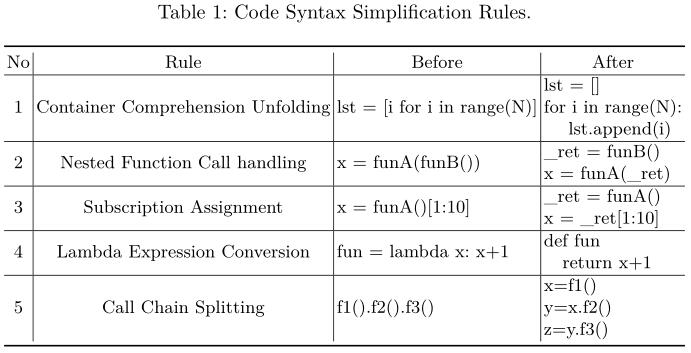
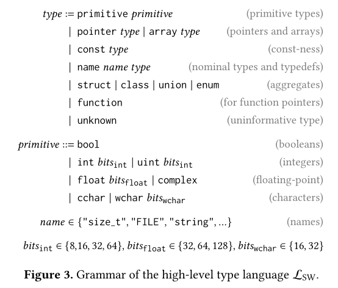

#### markdown语法

**加粗**  *斜体*
**在一行的末尾添加两个或多个空格，然后按回车键,即可创建一个换行( )。**

## 论文阅读杂项
**syntactic和semantic区别**：前者是语法上，后者是语义上，比如将一个字面量赋值给一个字面量，语法上是没问题的，但是语义上是有问题的，也就生成不了AST。

## 3.10 Scalpel: The Python Static Analysis Framework

#### core functions included in Scalpel    
##### Code Rewriter      
CR(Code Rewriter)被设计为支持系统化的对已有的python程序进行修改，以达到(1)简化程序便于静态分析和(2)优化或修改有问题的程序的目的。  
 
(1)集成了一个包含一组规则的数据库，规则指示了被匹配的代码如何进行转换。   
    比如，lambda语句可以被转换为函数，这样静态分析不用考虑lambda语句的影响，否则可能会把lambda语句视为赋值语句，进而将其视为局部变量。如：transforming x = lambda a: a + 10 to def x(a): return a + 10;
    另外一个好处是迭代，可以在静态分析结果简化了语义的基础上迭代调用规则。
    还有就是链式方法调用，如： f1().f2().f3()可以被分离为 x = f1(); y = x.f2(); z = y.f3()，，这样可以用来分离链式方法调用，从而加速静态分析性能。  
      
(2)受soot的启发，用户可以用特定的回调函数实现转换，以根据他们特定的需求来优化python代码。(后续此功能可能用来自动修复python代码)    
##### Static Analysis Functions  
(1)CFG construction  
考虑到python类和函数定义的嵌套，集成了一个嵌套的数据结构来存储控制流图。     
(2)SSA representation     
(3)constant propagation    
(4)alias analysis   
(5)import graph construction    
(6)fully qualified name inferrer    
    fully-qualified names, which are dotted strings that can represent the path from the top-level module down to the object itself   
(7)call graph construction    
(8)type inference    

## 4.2 A Language-Independent Analysis Platform for Source Code

## 5.8 Finding the Dwarf: Recovering Precise Types from WebAssembly Binaries
#### 启发式算法
启发式算法（heuristic algorithm)是相对于最优化算法提出的。一个问题的最优算法求得该问题每个实例的最优解。启发式算法可以这样定义：一个基于直观或经验构造的算法，在可接受的花费（指计算时间和空间）下给出待解决组合优化问题每一个实例的一个可行解，该可行解与最优解的偏离程度一般不能被预计。
启发式算法一般用于解决NP-hard问题，其中NP是指非确定性多项式。  
例如，著名的推销员旅行问题（Travel Saleman Problem or TSP）：假设一个推销员需要从南京出发，经过广州，北京，上海，…，等 n 个城市， 最后返回香港。 任意两个城市之间都有飞机直达，但票价不等。假设公司只给报销 C 元钱，问是否存在一个行程安排，使得他能遍历所有城市，而且总的路费小于 C？  
推销员旅行问题显然是 NP 的。因为如果你任意给出一个行程安排，可以很容易算出旅行总开销。但是，要想知道一条总路费小于 C 的行程是否存在，在最坏情况下，必须检查所有可能的旅行安排。  
启发式算法是相对于最优化算法提出的，是基于直观或者经验构造的算法，在可接受的开销（时间和空间）内给出待解决组合优化问题的一个可行解。 

**目前比较通用的启发式算法一般有模拟退火算法（SA）、遗传算法（GA）、蚁群算法（ACO）、人工神经网络（ANN）等。 **

It improves over prior work on learning-based type recovery by representing the types-to-predict in an expressive type language, which can describe a large number of complex types, instead of the fixed, and usually small type vocabulary used previously.

debug information can provide type labels for supervised training.

其他语言的类型预测神经网络训练方法各种各样，输入形式的不同，比如token序列，数据流图，与源码相关的自然语言等，还有不同的模型架构和训练方法，比如递归神经网络，transformers，图神经网络和无监督预训练等。
目前的学习方法有两个问题，一个是针对webassembly的没有，更重要的是之前的工作要么是关注如何表示预测类型的代码，要么是关注什么机器学习模型最适合。
现有的预测方法将类型预测归类为分类问题，由于分类问题无法适合大量类型，所以他们预测时只支持很少的类型。
SnowWhite核心技术时使用一种表达性语言来描述SnowWhite可以预测的类型，该语言支持基本类型，命名类型，复杂类型比如指针，数组，枚举等，以及上面所有类型的递归组合。

Given the type language, SnowWhite trains a model to predict types as a sequence of tokens. That is, we formulate the type prediction problem as a sequence prediction, and not a classification task. An important advantage of sequence prediction is that we do not have to artificially limit the number of types the model can choose from, but instead support (at least in principle) infinitely many types.

One core contribution of this work is to describe the types to predict using a type language that includes precise information about primitive types, nested types, const and signed-ness, and type names. Figure 3 gives a BNF grammar of the language.

#### 类型转换思路
相较于其他类型预测训练方法的预测的类型的局限性，他采用了一种上下文无关文法来表示各种类型。这样表示可以方便类型嵌套和组合。之前都是采用的类型分类训练方法，这次是序列预测问题

    

## 5.8 An Empirical Study of Bugs in WebAssembly Compilers

First, we use the GitHub Search API [26] to collect closed GitHub issues related to WebAssembly1. Second, we use the GitHub REST API [27] to collect all the issues and pull requests for the projects. We also collect the commits referenced in the timeline of each issue in order to find which files the issues affected in the repositories. After obtaining the full set of issues for each project, we use the keywords “bug”, “defect”, “error”, and “fault” to identify the issues likely to be bugs.

Qualitative Study Dataset (Emscripten). We extract all 430 closed bugs from the Emscripten project. We read the bug reports of these issues to only include those that are related to the challenges unique to WebAssembly compilers. Specifically, we check the root causes of the 430 bugs to determine whether a typical compiler targeting a native platform (e.g., GCC targeting x86-64) would need to deal with a similar root cause. If not, we consider that they are unique challenges to WebAssembly and include them in our dataset.

开发wasm编译器的几大挑战。
- Asyncify Synchronous C/C++ Code.
  - 浏览器的执行方式和c/c++不同，c/c++运行在一个同步的环境下，且大多都是分块运行，在浏览器中基于事件循环，不会说停下来等待用户交互。WebAssembly编译器需要提供额外的工具来处理同步块代码的转换，以适应基于事件的异步浏览器环境
- Incompatible Data Types. 
  - c和wasm的类型不匹配，wasm和js的类型不匹配。
- 内存模型的不同
  - wasm的内存模型和本机不同
- Emulating Native Environment.
  - emscripten提供了很多库来模拟本机环境(在web上本身不可以的)的执行。比如说文件系统，sockets。
- Supporting Web APIs.
  - emscripten还提供了一些API用于c/c++代码和WebAPIs交互。These WebAPIs include WebGL, the Fullscreen API, and IndexedDB, and these interfaces are called by existing C/C++ libraries such as OpenGL and SDL or by using the Emscripten-provided WebAPI bindings.
- Cross-Language Optimizations.
  - emscripten实现了两种运行环境，一个wasm一个js，在优化的时候会出现问题
- Runtime Implementation Discrepancy.
  - 不同的运行时环境和浏览器所产生的实现不同出现bug
- Unsupported Primitives.
  - 用户想实现一些wasm不支持的功能的时候出现问题，比如 C keyword sigsetjmp，因为wasm不支持signals

## 5.11 Fuzzm: Finding Memory Bugs through Binary-Only Instrumentation and Fuzzing of WebAssembly
我们的方法称为Fuzzm，它结合了用于检测堆栈和堆上的溢出和下溢的金丝雀指令、高效的覆盖率指令、WebAssembly VM和流行的AFL fuzzer的输入生成算法.
wasm提出了不少安全策略，但是内存漏洞依旧很容易从源码级触发，一个重要原因是缺少stack canary，页保护flag，或者加固的内存分配器。
一个漏洞能否被利用取决于源代码语义和目标代码提供的缓解措施。fuzzing一个为其他平台编译的程序，是不足够探索内存bugs的，在webassembly中。

wasm没有canary，以及它的线性内存容易让栈溢出到堆，尽管有AddressSanitizer工具能够在源码级别探测bug，但是对binary没用。
本文提出的canary重写了binary文件，能够检测栈的上溢和下溢。提出的fuzz方法能有效跟踪覆盖范围，比AFL不能应用在wasm好得多。为了提高fuzzing的效率，他将wasm vm和AFL集成在一起。

The approach instruments every function in the binary with code that inserts a canary onto the stack frame upon entry and checks it upon function exit. Beyond stack overflows, the instrumentation also detects memory violations on the heap by surrounding heap chunks with canaries。

将AFL风格的灰盒模糊应用于WebAssembly并非易事，原因有二。首先，fuzzer需要覆盖信息，原生AFL在从源代码编译程序时通过插入代码来获取覆盖信息。然而，我们希望在不需要访问源代码的情况下模糊WebAssembly二进制文件。而且执行速度也要针对wasm做调整。

在heap chunks周围插入canary时，是通过alloc函数插入和dealloca函数检测的。插桩在malloc、calloc，realloc等函数插入，继而其他的函数也能受到保护。插桩会在这些函数的头部和尾部插入代码。这些代码实现了三个目标。首先，分配的内存大小需要增加，因为插入了canaries。其次，canaries值需要写入内存。最后，数据指针在返回给用户的时候也做个调整。同时在这些函数中添加两个新的locals，以存放insert代码所需的数据。
首先检索其原本要分配的内存大小，存储到一个local中，然后将其申请的内存大小增加20bytes，这20bytes包括两个8bytes的canaries，还有4个bytes用于存放size。具体的插入前导指令取决于具体的allocator函数。对malloc(size_t) and realloc(void*,size_t),就简单的存储第一个参数于local中，然后对其增加。calloc(size_t nitems, size_titem_size)有一些挑战性，因为分配的大小是两参数的乘积，且任何一个参数都不是20的倍数。
在deallocation中检测canaries，涉及到的函数有free、realloc等。

canary在拿到wasm文件之后，可以直接破解，因为不是随机的。

### 5.14 讨论班
写论文可以从idea提出的时候就开始写了，如果拖到最后再写，就可能发现很多坑，来不及填了。
多和优秀的人沟通，有时候能够得到很好的启发。老师，师长，同辈，其他学生的工作。
对一些论文里好的句子可以摘抄下来，以后可能也会用到。
novel的idea咋想出来的？

对发paper最最重要的还是想idea的能力。
读了很多论文后，就可能局限在别人的论文思路里，如何解决？对人家的代码和工程要了解到什么程度？
一开始疯狂读文章，在做一个新的topic的时候，你在阅读了大量文章之后，就可以闭着想很多idea，因为这个时候思路还没陷进去。对人家代码工程特别细节的工作可以放到后面，一开始先了解浅一些的东西。
把科研作为这一辈子都要做的事情，作为生活的一部分，所以玩不影响科研，就是有时候玩能提高自己的效率。国外的人他们休闲和生活分的更开。

### 5.16 A First Look at Code Obfuscation for WebAssembly
#### Contributions:
- 调研了wasm混淆的可行性
- 对用于wasm的各种混淆方式做了一个对比分析
- 提出了一个use-case，描述混淆后的wasm代码如何影响wasm静态分析工具分辨良性和恶行应用。

